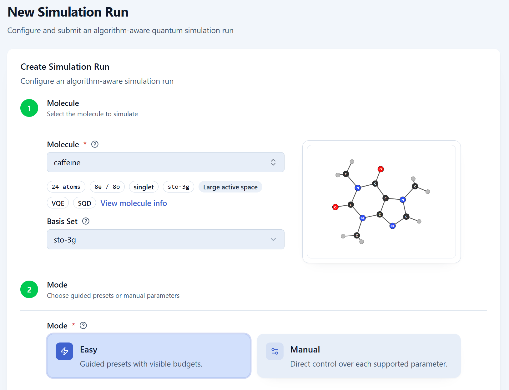
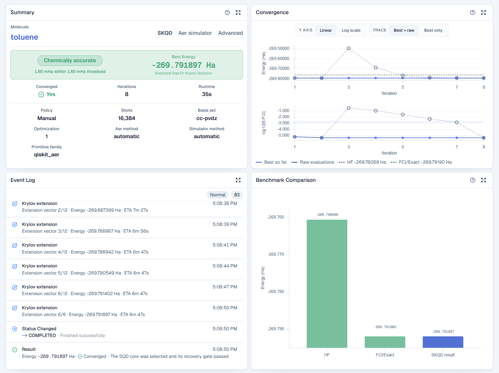
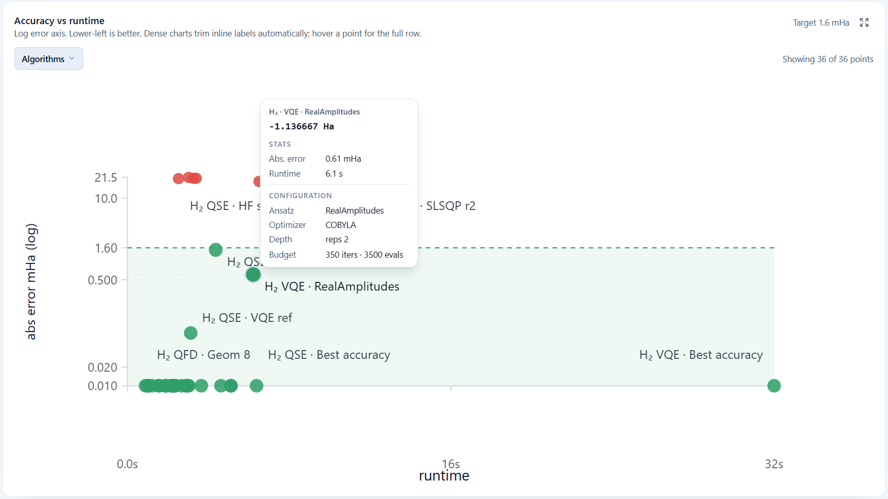

# Iota — Quantum Chemistry Workbench

Iota is a local workbench for molecular quantum simulation. It stores
molecules, prepares runs, executes local simulation or credential-gated IBM
Runtime jobs, and displays results.

This repository is a public application-source staging tree. It contains
application code, tests, configuration, and runtime documentation. It does not
contain thesis files, research data, benchmark exports, reports, or private
repository history.

## Demo

[](https://youtu.be/lWYvvrYoys0)

Watch the [Iota application demo](https://youtu.be/lWYvvrYoys0).

## Screenshots

| Configure a run | Inspect run results |
| --- | --- |
|  |  |



The screenshots show the application workflow, run provenance, convergence
details, and benchmark comparison views.

## Public release status

This tree is not ready for public publication. The software license is now
selected, but third-party asset review, owner review of repository controls,
and remote branch-protection settings are still pending.

## Application layout

- `backend/`: FastAPI API and database migrations.
- `worker/`: background job worker and chemistry algorithms.
- `frontend/`: React and Vite web application.
- `shared/`: Python modules shared by the API and worker.
- `scripts/contracts/`: API schema export used by frontend type generation.
- `docs/`: application documentation.

## Run locally

Requirements:

- Docker Engine 24 or newer.
- Docker Compose v2.

Run the loopback-only development stack:

```sh
cp .env.example .env
docker compose up --build
```

Open these local endpoints:

- UI: <http://127.0.0.1:5173>
- API status: <http://127.0.0.1:18000/api/status>
- API documentation: <http://127.0.0.1:18000/docs>

The example enables insecure development defaults. Keep `HOST_BIND` set to
`127.0.0.1`. Do not expose this stack to a network. The API has no user login
system, and the development credentials are placeholders.

Stop the stack:

```sh
docker compose down
```

The following command also deletes local database, Redis, and credential
volumes. Use it only when you want to reset local state:

```sh
docker compose down -v
```

## Development checks

Install frontend dependencies and run the frontend checks:

```sh
npm --prefix frontend ci
npm --prefix frontend run check:generated-types
npm --prefix frontend run lint
npm --prefix frontend run test:run
npm --prefix frontend run build
```

Run Python syntax and style checks from an environment with the locked
dependencies installed:

```sh
python3 -m compileall backend worker shared scripts/contracts
ruff check --select E4,E7,E9,F,I backend worker shared scripts/contracts
```

Run the backend and worker tests from an environment with their locked
dependencies installed:

```sh
PYTHONPATH=.:backend .venv/bin/pytest backend/tests -q
PYTHONPATH=. .venv/bin/pytest worker/tests -q
```

Validate the Compose file before starting services:

```sh
docker compose config --quiet
```

The API contract command does not need a running API:

```sh
npm --prefix frontend run generate:types
```

## Credentials and execution boundary

IBM Runtime credentials are configured through the application settings page and
stored as encrypted local profiles. Do not put IBM tokens in `.env`, source
files, test fixtures, or issue reports.

IBM Runtime jobs can consume account quota or money. Run them only when you
have authorization. Local simulation results and IBM Runtime results are
different evidence classes.

The application is designed for local, single-user operation. It does not
provide multi-user authentication or tenant isolation. The API does not have
independent user authentication. A client that can reach the UI can receive
the local operator access used by the UI. Do not expose this stack to a
network. Review the deployment configuration before using the production-style
Compose override.

## License

This project uses the [GNU Affero General Public License, version 3](LICENSE)
(AGPL-3.0-only). It permits use, study, modification, redistribution, and
commercial use. Covered source changes must remain available under the same
license when the software is conveyed. A modified version that users access
over a network must also offer those users its corresponding source.

AGPL-covered work is open-source software. The license does not require every
separate program that communicates with this application to use the AGPL.
Review the full license before combining this project with other software.
