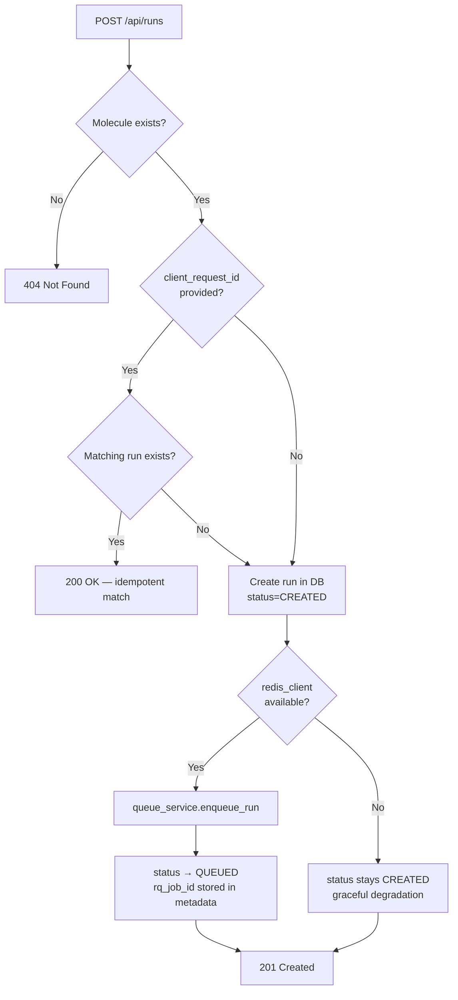

# API Endpoints

## Overview

The backend exposes a versioned REST API under the `/api` prefix (routed by
`backend/app/api/v1/router.py`) plus two root-level convenience endpoints. All
endpoints return JSON. All error responses use the `ErrorResponse` envelope:

```json
{
  "detail": {
    "code": "NOT_FOUND",
    "message": "Run abc123 not found",
    "field": null
  }
}
```

SSE streaming is available on `GET /api/runs/{id}/events/stream`

---

## Root Endpoints

| Method | Path | Description                                   |
| ------ | ---- | --------------------------------------------- |
| GET    | `/`  | API info envelope: `{message, version, docs}` |

Liveness and readiness probes live under `/api` (see the Health section):

- `GET /api/health` is the process liveness probe.
- `GET /api/status` is the readiness probe and returns `503` when PostgreSQL or
  Redis is disconnected.

---

## Molecules

| Method | Path                             | Description                                     | Status Codes       |
| ------ | -------------------------------- | ----------------------------------------------- | ------------------ |
| POST   | `/api/molecules`                 | Create a molecule                               | 201, 409, 422      |
| GET    | `/api/molecules`                 | List full molecules (paginated)                 | 200                |
| GET    | `/api/molecules/summaries`       | List lightweight molecule summaries (paginated) | 200                |
| GET    | `/api/molecules/{id}`            | Get molecule by ID                              | 200, 404           |
| PATCH  | `/api/molecules/{id}`            | Partial update                                  | 200, 404, 409, 422 |
| DELETE | `/api/molecules/{id}`            | Delete molecule                                 | 204, 404, 409      |
| GET    | `/api/molecules/pubchem/search`  | Search PubChem for compound candidates          | 200, 422           |
| POST   | `/api/molecules/pubchem/preview` | Preview a PubChem import without storing it     | 200, 404, 422      |
| POST   | `/api/molecules/pubchem/import`  | Import a molecule from PubChem                  | 201, 200, 404, 422 |
| POST   | `/api/molecules/xyz/preview`     | Preview standard XYZ coordinates                | 200, 422           |
| POST   | `/api/molecules/xyz/import`      | Import standard XYZ coordinates                 | 201, 409, 422      |

**409 Conflict** is returned on `POST` / `PATCH` and XYZ import when the
molecule name is already in use. `DELETE` returns `409` if the molecule has
associated runs and `delete_associated_runs=true` was not requested.
`DELETE /api/molecules/{id}` also accepts `?delete_associated_runs=true`; when
present, the backend best-effort deletes the persisted runs that reference the
molecule before removing the molecule row. Missing referenced runs are ignored,
while IBM-backed associated runs still require local-operator access because the
delete path reuses the normal run-deletion rules. Import preview endpoints do
not write molecule rows.

---

## Runs

| Method | Path                           | Description                           | Status Codes                    |
| ------ | ------------------------------ | ------------------------------------- | ------------------------------- |
| POST   | `/api/runs`                    | Create and queue a run                | 201, 200 (idempotent), 404, 422 |
| GET    | `/api/runs`                    | List full runs with optional filters  | 200                             |
| GET    | `/api/runs/summaries`          | List lightweight run summaries        | 200                             |
| GET    | `/api/runs/config-metadata`    | List registry-backed run-form choices | 200                             |
| GET    | `/api/runs/{id}`               | Get run by ID                         | 200, 404                        |
| DELETE | `/api/runs/{id}`               | Delete a run and its artifacts        | 204, 404, 403                   |
| POST   | `/api/runs/{id}/cancel`        | Cancel a run                          | 200, 409, 404                   |
| POST   | `/api/runs/{id}/pause`         | Request/persist a run pause           | 200, 409, 404                   |
| POST   | `/api/runs/{id}/resume`        | Resume a paused or failed run         | 200, 409, 404                   |
| POST   | `/api/runs/{id}/restart`       | Create a restart child run            | 200, 409, 404                   |
| POST   | `/api/runs/{id}/checkpoints`   | Persist a generation checkpoint       | 201, 404                        |
| GET    | `/api/runs/{id}/checkpoints`   | List run checkpoints                  | 200, 404                        |
| GET    | `/api/runs/{id}/result`        | Get run result                        | 200, 404                        |
| GET    | `/api/runs/{id}/events`        | Poll run events (paginated)           | 200, 404                        |
| GET    | `/api/runs/{id}/events/stream` | SSE stream of run events              | 200, 404                        |
| GET    | `/api/runs/{id}/export`        | Export reproducibility bundle         | 200, 404                        |

---

## Benchmarks

| Method | Path                   | Description                          | Status Codes  |
| ------ | ---------------------- | ------------------------------------ | ------------- |
| POST   | `/api/benchmarks`      | Persist a benchmark batch snapshot   | 201, 422      |
| GET    | `/api/benchmarks`      | List persisted benchmark batches     | 200           |
| GET    | `/api/benchmarks/{id}` | Get a benchmark batch by ID          | 200, 404      |
| PATCH  | `/api/benchmarks/{id}` | Update benchmark row/config snapshot | 200, 404, 422 |
| DELETE | `/api/benchmarks/{id}` | Delete a benchmark batch             | 204, 403, 404 |

The `/benchmarks` frontend creates ordinary simulation runs through
`POST /api/runs`, then stores the benchmark dashboard snapshot separately in
`benchmark_runs` through `/api/benchmarks`. The persisted snapshot includes the
selected molecule keys, algorithms, basis/backend settings, custom molecules,
chemical-accuracy target, and benchmark row state with referenced `runId`
values. Row snapshots can also persist per-row mode/label metadata and optional
easy-mode or advanced algorithm config so advanced benchmark dashboards can
restore duplicate algorithm rows without losing how each comparison was tuned.
`DELETE /api/benchmarks/{id}` also accepts `?delete_associated_runs=true`; when
present, the backend best-effort deletes the persisted runs referenced by the
snapshot before removing the benchmark row. Missing referenced runs are ignored,
while IBM-backed associated runs still require local-operator access because the
delete path reuses the normal run-deletion rules.

---

## Basis Sets

| Method | Path              | Description                             | Status Codes |
| ------ | ----------------- | --------------------------------------- | ------------ |
| GET    | `/api/basis-sets` | List selectable basis sets and metadata | 200          |

---

## Settings / IBM Profiles

| Method | Path                                               | Description                                      | Status Codes       |
| ------ | -------------------------------------------------- | ------------------------------------------------ | ------------------ |
| GET    | `/api/settings/ibm-profiles`                       | List safe IBM credential profile metadata        | 200                |
| POST   | `/api/settings/ibm-profiles`                       | Create an encrypted local IBM credential profile | 201, 409, 422      |
| PATCH  | `/api/settings/ibm-profiles/{profile_id}`          | Update profile metadata or replace credentials   | 200, 404, 409, 422 |
| POST   | `/api/settings/ibm-profiles/{profile_id}/activate` | Activate a profile for future IBM requests       | 200, 404           |
| POST   | `/api/settings/ibm-profiles/{profile_id}/test`     | Validate the profile against IBM Runtime         | 200, 404, 422      |
| DELETE | `/api/settings/ibm-profiles/{profile_id}`          | Delete a profile with `confirm_name` query       | 204, 404, 422      |

Profile responses never include raw credentials, encrypted blobs, or masked
credential previews. The test endpoint performs a lightweight IBM Runtime
validation call against one operational hardware backend after decrypting the
saved profile. That runtime call runs off the FastAPI event loop and uses a
short timeout, so a slow or stalled IBM account returns `ok=false` with a safe
timeout or validation-failure message instead of pinning the whole API process.
These endpoints require the local operator header `X-Local-Operator-Token`. The
default local Vite proxy injects that header automatically, so browser users do
not need to type or store the token in page state.

## Local Operator Protection

IBM-sensitive routes require the local operator header `X-Local-Operator-Token`:

- `GET|POST|PATCH|DELETE /api/settings/ibm-profiles*`
- `GET|POST /api/backends*`
- `POST /api/runs` when `backend_target="ibm_runtime"`
- `POST /api/runs` when `backend_target="aer_simulator"` and
  `noise_profile.source="backend_derived"`
- `POST /api/validate/config` when `run.backend_target="ibm_runtime"`
- `POST /api/validate/config` when `run.backend_target="aer_simulator"` and
  `run.noise_profile.source="backend_derived"`
- `POST /api/runs/{id}/pause`, `POST /api/runs/{id}/resume`, and
  `POST /api/runs/{id}/restart` when the run targets IBM Runtime
- `DELETE /api/runs/{id}` when the run targets IBM Runtime or still references a
  saved IBM credential profile / IBM job id

The default Compose/Vite setup injects the header server-side from local state
so the browser never needs the token directly. Browser bundles do not read or
send local operator tokens; IBM-sensitive frontend calls stay on same-origin
`/api/...` paths so the Vite proxy can add the header outside browser state.

---

## Validation

- Method: `POST`
- Path: `/api/validate/config`
- Description: Validate algorithm-aware run contract semantics
- Status codes: `200`

This endpoint always returns `200` — validation results are in the response body
(`valid: bool`, `errors: []`, `warnings: []`, `estimate: RunEstimate | null`).
It never returns `422` for semantic issues (those appear as errors/warnings in
the payload).

- Validation payload shape: `{"molecule_id", "run": {...}}`
  - includes backend capability gating and mode-shape checks
  - includes SQD paired-electron and active-space compatibility checks
  - includes SKQD base-sampling paired-electron and active-space compatibility
    checks
  - includes KQD warning when `evolution_method="exact"` and
    `trotter_steps != 1`
  - includes QSE and SKQD resource-limit checks
  - includes active-space and algorithm-specific resource guardrails

---

## Health

| Method | Path          | Description                                    | Status codes |
| ------ | ------------- | ---------------------------------------------- | ------------ |
| GET    | `/api/health` | Liveness probe — is the process running?       | 200          |
| GET    | `/api/status` | Readiness probe — are all backing services up? | 200, 503     |

---

## Endpoint Details

### GET /api/molecules

Fetches a paginated, filterable list of molecules. Used by the frontend to
populate molecule selectors and the molecules management page.

**Query Parameters:**

- `q` (`string`): case-insensitive substring search across `name`, `iupac_name`,
  `synonyms`, `smiles`, and `inchi`.
- `charge` (`int`): exact-match filter on `charge`.
- `limit` (`int`): max items per page (default `50`, max `200`).
- `offset` (`int`): number of items to skip for pagination (default `0`).

**Request:**

```http
GET /api/molecules?q=H2&limit=20&offset=0
```

**Response 200** — `MoleculeListResponse` paginated envelope (`items` plus
`total`; `limit`/`offset` travel on the request only):

```json
{
  "items": [
    {
      "id": "550e8400-e29b-41d4-a716-446655440000",
      "name": "H2",
      "atoms": [
        { "symbol": "H", "x": 0.0, "y": 0.0, "z": 0.0 },
        { "symbol": "H", "x": 0.0, "y": 0.0, "z": 0.74 }
      ],
      "charge": 0,
      "multiplicity": 1,
      "active_space": { "n_electrons": 2, "n_orbitals": 2 },
      "eligibility": {
        "selectable": true,
        "label": "Ready",
        "reason": null,
        "capability_labels": ["All algorithms", "4 qubits"]
      },
      "created_at": "2026-02-25T10:00:00Z",
      "updated_at": "2026-02-25T10:00:00Z"
    }
  ],
  "total": 62
}
```

**Field Reference (`MoleculeResponse` item):**

| Field          | Type                     | Description                                             |
| -------------- | ------------------------ | ------------------------------------------------------- |
| `id`           | UUID                     | Unique identifier (use for `molecule_id` in run config) |
| `name`         | string                   | Display name (e.g., "H2", "H2O")                        |
| `atoms`        | `AtomSchema[]`           | Cartesian coordinates of atoms                          |
| `charge`       | int                      | Total molecular charge                                  |
| `multiplicity` | int                      | Spin multiplicity (2S+1)                                |
| `active_space` | `ActiveSpaceSchema` null | (Optional) Core/valence partitioning                    |
| `eligibility`  | object                   | Derived selectability and capability labels for UIs     |
| `pubchem_cid`  | `int, nullable`          | PubChem Compound ID                                     |
| `iupac_name`   | `string, nullable`       | IUPAC systematic name                                   |
| `description`  | `string, nullable`       | Chemical description from PubChem                       |
| `synonyms`     | `array, nullable`        | Alternative names from PubChem                          |
| `smiles`       | `string, nullable`       | SMILES structure notation                               |
| `inchi`        | `string, nullable`       | InChI structure notation                                |
| `inchi_key`    | `string, nullable`       | InChI hashkey (max 27 chars)                            |
| `created_at`   | ISO 8601 datetime string | Molecule creation timestamp                             |
| `updated_at`   | ISO 8601 datetime string | Last modification timestamp                             |

---

### GET /api/molecules/summaries

Fetches the same paginated/filterable molecule set as `GET /api/molecules` but
returns compact list items for the molecules library table instead of full atom
coordinate payloads.

**Query Parameters:**

- `q` (`string`): case-insensitive substring search across `name`, `iupac_name`,
  `synonyms`, `smiles`, and `inchi`.
- `charge` (`int`): exact-match filter on `charge`.
- `limit` (`int`): max items per page (default `50`, max `200`).
- `offset` (`int`): number of items to skip for pagination (default `0`).

**Response 200** — `MoleculeSummaryListResponse`:

```json
{
  "items": [
    {
      "id": "550e8400-e29b-41d4-a716-446655440000",
      "name": "H2O",
      "charge": 0,
      "atom_count": 3,
      "formula": "H2O",
      "iupac_name": "oxidane",
      "eligibility": {
        "selectable": true,
        "label": "Ready",
        "reason": null,
        "capability_labels": ["All algorithms", "12 qubits"]
      }
    }
  ],
  "total": 62
}
```

**Field Reference (`MoleculeSummaryResponse` item):**

| Field         | Type               | Description                                           |
| ------------- | ------------------ | ----------------------------------------------------- |
| `id`          | UUID               | Unique identifier (use for links/detail fetches)      |
| `name`        | string             | Display name (e.g. "H2", "H2O")                       |
| `charge`      | int                | Total molecular charge                                |
| `atom_count`  | int                | Number of atoms in the stored geometry                |
| `formula`     | string             | Precomputed compact formula for list/table rendering  |
| `iupac_name`  | `string, nullable` | IUPAC systematic name shown as secondary row metadata |
| `eligibility` | object             | Derived selectability and capability labels           |

---

### GET /api/molecules/pubchem/search

Searches PubChem for compound candidates using the autocomplete endpoint. Used
by the import dialog to let users discover molecules before importing.

**Query Parameters:**

| Parameter | Type   | Default | Description                                                    |
| --------- | ------ | ------- | -------------------------------------------------------------- |
| `q`       | string | —       | Search query (compound name, partial, or synonym); 1–200 chars |

The endpoint does not accept a `limit` parameter; `search_pubchem_compounds()`
uses a fixed internal cap driven by the PubChem autocomplete response.

**Response 200** — `PubChemSearchResponse` wrapper: `{"results": [...]}`

```json
{
  "results": [
    {
      "name": "caffeine",
      "iupac_name": "1,3,7-trimethylpurine-2,6-dione",
      "formula": "C8H10N4O2",
      "cid": 2519
    }
  ]
}
```

**`PubChemSearchResult` fields:**

| Field        | Type             | Description                                              |
| ------------ | ---------------- | -------------------------------------------------------- |
| `name`       | string           | Canonical compound name from PubChem                     |
| `iupac_name` | string, nullable | IUPAC systematic name                                    |
| `formula`    | string           | Molecular formula (e.g. `C8H10N4O2`)                     |
| `cid`        | int \| null      | PubChem Compound ID; used to render CID badges in the UI |

---

### POST /api/molecules/pubchem/import

Imports a single molecule from PubChem by name.

- Returns `201` when a new molecule row is created.
- Returns `200` when an existing molecule is reused (case-insensitive name match
  or matching PubChem CID).

**Request body** (`PubChemImportRequest`):

```json
{ "name": "caffeine", "display_name": "Caffeine" }
```

| Field          | Type   | Required | Description                                              |
| -------------- | ------ | -------- | -------------------------------------------------------- |
| `name`         | string | Yes      | PubChem compound name used for the geometry lookup       |
| `display_name` | string | No       | Override name stored in the library (defaults to `name`) |

**Response 200/201** — `MoleculeResponse` for the imported (or existing)
molecule.

**Response 422** — PubChem returned no result for the given name.

---

### POST /api/runs

Creates an algorithm-aware run and immediately attempts to enqueue it for
execution.

**Request body** (`RunCreate`):

- `molecule_id` (`UUID`, required): ID of the molecule to simulate.
- `algorithm` (`RunAlgorithm`, required): selected algorithm (`vqe`, `qse`,
  `kqd`, `qfd`, `sqd`, `skqd`).
- `mode` (`RunMode`, required): `easy` or `advanced`.
- `backend_target` (`BackendTarget`, required): `statevector`, `aer_simulator`,
  or `ibm_runtime`.
- `easy_options` (`EasyOptions`, conditionally required): required when
  `mode=easy`.
- `advanced_config` (`AdvancedConfig`, conditionally required): required when
  `mode=advanced`. VQE configs may include warm-start controls
  (`initial_point_strategy`, `initial_point_candidates`); QSE VQE-reference
  configs may include ansatz/optimizer selectors plus
  `vqe_reference_max_iterations` and `vqe_reference_reps`; QSE
  large-active-space configs use `reference_method="hf"` or `"provided_sector"`
  with `provided_sector_amplitudes`; SKQD configs also accept `time_step`.
- `basis_set_override` (`string`, optional): run-level basis-set override.
- `chemical_accuracy_target_ha` (`float > 0`, optional): per-run target used by
  the frontend to recommend manual settings and score chemical accuracy on run
  detail when a reference energy is present.
- `noise_profile` (`NoiseProfile`, optional): backend-dependent noise settings.
- `client_request_id` (`UUID`, optional): idempotency key.
- `backend_options.credential_profile_id` (`UUID`, optional): saved IBM
  credential profile reference for Runtime submissions and backend-derived Aer
  noise. When omitted, the active saved profile is used.

**Run creation flow:**



**Response 201** — `RunResponse` with the full run object including status,
algorithm/mode/backend_target, the saved IBM profile snapshot name when
available, and config snapshot. **Response 200** — returned when
`client_request_id` matches an existing run belonging to the same molecule.
Identical to `201` but signals a replay rather than a new creation.

For IBM Runtime runs using `backend_options.selection_policy="least_busy"` or
`"least_error"`, the API resolves a concrete backend during creation and writes
that `backend_options.backend_name` into `config_json` before enqueueing. This
freezes the selected hardware for worker execution, resume/restart, and run
history rendering instead of re-resolving later against a possibly different
catalog snapshot.

`RunResponse` includes runtime estimate snapshots:

- `initial_estimate`: nullable estimate snapshot populated by validation or by
  the post-create async ETA seeding task.
- `latest_estimate`: nullable live estimate snapshot. It may be backfilled by
  the same post-create API background task for newly queued runs, then refreshed
  by worker telemetry during execution.

For easy-mode runs, `config_json` preserves the original request snapshot while
`metadata.easy_mode` stores the catalog version plus the expanded advanced
config consumed by the worker.

During execution, the event stream may include `estimate_updated` events in
addition to status/progress/result events. These payloads mirror the
`RunEstimate` shape and are emitted as telemetry updates.

---

### GET /api/runs

Fetches a paginated, filterable list of full run records. Used by detail-aware
surfaces that need the complete persisted run snapshot.

**Query Parameters:**

- `molecule_id` (`UUID`): exact filter on the selected molecule.
- `status` (`RunStatus`): exact filter on the current run status.
- `backend_target` (`BackendTarget`): exact filter on the persisted backend
  target (`statevector`, `aer_simulator`, or `ibm_runtime`).
- `converged` (`bool`): exact filter on the persisted run-result convergence
  flag; runs without a result are excluded when this filter is present.
- `chemical_accurate` (`bool`): exact filter on the persisted chemical-accuracy
  verdict derived from the saved result error and the run's saved target; runs
  without a scorable reference are excluded when this filter is present.
- `limit` (`int`): max items per page (default `50`, max `1000`).
- `offset` (`int`): number of items to skip for pagination (default `0`).

**Response 200** — `RunListResponse`:

```json
{
  "items": [
    {
      "id": "550e8400-e29b-41d4-a716-446655440000",
      "molecule_id": "3fa85f64-5717-4562-b3fc-2c963f66afa6",
      "molecule_name": "H2",
      "status": "RUNNING",
      "algorithm": "vqe",
      "backend_target": "ibm_runtime",
      "config_json": {
        "backend_options": {
          "backend_name": "ibm_brisbane"
        }
      },
      "metadata": {
        "run_started_at": "2026-05-18T09:55:00Z"
      },
      "latest_estimate": {
        "source": "telemetry",
        "algorithm": "vqe",
        "estimated_remaining_seconds": 180.0,
        "updated_at": "2026-05-18T10:00:00Z"
      },
      "created_at": "2026-05-18T09:54:00Z",
      "updated_at": "2026-05-18T10:00:00Z"
    }
  ],
  "total": 12,
  "limit": 50,
  "offset": 0
}
```

---

### GET /api/runs/summaries

Fetches the same paginated/filterable run set as `GET /api/runs` but returns
compact rows for the `/runs` history table instead of the full config/version
payload.

**Query Parameters:**

- `molecule_id` (`UUID`): exact filter on the selected molecule.
- `status` (`RunStatus`): exact filter on the current run status.
- `backend_target` (`BackendTarget`): exact filter on the persisted backend
  target (`statevector`, `aer_simulator`, or `ibm_runtime`).
- `converged` (`bool`): exact filter on the persisted run-result convergence
  flag; runs without a result are excluded when this filter is present.
- `chemical_accurate` (`bool`): exact filter on the persisted chemical-accuracy
  verdict derived from the saved result error and the run's saved target; runs
  without a scorable reference are excluded when this filter is present.
- `limit` (`int`): max items per page (default `50`, max `1000`).
- `offset` (`int`): number of items to skip for pagination (default `0`).

**Response 200** — `RunSummaryListResponse`:

```json
{
  "items": [
    {
      "id": "550e8400-e29b-41d4-a716-446655440000",
      "molecule_id": "3fa85f64-5717-4562-b3fc-2c963f66afa6",
      "status": "RUNNING",
      "algorithm": "vqe",
      "backend_target": "ibm_runtime",
      "backend_name": "ibm_brisbane",
      "converged": null,
      "chemical_accurate": null,
      "metadata": {
        "run_started_at": "2026-05-18T09:55:00Z"
      },
      "latest_estimate": {
        "source": "telemetry",
        "algorithm": "vqe",
        "estimated_remaining_seconds": 180.0,
        "updated_at": "2026-05-18T10:00:00Z"
      },
      "created_at": "2026-05-18T09:54:00Z",
      "updated_at": "2026-05-18T10:00:00Z"
    }
  ],
  "total": 12,
  "limit": 50,
  "offset": 0
}
```

**Field Reference (`RunSummaryResponse` item):**

| Field                     | Type                      | Description                                                    |
| ------------------------- | ------------------------- | -------------------------------------------------------------- |
| `id`                      | UUID                      | Run identifier                                                 |
| `molecule_id`             | UUID                      | Referenced molecule identifier                                 |
| `molecule_name`           | `string, nullable`        | Molecule name embedded for immediate run-list labels           |
| `status`                  | `RunStatus`               | Current run status                                             |
| `algorithm`               | `RunAlgorithm, nullable`  | Persisted algorithm id                                         |
| `backend_target`          | `BackendTarget, nullable` | Persisted backend target                                       |
| `backend_name`            | `string, nullable`        | Selected concrete backend name for IBM summary rows            |
| `credential_profile_name` | `string, nullable`        | Snapshot of the IBM profile display name used at creation time |
| `converged`               | `bool, nullable`          | Solver convergence flag when a result is persisted             |
| `chemical_accurate`       | `bool, nullable`          | Chemical-accuracy verdict for scorable runs in the history UI  |
| `metadata`                | `object, nullable`        | Runtime metadata used by the list to derive durations          |
| `latest_estimate`         | `RunEstimate, nullable`   | Latest live estimate for active-row progress                   |
| `created_at`              | ISO 8601 datetime string  | Run creation timestamp                                         |
| `updated_at`              | ISO 8601 datetime string  | Last modification timestamp                                    |

---

### POST /api/runs/{id}/cancel

Cancels a run. The endpoint is **idempotent** — cancelling an already-cancelled
run returns `200`, not an error.

- **`QUEUED` runs**: `cancel_queued_job()` attempts to remove the RQ job from
  the `quantum` queue. Failure is logged but does not block the status
  transition.
- **IBM-backed runs**: require local-operator access. When a submitted Runtime
  job ID and a resolvable saved profile are present, the API requests a
  best-effort remote `job.cancel()` immediately before committing the local
  `CANCELLED` status. If the remote cancel request fails, the local transition
  still completes and the worker continues to honor the cancelled DB state.
- **`COMPLETED` / `FAILED` runs**: returns `409 Conflict` — terminal states
  cannot be reversed.

**Response** — `RunCancelResponse` with `id` and the new `status`.

### POST /api/runs/{id}/pause

Requests a cooperative pause. Queue-local runs (`CREATED`/`QUEUED`) move to
`PAUSED`; active worker/IBM runs move to `PAUSING` so the worker can checkpoint
and acknowledge in a later slice. The endpoint records `control_requested` and
`status_changed` events.

**Response** — `RunActionResponse` with `id`, `status`, and
`execution_generation`.

### POST /api/runs/{id}/resume

Resumes a `PAUSED` or `FAILED` run by incrementing `execution_generation` and
returning the run to `QUEUED` when Redis enqueue succeeds or `CREATED` when
Redis is absent. The endpoint records `resume_enqueued` and `status_changed`
events.

### POST /api/runs/{id}/restart

Creates a child run with the same molecule/configuration and
`restarted_from_run_id` pointing to the source. Terminal and paused runs can be
restarted directly; active runs require `{"cancel_active": true}`. The response
contains `child_run_id`.

### Run checkpoints

`POST /api/runs/{id}/checkpoints` stores an arbitrary JSON checkpoint payload
for the run's current `execution_generation` and records a `checkpoint_saved`
event. `GET /api/runs/{id}/checkpoints` lists checkpoints newest-first and
accepts optional `execution_generation`.

---

### GET /api/runs/{id}/events/stream — SSE Streaming

Server-Sent Events stream for a run's event log. Clients should use this for
real-time progress during active runs.

**Content-Type**: `text/event-stream`

**Event format** (per SSE wire protocol):

```text
id: <sequence>
event: run_event
data: {"id": 42, "run_id": "...", "sequence": 5, "type": "iteration_update", ...}

```

**Terminal event** (sent once when the run reaches a terminal state):

```text
event: stream_end
data: {"status": "COMPLETED"}

```

**Terminal statuses** that close the stream: `COMPLETED`, `FAILED`, `CANCELLED`,
and `PAUSED`. `SUBMITTED_TO_IBM` is **not** terminal for the stream — the SSE
endpoint keeps polling and will close the stream once the run transitions to a
terminal status above (see `_TERMINAL_STATUSES` in
`backend/app/api/v1/endpoints/runs.py`). For IBM Runtime runs, `ibm_status_poll`
events can carry Runtime status, queue position, PUB count, shots, and
`ibm_timing` (`pending_seconds`, `usage_seconds`, `total_seconds`) after the
Runtime API exposes job metrics.

**Reconnection** — clients may send `Last-Event-ID: N` to resume from a specific
sequence number. The server yields only events with `sequence > N`.

**Polling interval**: 500 ms between Postgres queries.

---

### GET /api/runs/{id}/export

Returns an `ExportBundle` — a self-contained JSON document capturing everything
needed to reproduce or audit the run:

| Field            | Type                        | Description                                       |
| ---------------- | --------------------------- | ------------------------------------------------- |
| `export_version` | `"1.0"`                     | Bundle schema version                             |
| `exported_at`    | datetime                    | Timestamp of the export                           |
| `molecule`       | `MoleculeResponse`          | Full molecule geometry                            |
| `run`            | `RunResponse`               | Full run object with config snapshot              |
| `versions`       | dict or null                | Dependency version snapshot (qiskit, pyscf, etc.) |
| `events`         | `RunEventResponse[]`        | All run events in sequence order                  |
| `result`         | `RunResultResponse` or null | Final result (if run completed)                   |

Available for any run status — partial exports for `RUNNING` or `FAILED` runs
are valid and useful for debugging.

---

### GET /api/runs/config-metadata

Returns the server-owned catalog for run configuration controls. It includes
registry choices, chemical-accuracy target values, numeric limits, and
algorithm-specific recommended advanced settings. The recommendation map is
keyed by algorithm and easy-mode goal. Form-only text fields remain frontend
state.

**Response 200** — `RunConfigMetadataResponse`:

```json
{
  "catalog_version": "2026-09-11-v21",
  "algorithms": ["vqe", "qse", "kqd", "qfd", "sqd", "skqd"],
  "backend_targets": ["statevector", "aer_simulator", "ibm_runtime"],
  "easy_goals": ["fastest", "balanced", "best_accuracy"],
  "easy_goal_presets": [
    {
      "goal": "fastest",
      "label": "5.0 mHa",
      "chemical_accuracy_target_ha": 0.005
    },
    {
      "goal": "balanced",
      "label": "1.6 mHa",
      "chemical_accuracy_target_ha": 0.0016
    },
    {
      "goal": "best_accuracy",
      "label": "0.5 mHa",
      "chemical_accuracy_target_ha": 0.0005
    }
  ],
  "ansatzes": [
    {
      "id": "EfficientSU2",
      "label": "EfficientSU2",
      "aliases": ["efficient_su2", "efficientsu2"],
      "supported_algorithms": ["vqe", "qse"],
      "metadata": {
        "canonical_worker_id": "efficientsu2",
        "default_reps": 2
      }
    }
  ],
  "optimizers": [
    {
      "id": "L_BFGS_B",
      "label": "L-BFGS-B",
      "aliases": ["L-BFGS-B"],
      "supported_algorithms": ["vqe", "qse"],
      "metadata": {
        "kind": "scipy",
        "scipy_method": "L-BFGS-B",
        "allowed_options": ["eps", "ftol", "gtol", "maxfun", "maxls", "tol"],
        "supports_max_function_evaluations": true
      }
    }
  ],
  "defaults": {
    "ansatz_name": "EfficientSU2",
    "optimizer_name": "COBYLA",
    "qse_reference_ansatz_name": "EfficientSU2",
    "qse_reference_optimizer_name": "COBYLA"
  },
  "limits": {
    "advanced_config.max_iterations": { "minimum": 1, "maximum": 5000 }
  },
  "capabilities": {
    "statevector": {
      "enabled": true,
      "supports_noise_profile": false,
      "supports_shots": false
    }
  }
}
```

Each `easy_goal_presets` entry maps one `EasyGoal` value to the chemical
accuracy target shown by the run form. The run form keeps its local target
ladder only as an offline fallback.

This endpoint is backed by `shared/contracts/`. The worker keeps only
solver-specific construction details, so the manual form does not hardcode a
second list of selectable choices or runtime guardrails.

### POST /api/validate/config

Validates algorithm-aware run payload semantics, beyond what Pydantic enforces
at the schema level. The request shape is `RunValidationRequest`:
`{ molecule_id, run }`, where `run` is the same `RunCreate` payload accepted by
`POST /api/runs`.

**Checks performed:**

- `backend_target` is required.
- `backend_target` must be enabled in `Settings.backend_capabilities`.
  `statevector` and `aer_simulator` are enabled locally; `ibm_runtime`
  additionally requires IBM credentials.
- `noise_profile` is rejected unless the selected backend target supports noise.
  Aer noise profiles are supported; noisy Aer KQD/QFD requests route through the
  projected branch-matrix-element path instead of the ideal propagation path.
- IBM Runtime validation requires a supported algorithm, credentials, explicit
  confirmation on create, and `backend_options.backend_name` when manual
  selection is used. KQD/QFD are accepted for IBM Runtime through the
  branch-state Estimator matrix-element workflow, capped at 8 Krylov/time-grid
  basis states.
- KQD/QFD `aer_simulator` validation requires `aer_method` `automatic`,
  `statevector`, or `matrix_product_state` on the ideal Aer propagation path.
  Above 6 active orbitals, or whenever an Aer noise profile is supplied, Aer
  KQD/QFD use local Aer Estimator branch matrix elements and are capped at 8
  projected basis states.
- `molecule.active_space.n_orbitals > 6` does not block KQD/QFD, QSE, or SKQD by
  itself. Statevector KQD/QFD use a fixed-particle-sector matrix-free path; QSE
  still rejects `reference_method="vqe"` and `"provided_state"` above this size;
  large QSE uses `reference_method="hf"` or `"provided_sector"`.
- Measured QSE on noisy Aer or IBM Runtime supports `reference_method="hf"`
  only. The measured circuit prepares the Hartree-Fock reference state. Use
  statevector or ideal Aer for non-HF QSE references.
- QSE `provided_state` validation requires `provided_state_vector`; each entry
  may be a real number or a `{real, imag}` object.
- QSE `provided_sector` validation requires `provided_sector_amplitudes` entries
  with determinant bitstrings and amplitudes expressed either as a real number
  or `{real, imag}`.
- `ansatz` not in known set: warning from the shared catalog used by
  `/api/runs/config-metadata`.
- `optimizer` not in known set: warning from the shared catalog used by
  `/api/runs/config-metadata`.
- SQD/SKQD electron counts provided only on one spin channel: error on paired
  electron-count field.
- SQD/SKQD electron counts incompatible with molecule active-space size: error
  on paired electron-count field.
- KQD `evolution_method="exact"` with `trotter_steps != 1`: warning
  (`trotter_steps` is ignored).
- QFD `trotter_steps`: accepted for advanced runs and capped at 32; Aer/IBM
  branch-estimator and Aer state-propagation paths use it to synthesize
  Pauli-evolution circuits.
- QSE `max_subspace_dim`, QSE `vqe_reference_max_iterations`, and SKQD
  `krylov_extension_dim` over the supported max: error on algorithm-specific
  field.
- SKQD `samples_per_state` or `krylov_extension_dim` exceeds its supported
  limit: error on the corresponding algorithm-specific field.

Ansatz and optimizer metadata are owned by
`shared/contracts/registry_metadata.py`. Worker registries still construct
runtime objects. An unknown name becomes a warning (custom names may resolve
at runtime).

**Response** (`RunValidationResponse`):

```json
{
  "valid": false,
  "errors": [
    {
      "field": "ibm_runtime_credentials",
      "code": "missing_required",
      "message": "IBM Quantum credentials are not connected.",
      "suggestion": "Save an IBM profile in Settings and make it active before trying again."
    }
  ],
  "warnings": ["Ansatz 'MyCustomAnsatz' is not in the known-supported set ..."]
}
```

---

### GET /api/backends

Lists local and configured runtime backends. The response includes safe metadata
only: target, name/display name, availability, simulator flag, noise support,
transpile-preview support, explicit IBM `credential_configured` and
`credentials_usable` state, optional qubit/job/error-rate metadata, and
warnings.

IBM Runtime discovery is credential-aware. It can use a saved
`backend_options.credential_profile_id` or the active saved profile. Without
credentials, the endpoint returns an unavailable IBM Runtime summary with
warnings. Hardware catalog discovery is timeout-bounded by
`BACKEND_CATALOG_DISCOVERY_TIMEOUT_SECONDS`, uses an in-process cache controlled
by `BACKEND_CATALOG_CACHE_SECONDS`, and is enabled by default through
`BACKEND_CATALOG_DISCOVERY_ENABLED`. `GET /api/backends` does not wait on a live
IBM catalog call: on a cold profile load it returns a credential-aware IBM
placeholder immediately and starts a background refresh, and on an expired
snapshot it keeps serving the last successful hardware catalog while the refresh
runs. A cached unavailable IBM placeholder is retried in the background as well,
so a timed-out profile is not pinned behind the full cache TTL. Live IBM
discovery itself runs in an isolated child process so a stalled IBM lookup
cannot wedge the API server, and those background retries use a more relaxed
timeout budget than foreground resolve/preview calls. When a refresh times out
or fails, `/api/backends` keeps serving the last successful IBM hardware
snapshot together with a sanitized stale-cache warning instead of regressing the
form to a disabled placeholder. The frontend only falls back to the
saved-profile validation endpoint when the backend cannot produce usable IBM
catalog metadata.

### POST /api/backends/resolve

Resolves a target plus `backend_options` into a concrete backend when possible.

**Request** — `BackendResolveRequest`:

- `target`: `statevector`, `aer_simulator`, or `ibm_runtime`
- `backend_options`: `BackendOptions`
- `required_qubits`: optional positive integer
- `algorithm`: optional run algorithm

Manual IBM selection requires `backend_options.backend_name`; `least_busy`
chooses the operational backend with the fewest pending jobs after qubit-count
filtering; `least_error` only resolves when error-rate metadata is available.

### POST /api/backends/transpile-preview

Returns best-effort transpile feasibility metadata without building the full run
circuit. The response reports whether the request is feasible for the resolved
backend, includes metadata such as optimization level, shots, basis gates,
coupling-map edge count, and pending jobs when available, and returns warnings
when the preview is metadata-only.

---

### GET /api/health

Simple **liveness probe**. Returns 200 as long as the API process is running.
Does **not** check Postgres or Redis — use `/api/status` for that.

**Response:**

```json
{ "status": "ok" }
```

---

### GET /api/status

**Readiness probe** — checks actual connectivity to PostgreSQL and Redis.

| Status code | Meaning                             |
| ----------- | ----------------------------------- |
| 200         | All components reachable            |
| 503         | PostgreSQL or Redis is disconnected |

**Fields:**

| Field   | Values                                           | Notes                              |
| ------- | ------------------------------------------------ | ---------------------------------- |
| `api`   | `"ready"`                                        | Always `ready` (process is up)     |
| `db`    | `"connected"` \| `"disconnected"`                | Result of `SELECT 1` probe         |
| `redis` | `"connected"` \| `"disconnected"` \| `"unknown"` | `"unknown"` = Redis not configured |

> `"unknown"` redis does **not** trigger 503 — it means Redis is simply not
> configured in this environment, which is a valid operational choice.

**Response (all healthy — HTTP 200):**

```json
{ "api": "ready", "db": "connected", "redis": "connected" }
```

**Response (DB down — HTTP 503):**

```json
{ "api": "ready", "db": "disconnected", "redis": "connected" }
```
