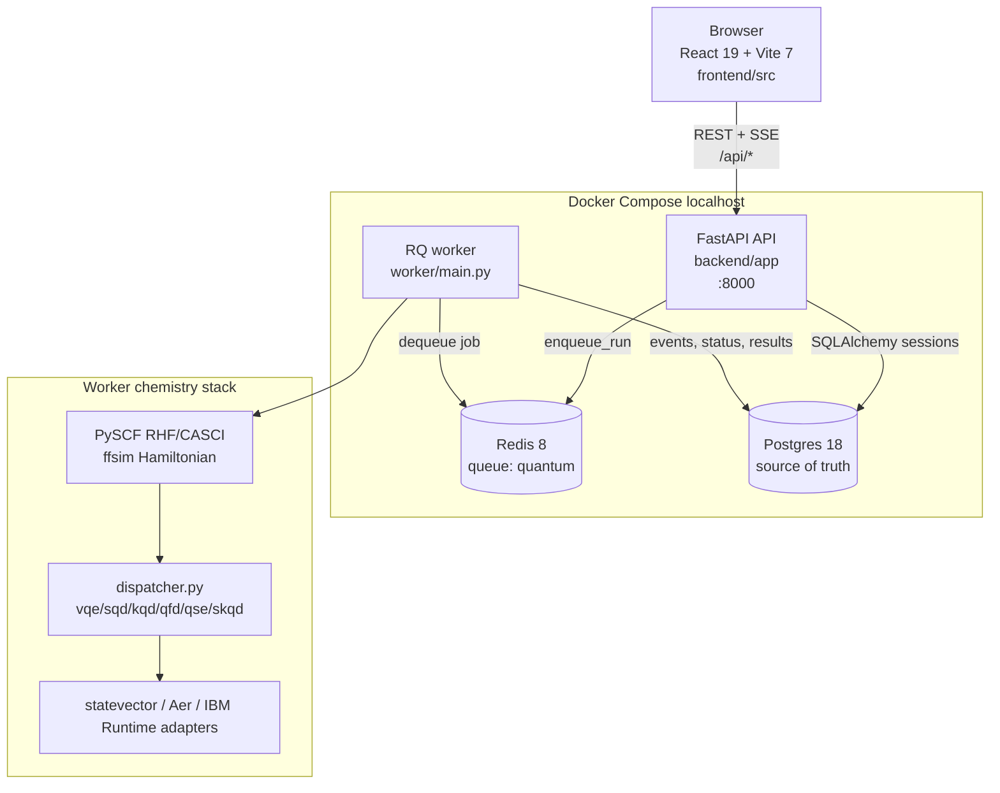
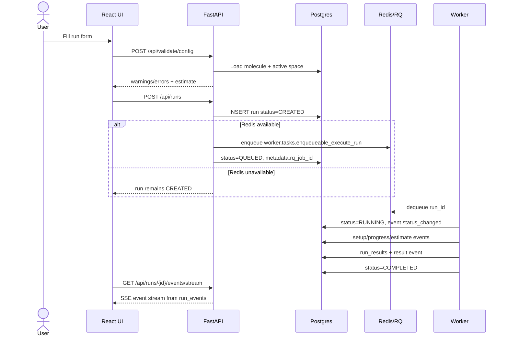
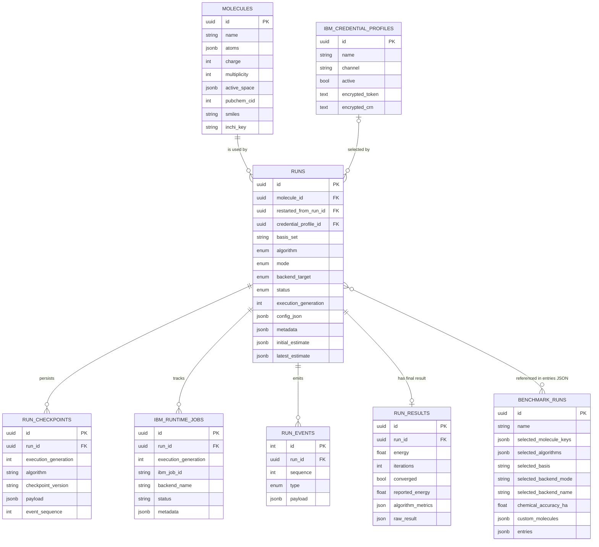
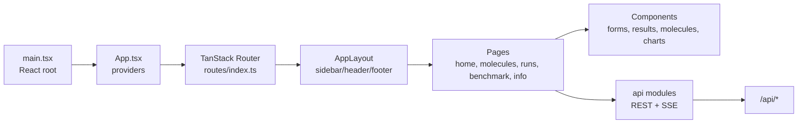
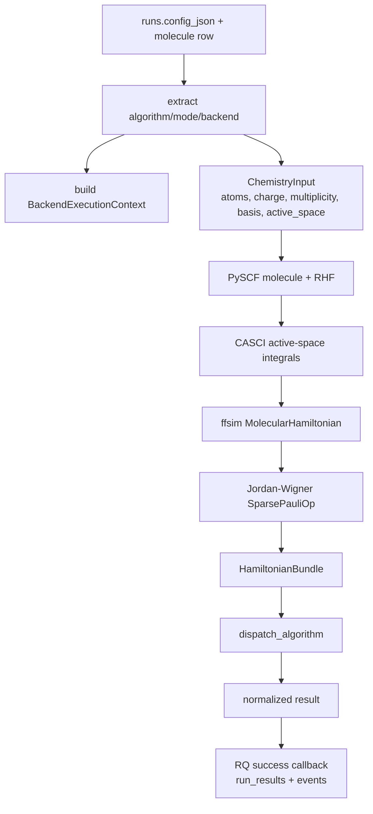

# Application Walkthrough

## Scope

This is the high-level implementation guide for the current application. It
connects the frontend, API, worker, database, queue, and quantum chemistry code
into one readable map.

## What This App Does

Quantum Simulation Studio is a localhost full-stack app for configuring and
running molecular quantum chemistry experiments. The frontend collects molecule,
algorithm, backend, and accuracy preferences. The API validates and persists
those requests. The worker builds molecular Hamiltonians and dispatches the
selected algorithm. Postgres stores every molecule, run, event, result, and
export bundle; Redis is only the transient RQ queue.

Supported algorithm identifiers are defined in
[`backend/app/models/enums.py`](../backend/app/models/enums.py):

| Algorithm | Worker runner                                                              |
| --------- | -------------------------------------------------------------------------- |
| `vqe`     | [`worker/chemistry/vqe_solver.py`](../worker/chemistry/vqe_solver.py)   |
| `sqd`     | [`worker/chemistry/sqd_solver.py`](../worker/chemistry/sqd_solver.py)   |
| `kqd`     | [`worker/chemistry/kqd_solver.py`](../worker/chemistry/kqd_solver.py)   |
| `qfd`     | [`worker/chemistry/qfd_solver.py`](../worker/chemistry/qfd_solver.py)   |
| `qse`     | [`worker/chemistry/qse_solver.py`](../worker/chemistry/qse_solver.py)   |
| `skqd`    | [`worker/chemistry/skqd_solver.py`](../worker/chemistry/skqd_solver.py) |

## Runtime Architecture

Primary source files:

| Layer            | Entry points                                                                                                                                     |
| ---------------- | ------------------------------------------------------------------------------------------------------------------------------------------------ |
| Frontend app     | [`frontend/src/main.tsx`](../frontend/src/main.tsx), [`frontend/src/App.tsx`](../frontend/src/App.tsx)                                     |
| Routing          | [`frontend/src/routes/index.ts`](../frontend/src/routes/index.ts), [`frontend/src/router.tsx`](../frontend/src/router.tsx)                 |
| API modules      | [`frontend/src/api/`](../frontend/src/api)                                                                                                    |
| API app          | [`backend/app/main.py`](../backend/app/main.py), [`backend/app/api/v1/router.py`](../backend/app/api/v1/router.py)                         |
| API services     | [`backend/app/services/run.py`](../backend/app/services/run.py), [`backend/app/services/molecule.py`](../backend/app/services/molecule.py) |
| Queue service    | [`backend/app/services/queue_service.py`](../backend/app/services/queue_service.py)                                                           |
| Worker entry     | [`worker/main.py`](../worker/main.py), [`worker/tasks.py`](../worker/tasks.py)                                                             |
| Worker execution | [`worker/jobs/execute_run.py`](../worker/jobs/execute_run.py), [`worker/jobs/__init__.py`](../worker/jobs/__init__.py)                     |
| Database models  | [`backend/app/models/`](../backend/app/models)                                                                                                |
| Migration        | [`backend/alembic/versions/20260511_0001_initial_schema.py`](../backend/alembic/versions/20260511_0001_initial_schema.py)                     |

## Request And Run Lifecycle

The API treats Postgres as authoritative. Redis can be absent; in that case the
run is still created with `CREATED` status and can be inspected/exported, but it
will not execute until it is queued.

Important lifecycle files:

| Concern                                   | File                                                                                 |
| ----------------------------------------- | ------------------------------------------------------------------------------------ |
| Run creation, validation, enqueue, cancel | [`backend/app/services/run.py`](../backend/app/services/run.py)                   |
| REST endpoints and SSE stream             | [`backend/app/api/v1/endpoints/runs.py`](../backend/app/api/v1/endpoints/runs.py) |
| Worker job body                           | [`worker/jobs/execute_run.py`](../worker/jobs/execute_run.py)                     |
| Worker success/failure callbacks          | [`worker/jobs/__init__.py`](../worker/jobs/__init__.py)                           |
| Event insertion and sequence locking      | [`worker/persistence/run_repository.py`](../worker/persistence/run_repository.py) |
| Frontend API modules and SSE subscriber   | [`frontend/src/api/`](../frontend/src/api)                                        |

## Data Model

The schema is implemented in
[`backend/app/models/molecule.py`](../backend/app/models/molecule.py),
[`backend/app/models/benchmark_run.py`](../backend/app/models/benchmark_run.py),
[`backend/app/models/run.py`](../backend/app/models/run.py),
[`backend/app/models/ibm_credential_profile.py`](../backend/app/models/ibm_credential_profile.py),
[`backend/app/models/run_checkpoint.py`](../backend/app/models/run_checkpoint.py),
[`backend/app/models/ibm_runtime_job.py`](../backend/app/models/ibm_runtime_job.py),
[`backend/app/models/run_event.py`](../backend/app/models/run_event.py), and
[`backend/app/models/run_result.py`](../backend/app/models/run_result.py).
The current DB shape comes from the consolidated initial migration
[`20260511_0001_initial_schema.py`](../backend/alembic/versions/20260511_0001_initial_schema.py)
plus the control/profile extension
[`20260531_0002_controls_profiles_imports.py`](../backend/alembic/versions/20260531_0002_controls_profiles_imports.py)
and the IBM profile-name snapshot follow-up
[`20260601_0003_ibm_profile_name_snapshot.py`](../backend/alembic/versions/20260601_0003_ibm_profile_name_snapshot.py),
plus the saved benchmark snapshot table
[`20260602_0004_benchmark_runs.py`](../backend/alembic/versions/20260602_0004_benchmark_runs.py).

## API Surface

The router is assembled in
[`backend/app/api/v1/router.py`](../backend/app/api/v1/router.py). The
implemented groups are:

| Prefix                 | Endpoint file                                                       | Purpose                                                            |
| ---------------------- | ------------------------------------------------------------------- | ------------------------------------------------------------------ |
| `/api/molecules`       | [`molecules.py`](../backend/app/api/v1/endpoints/molecules.py)   | CRUD, summaries, PubChem search/import, XYZ preview/import         |
| `/api/runs`            | [`runs.py`](../backend/app/api/v1/endpoints/runs.py)             | create/list/detail, control actions, checkpoints, events, export   |
| `/api/benchmarks`      | [`benchmarks.py`](../backend/app/api/v1/endpoints/benchmarks.py) | persist and manage saved benchmark dashboards                      |
| `/api/backends`        | [`backends.py`](../backend/app/api/v1/endpoints/backends.py)     | backend discovery, resolution, transpile preview                   |
| `/api/basis-sets`      | [`basis_sets.py`](../backend/app/api/v1/endpoints/basis_sets.py) | basis-set metadata for forms and benchmark presets                 |
| `/api/settings`        | [`settings.py`](../backend/app/api/v1/endpoints/settings.py)     | encrypted IBM credential profile management and profile validation |
| `/api/validate/config` | [`validate.py`](../backend/app/api/v1/endpoints/validate.py)     | semantic run validation                                            |
| `/api/health`          | [`health.py`](../backend/app/api/v1/endpoints/health.py)         | liveness                                                           |
| `/api/status`          | [`health.py`](../backend/app/api/v1/endpoints/health.py)         | readiness for DB and Redis                                         |

The detailed endpoint contract is maintained in
[`api-endpoints.md`](api-endpoints.md), and schema shapes are in
[`schemas.md`](schemas.md).

## Frontend Structure

Frontend routes live in
[`frontend/src/routes/index.ts`](../frontend/src/routes/index.ts):

| Route                      | Page                                                                            |
| -------------------------- | ------------------------------------------------------------------------------- |
| `/`                        | [`home-page.tsx`](../frontend/src/pages/home-page.tsx)                       |
| `/molecules`               | [`molecules-page.tsx`](../frontend/src/pages/molecules-page.tsx)             |
| `/molecules/$moleculeId`   | [`molecule-detail-page.tsx`](../frontend/src/pages/molecule-detail-page.tsx) |
| `/runs`                    | [`runs-list-page.tsx`](../frontend/src/pages/runs-list-page.tsx)             |
| `/runs/new`                | [`run-create-page.tsx`](../frontend/src/pages/run-create-page.tsx)           |
| `/runs/$runId`             | [`run-detail-page.tsx`](../frontend/src/pages/run-detail-page.tsx)           |
| `/benchmarks`              | [`benchmark-runs-page.tsx`](../frontend/src/pages/benchmark-runs-page.tsx)   |
| `/benchmarks/new`          | [`benchmark-page.tsx`](../frontend/src/pages/benchmark-page.tsx)             |
| `/benchmarks/$benchmarkId` | [`benchmark-page.tsx`](../frontend/src/pages/benchmark-page.tsx)             |
| `/info/*`                  | [`frontend/src/pages/info/`](../frontend/src/pages/info)                     |
| `/help/parameters`         | [`help-parameters-page.tsx`](../frontend/src/pages/help-parameters-page.tsx) |
| `/settings`                | [`settings-page.tsx`](../frontend/src/pages/settings-page.tsx)               |

The benchmark history at `/benchmarks` lists persisted benchmark batches from
`GET /api/benchmarks`. Starting a new benchmark opens `/benchmarks/new`; opening
an existing batch uses `/benchmarks/$benchmarkId`. The dashboard still submits
ordinary `/api/runs` jobs for the selected molecule/algorithm matrix, then
creates or patches the saved benchmark snapshot through `/api/benchmarks`.
Snapshots are stored in the `benchmark_runs` table and include row state plus
referenced `runId` values.

The run form is centered around
[`frontend/src/components/forms/run-form.tsx`](../frontend/src/components/forms/run-form.tsx)
and the algorithm-specific panels under
[`frontend/src/components/forms/run-form/advanced-panels/`](../frontend/src/components/forms/run-form/advanced-panels).
Frontend validation lives in
[`frontend/src/lib/run-form-schema.ts`](../frontend/src/lib/run-form-schema.ts),
and payload construction lives in
[`frontend/src/lib/run-create-payload.ts`](../frontend/src/lib/run-create-payload.ts).

## Worker Chemistry Pipeline

Key files:

| Stage                 | File                                                                                       |
| --------------------- | ------------------------------------------------------------------------------------------ |
| Molecule preparation  | [`worker/chemistry/molecule_builder.py`](../worker/chemistry/molecule_builder.py)       |
| Hamiltonian build     | [`worker/chemistry/hamiltonian_builder.py`](../worker/chemistry/hamiltonian_builder.py) |
| Chemistry dataclasses | [`worker/chemistry/types.py`](../worker/chemistry/types.py)                             |
| Backend selector      | [`worker/chemistry/backend_selector.py`](../worker/chemistry/backend_selector.py)       |
| Algorithm registry    | [`worker/jobs/dispatcher.py`](../worker/jobs/dispatcher.py)                             |
| Result normalization  | [`worker/adapters/result_adapter.py`](../worker/adapters/result_adapter.py)             |

## Backend Targets

| Target          | Current behavior                                                                                                                                                                                                                                     |
| --------------- | ---------------------------------------------------------------------------------------------------------------------------------------------------------------------------------------------------------------------------------------------------- |
| `statevector`   | Uses Qiskit SDK `StatevectorEstimator` and `StatevectorSampler`; no noise profile support.                                                                                                                                                           |
| `aer_simulator` | Uses Qiskit Aer V2 primitives for VQE/SQD/QSE/SKQD-style primitive paths; KQD/QFD use Aer state propagation for small systems and Aer branch-estimator matrix elements for larger systems.                                                           |
| `ibm_runtime`   | Credential-gated. Uses IBM Runtime `EstimatorV2`/`SamplerV2`, records job ids and Runtime status events, and transpiles circuits to backend ISA layouts. KQD/QFD measure capped projected matrix elements and keep the generalized eigensolve local. |

Backend discovery and preview logic is implemented in
[`backend/app/services/backend_runtime.py`](../backend/app/services/backend_runtime.py).
Worker-side adapters live in [`worker/adapters/`](../worker/adapters).

## Configuration And Deployment

The local runtime is defined by
[`docker-compose.yml`](../docker-compose.yml):

| Service  | Purpose           | Port            |
| -------- | ----------------- | --------------- |
| `ui`     | Vite dev server   | `5173`          |
| `api`    | FastAPI + Uvicorn | `8000`          |
| `worker` | RQ worker         | none            |
| `db`     | Postgres 18       | internal `5432` |
| `redis`  | Redis 8 queue     | `6379`          |

The API and worker both read the repository-root `.env` through Pydantic
Settings. The API requires `DATABASE_URL` and `REDIS_URL`; Compose builds those
from `DB_*` values. IBM Runtime access comes from encrypted credential profiles
saved through `/settings`, not from repository `.env` secrets.

## How To Read The Code

1. Start with the route that matches the user action:
   [`frontend/src/routes/index.ts`](../frontend/src/routes/index.ts).
2. Follow the page component into the UI feature folder:
   [`frontend/src/pages/`](../frontend/src/pages) and
   [`frontend/src/components/`](../frontend/src/components).
3. Follow API calls through the domain modules under
   [`frontend/src/api/`](../frontend/src/api).
4. Match the API endpoint under
   [`backend/app/api/v1/endpoints/`](../backend/app/api/v1/endpoints).
5. Move into the service layer under
   [`backend/app/services/`](../backend/app/services).
6. For execution behavior, follow `queue_service.enqueue_run()` into
   [`worker/tasks.py`](../worker/tasks.py) and
   [`worker/jobs/execute_run.py`](../worker/jobs/execute_run.py).
7. For persisted state, use the model files under
   [`backend/app/models/`](../backend/app/models) and the migration under
   [`backend/alembic/versions/`](../backend/alembic/versions).
