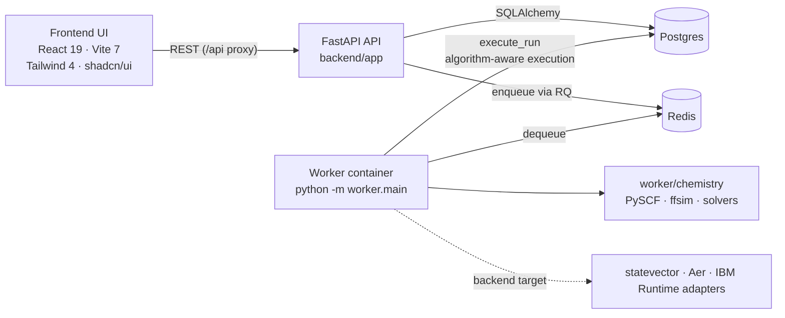
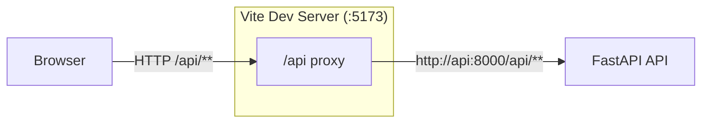
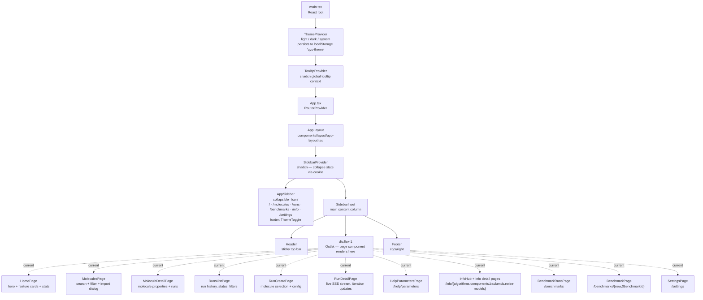
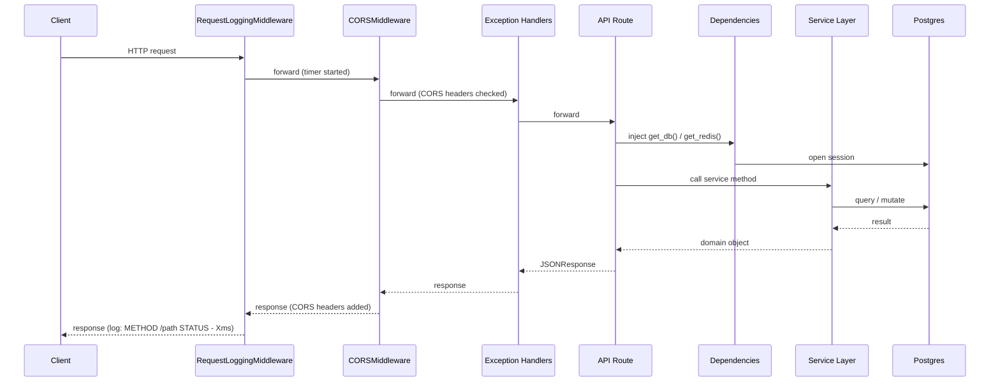

# Current Runtime Architecture

## Scope

Describe the runtime architecture implemented by the checked-in application,
including backend-worker integration status.

## Runtime Component Model (Current)

- `frontend/` UI (React 19, Vite 7, Tailwind 4 CSS-first, shadcn/ui slate,
  TanStack Router component-based) talks to the API over REST. In development
  the Vite dev server proxies `/api` → `http://api:8000` so the browser never
  needs to address the API directly.
- `backend/` provides molecules, runs, benchmarks, backend discovery, basis-set
  metadata, settings, validation, run events, health, and readiness endpoints.
- Postgres stores persistent state (`Molecule`, `Run`, `BenchmarkRun`,
  `RunEvent`, `RunResult`, checkpoint, and IBM Runtime/profile models).
- Redis is configured for queue transport.
- `worker/` is a top-level package that runs an RQ worker process. Job execution
  uses the algorithm-aware path described in
  [`worker-and-queue.md`](worker-and-queue.md).

## Current DB Contract Highlights

- `molecules` use typed atomic structure (`atoms`, `charge`, `multiplicity`,
  `active_space`) rather than legacy `geometry/description`. Basis selection is
  stored per run as `runs.basis_set`.
- `runs.status` is enum-backed in ORM with values: `CREATED`, `QUEUED`,
  `RUNNING`, `COMPLETED`, `FAILED`, `CANCELLED`, `SUBMITTED_TO_IBM`, `PAUSING`,
  and `PAUSED`.
- `runs` include nullable JSON `metadata` (ORM attribute `run_metadata`),
  version snapshot JSON, and first-class `algorithm`, `mode`, and
  `backend_target` columns for algorithm-aware execution.
- `run_results` include a normalized `algorithm_metrics` JSON column in addition
  to `raw_result`.
- `run_events.type` is enum-backed in ORM (`status_changed`, `iteration_update`,
  `estimate_updated`, `error`, `result`, `ibm_job_submitted`,
  `ibm_status_poll`).
- DB-level cascade deletes are configured from `runs` to `run_events`,
  `run_results`, `run_checkpoints`, and `ibm_runtime_jobs` via foreign keys with
  `ON DELETE CASCADE`.
- Alembic applies a consolidated base migration plus focused follow-ups for run
  controls, IBM profile-name snapshots, and saved benchmark dashboards. See
  [`data-model.md`](data-model.md) for the full migration story.

## Implemented vs Scaffold Status

| Component                                                             | Status      | Notes                                                                                                                                                                                                                                                                                                                                                          |
| --------------------------------------------------------------------- | ----------- | -------------------------------------------------------------------------------------------------------------------------------------------------------------------------------------------------------------------------------------------------------------------------------------------------------------------------------------------------------------- |
| FastAPI API (`backend/app/main.py`)                                   | Implemented | `/api/molecules`, `/api/runs`, `/api/benchmarks`, `/api/backends`, `/api/basis-sets`, `/api/settings`, `/api/validate`, `/api/health`, `/api/status`; optional PubChem background sync fires on startup                                                                                                                                                        |
| Service + DB layer (`backend/app/services/*`, `backend/app/models/*`) | Implemented | Synchronous SQLAlchemy services run in synchronous route handlers; async handlers are reserved for awaited I/O, streaming, or explicit threadpool boundaries                                                                                                                                                                                                   |
| Middleware stack (`CORS`, `RequestLoggingMiddleware`)                 | Implemented | Outermost raw-ASGI logging + CORS from `Settings.cors_origins`                                                                                                                                                                                                                                                                                                 |
| Redis queue enqueue                                                   | Implemented | `RunService.create()` enqueues via `queue_service.enqueue_run()` when Redis is up                                                                                                                                                                                                                                                                              |
| Worker package layout (`worker/*`)                                    | Implemented | `jobs/`, `chemistry/`, `adapters/`, `exceptions/`, `persistence/`, `tests/` plus `tasks.py`, `main.py`, `config.py`, `db.py`                                                                                                                                                                                                                                   |
| SSE run event stream endpoint                                         | Implemented | `GET /api/runs/{id}/events/stream` via `sse_starlette`                                                                                                                                                                                                                                                                                                         |
| `backend/app/core/` — logging & config                                | Implemented | `logging.py` (RequestLoggingMiddleware); centralized app configuration                                                                                                                                                                                                                                                                                         |
| `backend/app/database/` — session management                          | Implemented | `base.py` (declarative base), `session.py` (`create_engine_sync`, `create_async_engine_sync`, `create_session_factory_sync`, `create_async_session_factory`)                                                                                                                                                                                                   |
| Worker run execution logic (`worker/jobs/execute_run.py`)             | Implemented | Algorithm-aware execution: VQE, SQD, KQD, QFD, QSE and SKQD dispatch with cancellation detection, progress events and normalized result                                                                                                                                                                                                                        |
| Worker chemistry pipeline (`worker/chemistry/*`)                      | Implemented | Worker-owned PySCF → ffsim molecule/Hamiltonian builders; VQE/SQD/KQD/QFD/QSE/SKQD solvers; KQD circuit-artifact composition; QSE reference-policy, reference-input, sector-ranking, excitation, and basis helpers; shared state-vector, projected-subspace, and energy helpers; pure SKQD distribution diagnostics; and bounded LRU cache for dense operators |
| Worker adapters (`worker/adapters/*`)                                 | Implemented | `statevector_adapter.py`, `aer_adapter.py`, and credential-gated `ibm_adapter.py` provide primitive factories and execution metadata                                                                                                                                                                                                                           |
| Backend discovery/list/resolve/preview                                | Implemented | `/api/backends`, `/api/backends/resolve`, and `/api/backends/transpile-preview`; IBM discovery reports credential warnings instead of fake availability                                                                                                                                                                                                        |
| Worker persistence (`worker/persistence/run_repository.py`)           | Implemented | Repository owns worker lifecycle, event, result, checkpoint, IBM observation, and progress writes; worker job code calls the repository directly                                                                                                                                                                                                               |
| Frontend scaffold (`frontend/src/*`)                                  | Implemented | React 19, Vite 7, Tailwind 4, shadcn/ui slate, TanStack Router (component-based); `generate:types` script wires openapi-typescript                                                                                                                                                                                                                             |

## Current Component Diagram



## Frontend Layer

The frontend is a single-page application served by the Vite dev server on
port 5173. All API calls use the `/api` path prefix, which the Vite dev server
proxies to the `api` container at `http://api:8000` — the browser never speaks
directly to the backend.

Full frontend documentation: [`frontend.md`](frontend.md)

### Network Flow



The `generate:types` script will generate checked-in transport types from a
deterministic application OpenAPI schema with openapi-typescript. Frontend form
state and UI view models remain handwritten. Generated transport types must not
be edited manually.

### Component Tree



### Route Tree (Current)

| Path                               | Component                 | Status                   |
| ---------------------------------- | ------------------------- | ------------------------ |
| `/`                                | `HomePage`                | Implemented              |
| `/molecules`                       | `MoleculesPage`           | Implemented              |
| `/molecules/$moleculeId`           | `MoleculeDetailPage`      | Implemented              |
| `/runs`                            | `RunsListPage`            | Implemented              |
| `/runs/new`                        | `RunCreatePage`           | Implemented              |
| `/runs/$runId`                     | `RunDetailPage`           | Implemented              |
| `/benchmarks`                      | `BenchmarkRunsPage`       | Implemented              |
| `/benchmark`                       | `BenchmarkPage`           | Implemented legacy alias |
| `/benchmarks/new`                  | `BenchmarkPage`           | Implemented              |
| `/benchmarks/$benchmarkId`         | `BenchmarkPage`           | Implemented              |
| `/help/parameters`                 | `HelpParametersPage`      | Implemented              |
| `/info`                            | `InfoHubPage`             | Implemented              |
| `/info/algorithms`                 | `InfoAlgorithmsPage`      | Implemented              |
| `/info/algorithms/$algorithmId`    | `InfoAlgorithmDetailPage` | Implemented              |
| `/info/components`                 | `InfoComponentsPage`      | Implemented              |
| `/info/components/$componentId`    | `InfoComponentDetailPage` | Implemented              |
| `/info/backends`                   | `InfoBackendsPage`        | Implemented              |
| `/info/backends/$backendId`        | `InfoBackendDetailPage`   | Implemented              |
| `/info/noise-models`               | `InfoNoiseModelsPage`     | Implemented              |
| `/info/noise-models/$noiseModelId` | `InfoNoiseDetailPage`     | Implemented              |
| `/settings`                        | `SettingsPage`            | Implemented              |

All routes share `AppLayout` as their root route component. The `rootRoute`'s
`notFoundComponent` and the router's `defaultNotFoundComponent` both point to
`NotFoundPage` for unmatched URLs only.

## Backend-Worker Integration Reality

1. `POST /api/runs/` persists a run and immediately attempts to enqueue it.
2. If Redis is reachable, `queue_service.enqueue_run()` enqueues the task and
   the run transitions to `QUEUED`. If Redis is unavailable, the run stays in
   `CREATED`; see [Graceful Degradation](#graceful-degradation).
3. Worker process can start and bind to Redis queue `quantum`. The `execute_run`
   task body uses an algorithm-aware execution path that:

- Dispatches VQE, SQD, KQD, QFD, QSE, and SKQD runs through the chemistry
  solvers
- Emits `iteration_update` events with setup and progress metadata
- Checks for cancellation before each iteration
- Transitions to COMPLETED, creates RunResult, emits final events
- On failure: transitions to FAILED, emits error event

4. Readiness endpoint (`GET /api/status`) returns `StatusResponse` with fields
   `api: "ready"`, `db: "connected|disconnected|unknown"`, and
   `redis: "connected|disconnected|unknown"`. `GET /api/health` is a separate
   liveness probe that always returns `200`.

---

## Middleware Stack

FastAPI assembles middleware in last-registered-first-executed order. The stack
from outermost (first to receive a request) to innermost:

```text
RequestLoggingMiddleware  <- raw ASGI, logs every HTTP request/response
    └── CORSMiddleware    <- preflight + Access-Control headers
            └── FastAPI exception handlers
                    └── API routes
```

### RequestLoggingMiddleware

Implemented in `backend/app/middleware/logging.py` as raw ASGI (not
`BaseHTTPMiddleware`) to avoid buffering response bodies, which preserves SSE
streaming compatibility.

- Logs: `METHOD /path?sanitized_query STATUS - latencyms` via the `app.access`
  logger at `INFO`.
- Sensitive query parameters (`token`, `password`, `api_key`, `secret`,
  `authorization`, `ibm_quantum_token`, `access_token`, `refresh_token`) are
  replaced with `***` before logging.
- Non-HTTP ASGI scopes (lifespan, WebSocket) pass through without logging.
- A log record is always emitted in the `finally` block, so failures still
  produce a `500` entry with latency.

### CORS Middleware

FastAPI's built-in `CORSMiddleware` is configured from `Settings`:

| Setting             | Source                            |
| ------------------- | --------------------------------- |
| `allow_origins`     | `Settings.cors_origins` (list)    |
| `allow_credentials` | `Settings.cors_allow_credentials` |
| `allow_methods`     | `Settings.cors_allow_methods`     |
| `allow_headers`     | `Settings.cors_allow_headers`     |

Preflight `OPTIONS` requests from allowed origins receive a `200` with
`Access-Control-Allow-*` headers. Requests from disallowed origins receive no
`Access-Control-Allow-Origin` header (browser blocks the response). Wildcard
origins are accepted only when credentialed CORS requests are disabled.

### Exception Handlers

| Exception type           | Handler                        | HTTP status       |
| ------------------------ | ------------------------------ | ----------------- |
| `APIException`           | `api_exception_handler`        | `exc.status_code` |
| `RequestValidationError` | `validation_exception_handler` | `422`             |
| `Exception` (catch-all)  | `unhandled_exception_handler`  | `500`             |

All handlers return the `ErrorResponse` envelope (`detail.code`,
`detail.message`, `detail.field`). The catch-all handler logs the full traceback
server-side but returns a sanitized `"An unexpected error occurred"` message to
clients.

### Dependency Injection

| Dependency       | Module             | Behaviour                                                                                                 |
| ---------------- | ------------------ | --------------------------------------------------------------------------------------------------------- |
| `get_db()`       | `app.dependencies` | Sync `Session` built from `request.app.state.session_factory` (seeded by `lifespan`); closes in `finally` |
| `get_async_db()` | `app.dependencies` | Async `AsyncSession` built from `request.app.state.async_session_factory`; used by the SSE endpoint       |
| `get_redis()`    | `app.dependencies` | `Redis.from_url(settings.redis_url)`; yields `None` with a warning if init fails                          |

### Route Execution Rule

Use synchronous handlers for synchronous database and service work. Use async
handlers only for awaited I/O, streaming, or explicit threadpool offload. The
run route tests cover the synchronous lookup boundary and the asynchronous
creation boundary.

Both session factories are created once by the `lifespan` context manager in
`backend/app/main.py` and attached to `app.state` alongside the engines. The
lifespan also kicks off the non-blocking background PubChem sync task unless
`settings.skip_pubchem_sync` is set.

### Request Lifecycle Sequence



---

## Graceful Degradation

The API remains operational when optional dependencies are unavailable:

### Redis unavailable

`get_redis()` catches connection errors and yields `None`. Services that receive
`redis_client=None` skip queue operations:

- `RunService.create()` creates the run with `CREATED` status instead of
  `QUEUED`. The run is persisted and accessible; it simply won't be processed
  until Redis recovers and the job is enqueued externally.
- `RunService.cancel()` still transitions the DB status; queue cleanup is
  best-effort and skipped when Redis is absent.
- `GET /api/status` reports `redis: "disconnected"` and returns HTTP 503.
  `GET /api/health` remains a liveness-only `{"status": "ok"}` endpoint.

### Worker unavailable

If Redis is running but no worker process is consuming the `quantum` queue:

- Runs enqueue successfully and remain in `QUEUED` state.
- The current readiness response does not include worker status. Queued jobs
  remain visible through run status and Redis/RQ inspection.
- Jobs accumulate in the queue and execute as soon as a worker (re-)connects.
