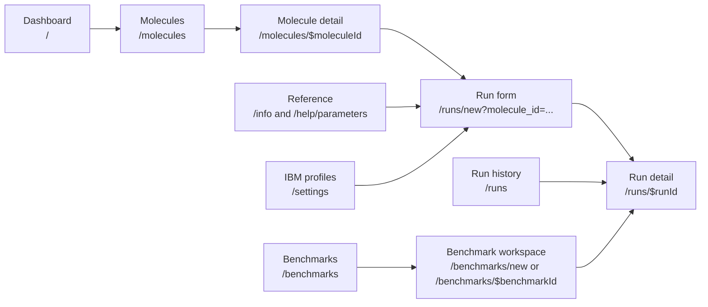
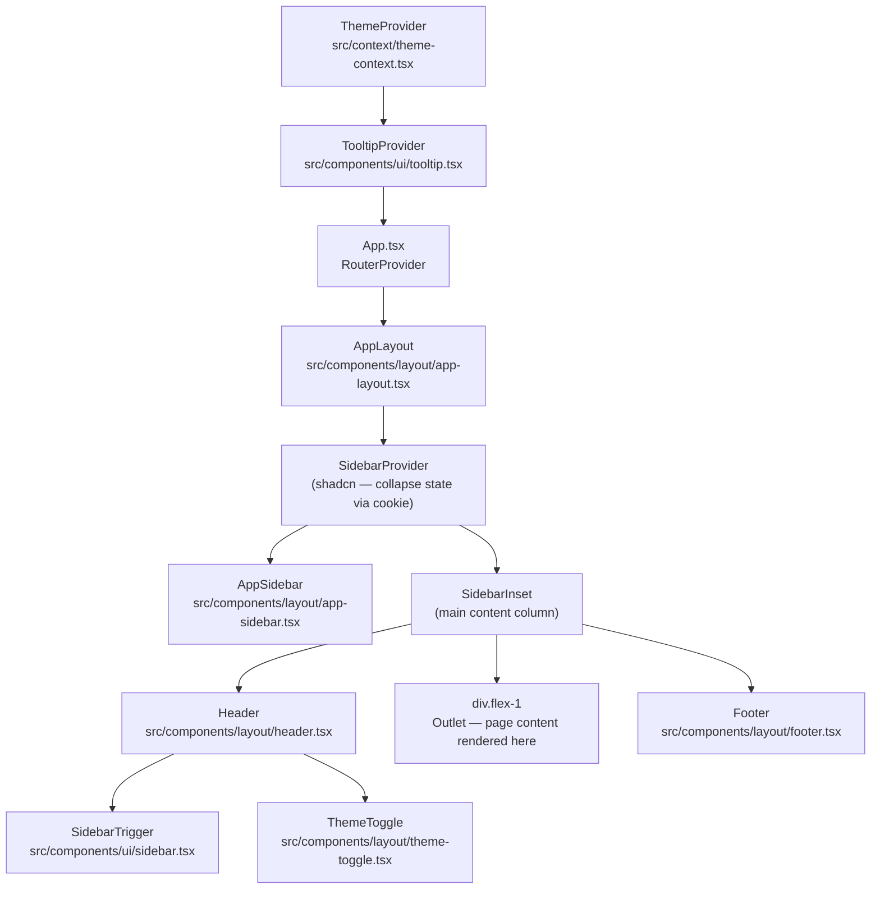
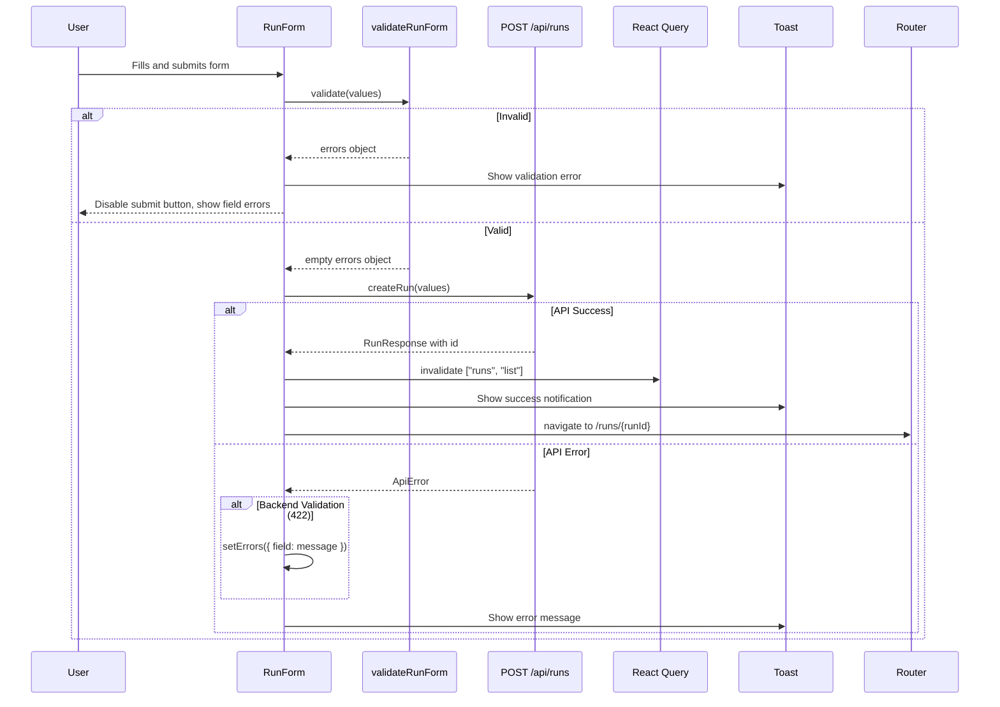
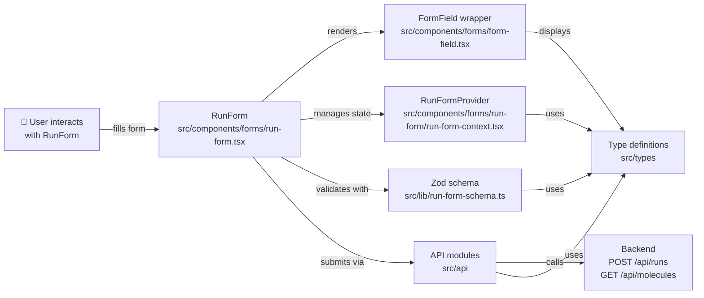
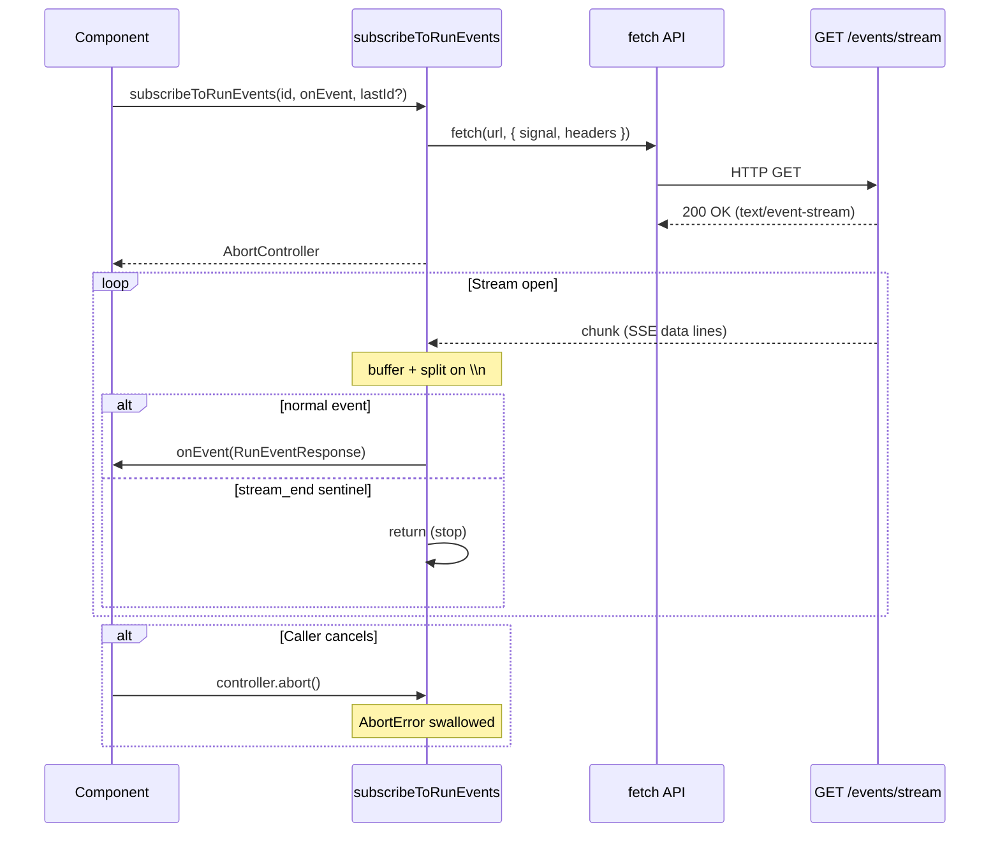
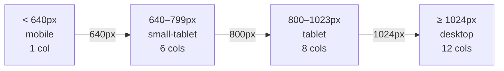

# Frontend

## Scope

Authoritative reference for the frontend: technology choices, component
architecture, theming, routing, CSS system, and testing setup.

---

## 1. Overview

The frontend is a Vite-served React single-page application on port `5173`. It
provides the browser interface for Quantum Simulation Studio: molecule
management, simulation setup, live run tracking, result inspection, and
benchmark comparison.

All API communication uses the `/api` path prefix. In development, the Vite
server proxies those calls to `http://api:8000`, so browser code does not need a
container-internal backend URL.

### Product Surface



- **Dashboard** gives entry points into molecules, runs, benchmarks, and summary
  counters backed by lightweight list APIs.
- **Molecule workflows** support search, PubChem/XYZ import, detail inspection,
  2D/3D visualization, and a prefilled handoff into run creation.
- **Run workflows** cover algorithm-aware configuration, validation feedback,
  easy/manual modes, backend selection, SSE progress, run controls, convergence
  charts, result tiles, event logs, and exportable provenance.
- **Benchmark workflows** compare algorithms across molecules, persist saved
  dashboards, link rows back to generated runs, and visualize accuracy/runtime
  tradeoffs.
- **Reference and settings pages** provide algorithm/backend/noise-model notes,
  parameter glossary anchors, and encrypted IBM Runtime profile management.

### Platform Behavior

- Shared degraded-state cards handle API outages on data-backed pages.
- The app shell uses a collapsible sidebar, light/dark/system theme handling,
  typed route metadata, Sonner toasts, and route-level lazy loading.
- IBM-sensitive API calls pass through the local operator-token proxy layer.

### Tech Stack Summary

| Technology             | Version | Role                                               |
| ---------------------- | ------- | -------------------------------------------------- |
| React                  | 19.x    | UI component model                                 |
| TypeScript             | 5.x     | Static typing                                      |
| Vite                   | 7.x     | Dev server, bundler, test runner host              |
| Tailwind CSS           | 4.x     | Utility-first CSS (CSS-first, no config file)      |
| shadcn/ui              | latest  | Accessible component primitives (New York / slate) |
| TanStack Router        | 1.x     | Component-based, type-safe routing                 |
| Vitest                 | 4.x     | Unit + component test runner                       |
| Testing Library        | 16.x    | DOM + user-event testing utilities                 |
| lucide-react           | 0.575.x | Icon set                                           |
| openapi-typescript     | 7.x     | Deterministic OpenAPI type generation script       |
| 3dmol                  | 2.5.4   | 3D molecular structure viewer                      |
| react-grid-layout      | 2.2.2   | Responsive grid layout                             |
| @radix-ui/react-slider | 1.x     | Run-form numeric slider primitive                  |

---

## 2. Directory Structure

```text
frontend/src/
├── App.tsx                       # Root component — mounts RouterProvider + ViewerPreferencesProvider
├── index.css                     # Global styles: Tailwind import + CSS variable tokens
├── main.tsx                      # Entry point: React root, ThemeProvider, TooltipProvider, Toaster
├── router.tsx                    # TanStack Router registration + type augmentation
├── vite-env.d.ts                 # Vite/TS ambient type declarations
│
├── components/
│   ├── bulk-actions/            # Shared edit-mode selection state + toolbar used by list pages
│   ├── filters/                 # Shared typed filter controls, selection indicators, chips, and clear-all action
│   │   └── filter-primitives.tsx # Reusable trigger, option, selection, active-chip, and clear-filter controls
│   ├── forms/                    # Form components and form-specific controls
│   │   ├── form-field.tsx        # Reusable field wrapper with label, required indicator, error display
│   │   ├── form-error.tsx        # Error message display component
│   │   └── run-form.tsx          # RunForm component for creating algorithm-aware simulation runs
│   ├── layout/                   # Application shell (not page-specific)
│   │   ├── app-layout.tsx        # Root layout: SidebarProvider + AppSidebar + SidebarInset
│   │   ├── app-sidebar.tsx       # Collapsible navigation sidebar (icon-only when collapsed)
│   │   ├── header.tsx            # Sticky top bar container (currently minimal markup)
│   │   ├── footer.tsx            # Copyright footer
│   │   └── theme-toggle.tsx      # Sidebar theme toggle that cycles Light / Dark / System
│   ├── molecules/                # Molecule management components
│   │   ├── molecules-list.tsx    # MoleculesList: URL state and page composition
│   │   ├── molecules-list/       # List states, import flow, and molecule-bulk-delete.ts action owner
│   │   ├── molecule-detail.tsx   # MoleculeDetail: responsive react-grid-layout grid, PubChem metadata, 3D/2D viewer
│   │   ├── molecule-viewer-3d.tsx # 3Dmol.js wrapper for 3D visualization
│   │   └── molecule-viewer-2d.tsx # SVG-based 2D projection viewer
│   ├── motion/                   # Shared motion primitives (MoleculeLoader, etc.)
│   ├── runs/                     # Run-detail components and compatibility exports
│   │   ├── run-detail.tsx        # RunDetail: live detail view with SSE, background refresh, unified outcome card, sticky timeline auto-scroll
│   │   ├── runs-list-row.tsx     # Compatibility export for feature-owned row components
│   │   ├── runs-list-row-utils.ts # Compatibility export for row layout helpers
│   │   └── use-runs-list-filter.ts # Compatibility export for run filter state
│   └── ui/                       # shadcn/ui generated components — do not hand-edit
│       ├── badge.tsx
│       ├── button.tsx
│       ├── card.tsx
│       ├── command.tsx           # Command palette primitives (cmdk); used by MoleculeCombobox
│       ├── confirm-dialog.tsx   # Confirmation dialog component
│       ├── dialog.tsx            # Dialog modal; used by molecule detail expand feature
│       ├── input.tsx
│       ├── label.tsx
│       ├── loading-skeleton-blocks.tsx # Reusable skeleton primitives: TableSkeletonRow, DetailCardSkeleton, SkeletonLines, SkeletonCardGrid
│       ├── molecule-combobox.tsx # Searchable combobox for molecule selection (Popover + Command)
│       ├── popover.tsx           # Popover primitive (Radix); used by MoleculeCombobox
│       ├── route-skeleton-variants.tsx # Per-page skeleton fallback variants for all lazy-loaded routes
│       ├── select.tsx
│       ├── separator.tsx
│       ├── sheet.tsx             # Slide-over drawer; used by sidebar on mobile
│       ├── sidebar.tsx           # shadcn Sidebar primitives (large generated file)
│       ├── skeleton.tsx          # Base Skeleton component with reduced-motion support and shimmer animation
│       ├── sonner.tsx            # Toast notifications — Sonner component
│       └── tooltip.tsx
├── features/
│   ├── benchmarks/               # Benchmark workspace state ownership boundary
│   │   └── state/
│   │       ├── catalog.ts        # Backend capability loading and IBM target resolution
│   │       ├── controls.ts       # Benchmark control actions and status transitions
│   │       ├── control-selectors.ts # Pure control labels, lock, validation, and reset predicates
│   │       ├── control-selectors.test.ts # Control-selector behavior and compatibility facade identity
│   │       ├── polling.ts        # Run and event polling, terminal results, and saved-row refresh
│   │       ├── polling.test.ts   # Polling behavior
│   │       ├── saved-catalog.ts  # Saved benchmark listing, loading, and deletion actions
│   │       ├── history.ts        # Saved-benchmark status, filtering, sorting, and selection policy
│   │       ├── history.test.ts   # History policy behavior and compatibility facade identity
│   │       ├── history-actions.ts # Saved-benchmark actions, batches, and cache updates
│   │       ├── execution.ts      # Benchmark launch sequencing and guarded submission
│   │       ├── execution.test.ts # Execution helpers
│   │       ├── normalization.ts  # Snapshot normalization, cache, and restart-target decisions
│   │       ├── normalization.test.ts # Normalization behavior
│   │       ├── hydration.ts      # Saved-run hydration and workspace reset transitions
│   │       ├── hydration.test.ts # Hydration behavior
│   │       ├── payloads.ts       # Benchmark API snapshot and persistence-signature construction
│   │       ├── payloads.test.ts  # Payload behavior
│   │       ├── route-lifecycle.ts # Route reset, hydration effects, and active-run deactivation
│   │       ├── route-lifecycle.test.ts # Route lifecycle behavior
│   │       ├── persistence.ts    # Active-entry and draft persistence, cache synchronization, and timer cleanup
│   │       ├── persistence.test.ts # Persistence helpers
│   │       ├── selectors.ts      # Entry action predicates, grouping, mode copy, and variant insertion
│   │       ├── selectors.test.ts # Selector behavior
│   │       └── variant-selection.ts # Advanced variant actions and entry reconciliation
│   └── runs/                     # Run-list ownership boundary
│       ├── RunsList.tsx          # Thin feature facade
│       ├── components/
│       │   ├── runs-list-view.tsx # Runs-list rendering composition
│       │   ├── runs-filter-bar.tsx # URL-backed filter controls and active chips
│       │   ├── runs-table.tsx    # Desktop/mobile states, rows, and pagination
│       │   ├── runs-selection-controls.tsx # Toolbar, bulk actions, and confirmation dialogs
│       │   ├── runs-list-row.tsx # Desktop row and mobile card presentation
│       │   ├── runs-list-row-utils.ts # Row grid and identifier helpers
│       │   ├── status-badge.tsx  # RunStatus presentation
│       │   └── status-badge.test.tsx # RunStatus label and variant behavior
│       └── state/
│           ├── filters.ts        # URL-backed filter and sort state
│           ├── selection-actions.ts # Pure selection labels, status overrides, and summaries
│           ├── selection-eligibility.ts # Pure bulk-action status policy
│           ├── run-actions.ts    # Run mutation dispatch adapter
│           ├── use-runs-list-actions.ts # Action state, refresh, overrides, and mutation lifecycle
│           └── use-runs-list-controller.ts # Query, polling, selection, and page coordination
│
├── context/
│   ├── theme-context.tsx         # ThemeProvider, ThemeContext, useTheme hook
│   └── viewer-preferences-context.tsx # ViewerPreferencesProvider, useViewerPreferences hook; persists to localStorage
│
├── hooks/
│   ├── use-local-storage.ts      # Generic localStorage hook; provides state + persistence
│   ├── use-mobile.ts             # Installed by shadcn; viewport-width breakpoint helper
│   ├── pagination.ts             # Shared total-aware pagination and duplicate handling
│   ├── query-options.ts          # Shared cache lifetime, retry, and previous-data options
│   ├── use-query-hooks.ts        # TanStack Query wrappers (molecules, runs, mutations)
│   ├── use-smart-back.ts         # Smart back-button that prefers browser history
│   ├── use-theme.ts              # Re-export of useTheme + Theme type from context
│   └── use-validate-run-debounced.ts # Debounced call into /api/validate/config
│
├── api/
│   ├── runs.ts                   # Run CRUD, controls, results, metadata, and validation
│   ├── sse.ts                    # Run event stream parsing and subscription lifecycle
│   ├── molecules.ts              # Molecule, basis-set, PubChem, and XYZ endpoints
│   ├── benchmarks.ts             # Saved benchmark endpoints
│   ├── profiles.ts               # IBM profile endpoints and capability warm-up
│   ├── backends.ts               # Backend discovery, normalization, and refresh
│   ├── status.ts                 # Service status endpoint
│   ├── backend-capabilities-cache.ts # Shared cache state for profiles and backends
│   └── http.ts                   # Fetch wrapper and API error decoding
│
├── content/
│   └── info/                     # Data for the Info Hub pages (algorithms, components, backends, noise models, shared types)
├── lib/
│   ├── chemistry-utils.ts        # Utility functions for molecular properties (formula, MW, bonds)
│   ├── responsive-columns.ts     # Column-count helpers used by the molecule-detail grid
│   ├── utils.ts                  # cn() helper (clsx + tailwind-merge)
│   └── validation.ts             # Client-side form validators for all run fields
├── state/
│   ├── list-cache.ts             # TanStack Query list-cache helpers
│   └── query-client.ts           # QueryClient configuration + retry policy
├── utils/
│   ├── loading-policy.ts         # shouldUseSkeleton / shouldUseSpinner helpers
│   ├── route-timing.ts           # markRoute + performance-measure helpers (imported from web-vitals)
│   └── web-vitals.ts             # captureWebVitals + emitVital fire-and-forget helpers
│
├── pages/
│   ├── help-parameters-page.tsx  # HelpParametersPage: parameter glossary (`/help/parameters`)
│   ├── home-page.tsx             # Dashboard: hero section + feature cards + stats row
│   ├── info/                     # InfoHub + per-resource pages (algorithms, backends, noise-models; list + detail)
│   ├── benchmark/                # Benchmark workspace state, controls, storage, and utilities
│   │   ├── use-benchmark-state.ts # Compatibility hook facade for benchmark workspace behavior
│   │   ├── benchmark-storage.ts   # Compatibility facade for benchmark hook and saved-run storage
│   │   ├── benchmark-storage-serialization.ts # Local-storage serialization, cleanup, cache validation, and defaults
│   │   ├── benchmark-history-utils.ts # Compatibility export for feature-owned history policy
│   │   ├── use-benchmark-history-controller.ts # Saved-benchmark history state and action orchestration
│   │   ├── molecule-acquisition.ts # Typed molecule lookup, cache, create, and failure outcomes
│   │   ├── use-benchmark-basis-sets.ts # Basis metadata loading, fallback, and selection correction
│   │   ├── benchmark-controls.tsx # Benchmark workspace controls composition
│   │   ├── benchmark-controls-state.ts # Compatibility export for feature-owned control selectors
│   │   ├── benchmark-action-buttons.tsx # Run, pause, resume, and pending-action buttons
│   │   ├── benchmark-action-bar.tsx # Action layout, progress summary, and reset control
│   │   ├── benchmark-results-table.tsx # Grouped benchmark result rows and cell presentation
│   │   ├── benchmark-results-row-actions.tsx # Per-row action menu and confirmation dialogs
│   │   ├── benchmark-mode-section.tsx # Simple/advanced benchmark mode selection
│   │   ├── benchmark-advanced-algorithm-section.tsx # Advanced row counts and variant groups
│   │   ├── benchmark-random-library.ts # Eligible library acquisition and random selection
│   │   ├── use-benchmark-molecule-workspace.ts # Molecule visibility, deletion, and random-library state
│   │   ├── benchmark-history-filters.tsx # Saved benchmark status and backend filters
│   │   ├── benchmark-history-actions.ts # Compatibility export for feature-owned history actions
│   │   ├── benchmark-history-dialogs.tsx # Saved benchmark confirmation and delete dialogs
│   │   ├── benchmark-history-action-dialogs.tsx # Saved benchmark action-dialog composition
│   │   ├── benchmark-history-content.tsx # Saved benchmark loading, empty, and list content
│   │   ├── benchmark-accuracy-matrix.tsx # Accuracy matrix cells, status styling, and run links
│   │   ├── benchmark-insights-formatters.ts # Shared benchmark metric and parameter formatting
│   │   ├── benchmark-insights-geometry.ts # Pure runtime scatter metric and label geometry helpers
│   │   ├── benchmark-panel-expand-button.tsx # Shared fullscreen panel control
│   │   ├── benchmark-scatter-markers.ts # Scatter family shapes, colors, and SVG paths
│   │   ├── benchmark-scatter-tooltips.ts # Algorithm configuration tooltip rows
│   │   ├── benchmark-runtime-scatter-chart.tsx # Scatter axes, points, legend, and hover tooltip
│   │   ├── benchmark-scatter-filters.tsx # Scatter filter controls and empty state
│   │   ├── benchmark-scatter-downloads.tsx # CSV and styled SVG chart exports
│   │   ├── benchmark-scatter-data.ts # Completed-point preparation and scatter filter state helpers
│   │   ├── benchmark-scatter-panel.tsx # Runtime scatter panel composition and controls
│   │   ├── use-benchmark-scatter-filters.ts # Scatter filter derivation and reconciliation state
│   │   ├── benchmark-molecule-selection.tsx # Molecule and algorithm selection cards
│   │   ├── benchmark-execution-settings.tsx # Basis, backend, and accuracy controls
│   │   ├── benchmark-action-menu.tsx # Benchmark overflow action eligibility and menu rendering
│   │   └── benchmark-state/       # Remaining benchmark hook orchestration
│   │       └── use-benchmark-controller.ts # Benchmark hook orchestration behind the public facade
│   ├── benchmark-page.tsx        # BenchmarkPage: shared benchmark workspace for new + saved dashboards
│   ├── benchmark-history-toolbar.tsx # Saved benchmark filter, edit, and bulk-action controls
│   ├── benchmark-runs-page.tsx   # BenchmarkRunsPage: saved benchmark history presentation and layout
│   ├── molecule-detail-page.tsx  # MoleculeDetailPage: page wrapper for /molecules/:moleculeId route
│   ├── molecules-page.tsx        # MoleculesPage: heading, search/filter bar, MoleculesList section
│   ├── run-create-page.tsx       # RunCreatePage: back link + RunForm (constrained to max-w-2xl)
│   ├── run-detail-page.tsx       # RunDetailPage: thin wrapper that reads runId param and renders <RunDetail>
│   └── runs-list-page.tsx        # RunsListPage: heading, New Run button, RunsList section
│
├── test/
│   └── setup.ts                  # Vitest global setup (jest-dom matchers, DOM mocks)
│
└── types/
    ├── profile.ts                # IBM profile API types
    ├── api.ts                    # Stable aliases over generated API transport types
    ├── generated-api.ts          # Generated OpenAPI transport types (do not edit)
    ├── run.ts                    # Barrel exports for run-related types
    ├── run-config.ts             # Run config, molecule, backend, validation, and form types
    ├── run-result.ts             # Result/event/export response types
    └── run-status.ts             # Shared enum/string-literal status types
```

`npm run generate:types` writes `src/types/generated-api.ts` from the FastAPI
OpenAPI schema. The generated file is checked in and is not edited directly.
Use `npm run check:generated-types` to generate into a temporary file and fail
when the checked-in output is stale.
`src/types/api.ts` contains stable aliases and small type adapters over that
file. Handwritten form, chart, and local-storage types remain in the feature
files under `src/types/`.

### API transport boundary

Each endpoint family has a focused module under `src/api/`. These modules use
the aliases in `src/types/api.ts` for request and response transport types.
They convert transport data to the frontend domain types at the module
boundary. This keeps generated server contracts close to HTTP calls while
allowing forms and components to use stable UI models.

Profile endpoints also normalize server defaults at this boundary. For
example, omitted profile `activate` and `channel` values are filled before a
request is sent, and nullable profile identifiers are normalized before they
reach the cache. New endpoint work should follow the same pattern: add the
generated alias, and add a small adapter when the UI model differs. Import each
endpoint family directly. Benchmark history actions import run operations from
`src/api/runs.ts` and benchmark operations from `src/api/benchmarks.ts`.

Runtime identifier tuples have one frontend owner in `src/types/run-status.ts`:
`RUN_STATUSES`, `RUN_ALGORITHMS`, `BACKEND_TARGETS`, and `EASY_GOALS` back route
parsing, form schemas, filters, reference-page IDs, and offline metadata
fallbacks. Benchmark persistence adds its noise-enabled mode to the related
`BENCHMARK_BACKEND_MODES` tuple in `src/types/benchmark.ts`. Consumers should
reuse these values and guards instead of introducing another copy of the wire
identifiers.

### Benchmark fixture ownership

`src/lib/benchmark-presets.ts` owns the benchmark fixture catalog. It contains
molecule geometries, reference energies, benchmark descriptions, and local
benchmark defaults. These values support benchmark setup, comparison, and
storage recovery. They are not service execution policy.

The server catalog owns cross-service identifiers, runtime limits, algorithm and
goal recommendations, and chemical-accuracy target metadata. Keep benchmark
fixtures in the frontend until a reviewed API contract makes them server-owned.

Completed benchmark entries retain normalized execution metadata from the
terminal run result. The state includes the actual execution target and path,
primitive family, requested and effective sampling controls, Aer noise source
and fingerprint, and the worker-observed work ledger when available. The visible
accuracy-versus-runtime CSV exports these fields. A missing field means that the
older result did not record that value; it does not prove hardware execution.

---

## 3. Theming System

### How It Works

Theme state is managed by `ThemeProvider` in `src/context/theme-context.tsx`.
Three stored values are supported:

| Value      | Behavior                                                                             |
| ---------- | ------------------------------------------------------------------------------------ |
| `'light'`  | Resolves to light, removes the `dark` class, and sets `color-scheme: light`          |
| `'dark'`   | Resolves to dark, adds the `dark` class, and sets `color-scheme: dark`               |
| `'system'` | Reads `prefers-color-scheme`, subscribes to changes, and applies the resolved result |

The selected value is persisted to `localStorage` under the key `"qvs-theme"`.
On load, `ThemeProvider` reads `localStorage` first, then falls back to the
`defaultTheme` prop (configured as `'system'` in `main.tsx`). The context also
exposes a `resolvedTheme` value (`'light'` or `'dark'`) so viewers, animated
assets, and other theme-aware components do not need to re-run their own media
query checks.

### Provider Tree

```tsx
// src/main.tsx
<ThemeProvider defaultTheme="system" storageKey="qvs-theme">
  <TooltipProvider>
    <App /> {/* → RouterProvider → AppLayout → page */}
  </TooltipProvider>
</ThemeProvider>
```

### Consuming the Theme

```tsx
import { useTheme } from "@/hooks/use-theme";

function MyComponent() {
  const { theme, resolvedTheme, setTheme } = useTheme();
  // theme: 'light' | 'dark' | 'system'
  // resolvedTheme: 'light' | 'dark'
  // setTheme(t: Theme): persists to localStorage and re-renders
}
```

`useTheme` throws `Error('useTheme must be used within a ThemeProvider')` if
called outside the provider tree.

### How Dark Mode Is Applied

1. `ThemeProvider`'s `useEffect` runs when `theme` changes.
2. For `'dark'`: adds `class="dark"` to `<html>` and sets
   `document.documentElement.style.colorScheme = 'dark'`.
3. For `'system'`: evaluates
   `window.matchMedia('(prefers-color-scheme: dark)')`, applies the result, and
   attaches a `change` listener (cleaned up on re-render).
4. Tailwind's `@custom-variant dark (&:is(.dark *))` in `index.css` activates
   all `dark:` utility classes.
5. The `.dark { }` block in `index.css` overrides all `--*` CSS variable tokens
   with a graphite-dimmed palette built around neutral surfaces, clearer panel
   contrast, and muted semantic/chart accents that fit the darker UI.

### Extending with New Palettes

To add a second color palette in the future (e.g., for branding), use a
`data-theme` attribute approach:

1. Add a new token block in `index.css`:

   ```css
   [data-theme="ocean"] {
     --primary: oklch(0.45 0.2 220);
     /* redefine all semantic tokens */
   }
   ```

2. Extend the `Theme` type in `theme-context.tsx` and update `ThemeProvider` to
   set `data-theme` on `document.documentElement` alongside the `dark` class.
3. Keep `storageKey` changes backward-compatible — existing user preferences
   will still be readable.

---

## 4. Layout Architecture

### Component Composition



### AppLayout Source

```tsx
// src/components/layout/app-layout.tsx
export function AppLayout() {
  return (
    <SidebarProvider defaultOpen={false}>
      <AppSidebar />
      <SidebarInset>
        <Header />
        <div className="flex flex-1 flex-col gap-4 p-6 min-w-0 overflow-x-hidden">
          <Outlet />
        </div>
        <Footer />
      </SidebarInset>
    </SidebarProvider>
  );
}
```

`min-w-0` prevents flex children from overflowing their container;
`overflow-x-hidden` eliminates any horizontal scroll caused by wide content
(e.g., the molecule detail grid during initial paint).

`<Outlet />` is the TanStack Router placeholder where the matched child route's
component is injected.

### Sidebar Behavior

`AppSidebar` uses `collapsible="icon"` on the `<Sidebar>` root:

| State               | Appearance                                                              |
| ------------------- | ----------------------------------------------------------------------- |
| Expanded (desktop)  | Icon + label for each nav item                                          |
| Collapsed (desktop) | Icon only; no hover tooltips                                            |
| Mobile              | Renders in a `Sheet` (slide-over overlay) triggered by `SidebarTrigger` |

Collapse state is persisted between page loads via a browser cookie managed
automatically by `SidebarProvider`.

### Navigation Items

| Route         | Icon           | Position       |
| ------------- | -------------- | -------------- |
| `/`           | `Home`         | Main nav group |
| `/molecules`  | `FlaskConical` | Main nav group |
| `/runs`       | `Play`         | Main nav group |
| `/benchmarks` | `TestTube2`    | Main nav group |
| `/info`       | `BookOpen`     | Main nav group |
| `/settings`   | `Settings`     | Sidebar footer |

Active route styling is applied via TanStack Router's `activeProps` on each
`<Link>`: `bg-sidebar-accent text-sidebar-accent-foreground`.

### Header

Sticky (`position: sticky; top: 0`) inside `SidebarInset`, so it scrolls with
the sidebar but stays fixed relative to the content column. Contains:

**Current behavior:** the header container renders without interactive controls.
Sidebar behavior is controlled by hover-to-expand on the sidebar itself, and the
`ThemeToggle` is rendered in the sidebar footer (not in the header).

---

## 5. Routing

The app uses **TanStack Router** in component-based (non-file-based) mode. The
route tree lives in `src/routes/index.ts`, while `src/router.tsx` registers the
router instance and module augmentation.

### Current Route Tree

```mermaid
graph TD
    Root["rootRoute\ncomponent: AppLayout"]
    Index["/ (indexRoute)\ncomponent: HomePage"]
    Molecules["/molecules\ncomponent: MoleculesPage"]
    MoleculeDetail["/molecules/$moleculeId\ncomponent: MoleculeDetailPage"]
    Runs["/runs\ncomponent: RunsListPage"]
    RunNew["/runs/new\ncomponent: RunCreatePage"]
    RunDetail["/runs/$runId\ncomponent: RunDetailPage → RunDetail"]
    Help["/help/parameters\ncomponent: HelpParametersPage"]
    Info["/info\ncomponent: InfoHubPage"]
    InfoAlg["/info/algorithms\n+ /info/algorithms/$algorithmId"]
    InfoComp["/info/components\n+ /info/components/$componentId"]
    InfoBack["/info/backends\n+ /info/backends/$backendId"]
    InfoNoise["/info/noise-models\n+ /info/noise-models/$noiseModelId"]
    BenchmarkList["/benchmarks\ncomponent: BenchmarkRunsPage"]
    BenchmarkLegacy["/benchmark\ncomponent: BenchmarkPage"]
    BenchmarkNew["/benchmarks/new\ncomponent: BenchmarkPage"]
    BenchmarkDetail["/benchmarks/$benchmarkId\ncomponent: BenchmarkPage"]
    Settings["/settings\ncomponent: SettingsPage"]

    Root --> Index
    Root --> Molecules
    Molecules --> MoleculeDetail
    Root --> Runs
    Runs --> RunNew
    Runs --> RunDetail
    Root --> Help
    Root --> Info
    Info --> InfoAlg
    Info --> InfoComp
    Info --> InfoBack
    Info --> InfoNoise
    Root --> BenchmarkList
    Root --> BenchmarkLegacy
    Root --> BenchmarkNew
    Root --> BenchmarkDetail
    Root --> Settings
```



Run result dashboards are embedded in `/runs/$runId`. Every listed route is
wired to an implemented page.

### Global 404

Both `rootRoute`'s `notFoundComponent` and the `router`'s
`defaultNotFoundComponent` point to `NotFoundPage` — any unmatched URL shows the
same placeholder with a link back to `/`.

### How to Add a New Route

**Step 1** — Create the page component:

```tsx
// src/pages/molecules-page.tsx
export function MoleculesPage() {
  return (
    <div className="flex flex-col gap-6">
      <h1 className="text-2xl font-bold">Molecules</h1>
      {/* page content */}
    </div>
  );
}
```

**Step 2** — Register in `src/routes/index.ts`:

```tsx
import { MoleculesPage } from "@/pages/molecules-page";

const moleculesRoute = createRoute({
  getParentRoute: () => rootRoute,
  path: "/molecules",
  component: MoleculesPage, // replace NotFoundPage
});
```

No changes needed to `AppSidebar` — the `/molecules` link already exists. The
active-route highlight is applied automatically by TanStack Router's
`activeProps` on each `<Link>`.

### Run Routes

Run management is split across three pages:

- `/runs` renders `RunsListPage` — paginated run history with filter + sort
  query params validated by the route's `validateSearch`.
- `/runs/new` renders `RunCreatePage`, which hosts the `RunForm`; after a
  successful submission it pushes `/runs/$runId` onto browser history instead of
  replacing the current entry so the detail view's back button returns to the
  actual originating page (for example benchmark or the runs list).
- `/runs/$runId` renders `RunDetailPage`, which wraps `RunDetail` (live SSE,
  results dashboard, IBM hardware mapping when recorded, timeline, run controls
  for cancel/pause/resume/restart where supported, including in-place resume for
  failed runs, and export for JSON/CSV bundles plus the visible result plots as
  SVGs). The summary tile presents method, backend, and mode as metadata, while
  `src/lib/results/execution-metadata.ts` owns the source precedence that
  normalizes recorded execution fields. Outcome verdicts and interactive
  controls keep their own distinct affordances.
  The dashboard uses a persisted 12-column grid preset per algorithm/backend
  variant, auto-packs new or reset panels into valid slots, stretches lone
  trailing panels when space is available, and keeps circuit/artifact viewers on
  the last selected tab and artifact between reloads. The timeline merges
  estimate updates into progress rows and omits raw result payload rows so bulky
  `algorithm_metrics` content stays in the result dashboard instead of the event
  feed. `src/components/results/results-dashboard-model.ts` owns pure metric,
  reference, pending-state, and tile-visibility decisions. The pure
  `src/lib/results/convergence-status.ts` module owns solver-specific
  convergence insights and result-event summaries. `ResultsDashboard` keeps
  layout persistence and tile rendering.
- The `All Runs` card header exposes `Pause All` and `Resume All` buttons for
  the current filtered page. They fan out to the existing per-run controls for
  eligible rows only, disable while requests are in flight, and surface one
  inline error summary when any row action fails.
- `/settings` renders `SettingsPage`, which lists encrypted IBM Runtime
  credential profiles, creates/replaces local profile secrets, activates a
  profile for new IBM submissions, tests local decryption, starts a background
  backend-catalog refresh for the active profile after credential changes, and
  requires confirmation before deletion.

All router and test imports reference `RunsListPage` directly from
`src/pages/runs-list-page.tsx`; no legacy `runs-page.tsx` re-export exists.

### Type-Safe Links

TanStack Router validates all `<Link to="…">` paths at compile time via the
module augmentation at the bottom of `router.tsx`:

```tsx
declare module "@tanstack/react-router" {
  interface Register {
    router: typeof router;
  }
}
```

Using an unknown path causes a TypeScript error, not a runtime 404.

---

## 6. Performance Optimizations

### Route-Level Code Splitting

To reduce initial bundle size and improve time-to-interactive, all page
components are **lazy-loaded** using React's `React.lazy()` and `Suspense`. Each
page is bundled as an independent chunk and downloaded on navigation. Sidebar
links also preload their matching page modules on hover or keyboard focus so
common tab switches can reuse a warm route chunk.

**Deferred Suspense Boundary (Anti-Flicker):**

To prevent skeleton UI flashing on ultra-fast loads (cached chunks or tiny
bundles), the `DeferredSuspense` component delays showing the fallback by 50ms:

- If the component resolves before 50ms, no skeleton is shown (instant
  navigation)
- If loading takes longer than 50ms, the skeleton appears to indicate progress
- This provides a better perceived performance for fast cached loads while still
  showing feedback on slow networks

Implementation in `src/routes/lazy-pages.ts`:

```tsx
function DeferredSuspense({ children, fallback }: { children: ReactNode; fallback: ReactNode }) {
  const [showFallback, setShowFallback] = useState(false);

  useEffect(() => {
    const timer = setTimeout(() => setShowFallback(true), 50);
    return () => clearTimeout(timer);
  }, []);

  return <Suspense fallback={showFallback ? fallback : null}>{children}</Suspense>;
}
```

**How it works:**

- Page imports in `src/routes/lazy-pages.ts` wrap each component with
  `React.lazy()` and dynamic imports:

  ```tsx
  const HomePage = lazy(() => import("./pages/home-page").then((m) => ({ default: m.HomePage })));
  ```

- Each route specifies its component via a wrapper function that provides a
  deferred `Suspense` boundary with a route-specific skeleton variant:

  ```tsx
  const indexRoute = createRoute({
    getParentRoute: () => rootRoute,
    path: "/",
    component: () => <LazyRoute Component={HomePage} SkeletonComponent={HomePageSkeleton} />,
  });
  ```

- While a lazy chunk is loading (and > 50ms has elapsed), route-specific
  skeleton fallbacks render in the same content shape as the destination page
  (`home`, `molecules`, `molecule-detail`, `runs`, `run-detail`, `run-create`,
  `help-parameters`, `benchmark-runs`, `benchmark`, `settings`).
- The sidebar calls the lazy-page preloaders on link hover/focus for Home,
  Molecules, Runs, New Run, Benchmark, Info, and Settings.

**Bundle breakdown from the current production build:**

| Chunk                       | Gzipped size | Content                                      |
| --------------------------- | ------------ | -------------------------------------------- |
| `index-*.js`                | 226.44 kB    | App shell, layout, routing, shared utilities |
| `3Dmol-*.js`                | 166.15 kB    | 3D molecular viewer library                  |
| `info-detail-content-*.js`  | 80.27 kB     | Info detail content                          |
| `run-detail-page-*.js`      | 50.11 kB     | Run execution and results dashboard          |
| `benchmark-page-*.js`       | 44.80 kB     | Benchmark workspace                          |
| `run-create-page-*.js`      | 40.85 kB     | Algorithm-aware run creation form            |
| `runs-list-page-*.js`       | 13.02 kB     | Runs table and navigation                    |
| `molecule-detail-page-*.js` | 10.53 kB     | Molecule detail view and panel grid          |
| `molecules-page-*.js`       | 9.28 kB      | Molecule list and library                    |
| `home-page-*.js`            | 3.43 kB      | Home dashboard                               |

**User experience:**

- On first page load: app shell loads (containing theme, routing, sidebar). The
  app shell makes navigation available as soon as it loads.
- On first navigation to `/molecules`, `/runs`, or molecule detail: the
  respective chunk downloads. If download/parse takes > 50ms, a route-specific
  skeleton appears to indicate progress.
- On rapid route changes (< 50ms overhead): no skeleton appears.
- On subsequent navigation to the same route: chunk is cached, navigation is
  instant with no skeleton.
- Root app layout remains responsive during lazy loading. Page transitions use
  Framer Motion's `popLayout` mode with a short fade/slide so the incoming page
  can paint promptly instead of waiting for the outgoing page to finish exiting.

### Molecule List Row Rendering

The molecule list renders rows synchronously without staggered entrance
animations, keeping search/filter/click interactions responsive on list mount.
Tests verify rows do not carry per-row animation delays.

### Molecules List Pagination

The molecules list supports pagination with a maximum of 50 items per page.

**Behavior:**

- **Fixed page size:** 50 molecules per page (configurable via
  `MOLECULE_LIST_LIMIT`)
- **Previous/next arrow controls:** Navigation buttons appear when total
  molecules exceed one page
- **Direct page jump:** The current page number is an editable input; entering a
  page and pressing Enter or leaving the field jumps directly to that page,
  clamped to the valid range
- **Disabled states:** Previous button disabled on page 1; next button disabled
  on last page
- **Automatic reset:** Page resets to 1 when search query changes
- **Keep-previous-data transitions:** Previous page's rows remain visible while
  fetching the next page, eliminating skeleton flash during pagination
- **Query parameters:** API calls use `limit=50` and `offset=(currentPage-1)*50`

**Implementation locations:**

- `src/components/molecules/molecules-list.tsx`: Pagination state management and
  UI controls
- `src/hooks/use-query-hooks.ts`: `useFetchMolecules` hook with
  `placeholderData` enabled for smooth transitions
- `src/index.css`: Transition styles for table rowgroups

**User experience:**

Users can navigate large molecule libraries without page reloads. The previous
dataset remains visible during page transitions, ensuring users don't see
"loading" skeletons when moving between pages.

### Molecules Import Dialog — Progressive Loading

The import dialog's PubChem search maintains a better user experience during
searches by showing interim results.

**Progressive loading behavior:**

- Previous search results remain visible while a new search is in flight
- A small "Updating results…" indicator appears to show that a refresh is
  pending
- Stale requests are guarded: if a user types rapidly, only the final search
  executes; earlier typed queries are discarded based on the current
  `importQuery` state

**Race condition prevention:**

Simple equality check: before updating results, verify that the search query
matches the currently displayed query. If the user types while a search is in
flight, only the latest query's results will be shown.

```tsx
async function handleSearch() {
  const q = importQuery.trim();
  // ... fetch
  if (importQuery.trim() === q) {
    // Safe to update results — this is the latest request
    setSearchResults(data.results);
  }
  // Discard stale results if query changed
}
```

### Loading State Policy

Loading states are handled by a simple **context-based contract** defined in
`src/utils/loading-policy.ts`:

| Context         | UI Component | Use Case                      | Rationale                                     |
| --------------- | ------------ | ----------------------------- | --------------------------------------------- |
| `route-loading` | Skeleton     | Lazy route chunks loading     | Minimizes layout shift; skeleton-first design |
| `search`        | Spinner      | Search/autocomplete actions   | Quick, deliberate action → immediate feedback |
| `load-more`     | Spinner      | Pagination/infinite scroll    | Incremental fetch → quick visual confirmation |
| `mutation`      | Spinner      | Form submission, import, sync | User action → inline progress indication      |

**Skeleton animations respect `prefers-reduced-motion`:**

The `Skeleton` component checks
`window.matchMedia("(prefers-reduced-motion: reduce)")` and conditionally
applies animation classes. Animated skeletons use a layered `animate-pulse` +
`skeleton-shimmer` effect for smoother waiting feedback. Users with motion
sensitivity see a static skeleton instead of animated states.

**Reusable skeleton blocks:**

- `src/components/ui/loading-skeleton-blocks.tsx` centralizes reusable loading
  primitives used by list/detail surfaces:
  - `TableSkeletonRow`
  - `DetailCardSkeleton`
  - `SkeletonLines`
  - `SkeletonCardGrid`
- `src/components/ui/route-skeleton-variants.tsx` defines per-page route
  fallback variants used by `Suspense` boundaries.

**Accessibility:**

- Route loading fallback (`RouteLoadingFallback`) exposes:
  - `role="status"` — announces loading state to screen readers
  - `aria-busy="true"` — indicates pending operation
  - `aria-label="Loading page"` — describes the loading context
- Spinners for actions are inline and scoped to their form/button (no
  full-screen overlays)

**Enforcement:**

Helper functions `shouldUseSkeleton(context)` and `shouldUseSpinner(context)`
provide a testable contract. All loading state decisions use these helpers so
policy violations are caught in CI.

**Usage example in components:**

Search actions render spinners for immediate feedback, mutations use spinners to
indicate form processing:

```tsx
// Search with spinner feedback (molecules-list.tsx)
{
  shouldUseSpinner("search") && <Loader2 className="h-4 w-4 animate-spin" />;
}

// Form submission with spinner feedback (run-form.tsx)
{
  submitting && shouldUseSpinner("mutation") && <Loader2 className="animate-spin" />;
}

// Confirmation dialog with spinner (confirm-dialog.tsx)
{
  isLoading && shouldUseSpinner("mutation") && <Loader2 className="h-4 w-4 animate-spin" />;
}
```

---

## 7. shadcn/ui Components

All shadcn components live in `src/components/ui/`. They are generated by the
`shadcn` CLI and must not be hand-edited — regenerate or patch via the CLI.

### Installed Components

| Component                                                               | File                       | Currently Used By                                              |
| ----------------------------------------------------------------------- | -------------------------- | -------------------------------------------------------------- |
| `Badge`                                                                 | `ui/badge.tsx`             | `home-page.tsx` (Beta badge)                                   |
| `Button`                                                                | `ui/button.tsx`            | `theme-toggle.tsx`, `home-page.tsx`, `run-form.tsx`            |
| `Card`, `CardHeader`, `CardTitle`, `CardDescription`, `CardFooter`      | `ui/card.tsx`              | `home-page.tsx`, `run-form.tsx`                                |
| `Command`, `CommandInput`, `CommandList`, `CommandItem`, etc.           | `ui/command.tsx`           | `ui/molecule-combobox.tsx`                                     |
| `Input`                                                                 | `ui/input.tsx`             | `run-form.tsx` (num_qubits, max_iterations fields)             |
| `Label`                                                                 | `ui/label.tsx`             | `form-field.tsx` (form field labels)                           |
| `MoleculeCombobox`                                                      | `ui/molecule-combobox.tsx` | `run-form.tsx` (molecule picker)                               |
| `Popover`, `PopoverContent`, `PopoverTrigger`                           | `ui/popover.tsx`           | `ui/molecule-combobox.tsx`                                     |
| `Select`, `SelectContent`, `SelectItem`, `SelectTrigger`, `SelectValue` | `ui/select.tsx`            | `run-form.tsx` (ansatz, optimizer, backend dropdowns)          |
| `Separator`                                                             | `ui/separator.tsx`         | `header.tsx`, `home-page.tsx`                                  |
| `Sheet` and sub-exports                                                 | `ui/sheet.tsx`             | `ui/sidebar.tsx` (mobile overlay)                              |
| `Skeleton`                                                              | `ui/skeleton.tsx`          | `run-form.tsx` (loading state)                                 |
| `Sonner` (toast notifications)                                          | `ui/sonner.tsx`            | `main.tsx` (provider), `run-form.tsx` (success/error messages) |
| `Tooltip`, `TooltipProvider`, `TooltipContent`, `TooltipTrigger`        | `ui/tooltip.tsx`           | `main.tsx` (provider), sidebar hover states                    |
| `Sidebar` and all primitives                                            | `ui/sidebar.tsx`           | `app-sidebar.tsx`, `app-layout.tsx`                            |

### Adding a New Component

```bash
# Run from the frontend/ directory
npx shadcn@latest add <component-name>
```

The CLI writes the component file to `src/components/ui/` and installs any
required Radix UI peer dependencies into `package.json`. Commit both
`package.json` and `package-lock.json` after running.

### shadcn Configuration (`components.json`)

| Setting          | Value             |
| ---------------- | ----------------- |
| Style            | `new-york`        |
| Base color       | `slate`           |
| CSS variables    | `true`            |
| Tailwind version | `4`               |
| Path alias       | `@/components/ui` |

---

## 8. Testing

### Setup

| Setting         | Value                                                            |
| --------------- | ---------------------------------------------------------------- |
| Test runner     | Vitest 4.x                                                       |
| DOM environment | `jsdom` 28.x                                                     |
| Globals         | `true` (no explicit imports needed for `describe`/`it`/`expect`) |
| Setup file      | `src/test/setup.ts` — imports `@testing-library/jest-dom/vitest` |
| Config location | `vite.config.ts` `test` block                                    |

### Scripts

| Command                        | Description                                                |
| ------------------------------ | ---------------------------------------------------------- |
| `npm test`                     | Interactive watch mode                                     |
| `npm run test:run`             | Single-pass run; exits with non-zero on failure (CI-safe)  |
| `npm run test:coverage`        | Single-pass run with V8 coverage reports and thresholds    |
| `npm run test:build-assets`    | Node-native asset-reference tests                          |
| `npm run typecheck:api-strict` | API dependency-scope check with `noUncheckedIndexedAccess` |

### Test File Conventions

- Tests co-located with the source file they test: `foo.tsx` → `foo.test.tsx`
- Global test infrastructure in `src/test/` only
- Vitest excludes `frontend/scripts/**/*.test.mjs`; run those Node-native tests with
  `npm run test:build-assets`.

### Existing Tests

| Test file                                                                       | Scope                                                                                                                                                                                                                       |
| ------------------------------------------------------------------------------- | --------------------------------------------------------------------------------------------------------------------------------------------------------------------------------------------------------------------------- |
| `src/context/theme-context.test.tsx`                                            | `ThemeProvider`: localStorage persistence, resolved-theme tracking, `dark` class toggling, `color-scheme` updates, and system media query handling                                                                          |
| `src/components/layout/app-layout.test.tsx`                                     | `AppLayout`: renders without crashing, `<Outlet>` present                                                                                                                                                                   |
| `src/components/layout/theme-toggle.test.tsx`                                   | `ThemeToggle`: single-button sidebar control cycles `light`, `dark`, and `system`, and announces the next target plus resolved system state                                                                                 |
| `src/pages/home-page.test.tsx`                                                  | `HomePage`: hero heading, feature cards, stats row                                                                                                                                                                          |
| `src/components/forms/run-form.test.tsx`                                        | `RunForm`: loading shell, section-chip completion, and local backend selection                                                                                                                                              |
| `src/components/forms/run-form-ibm.test.tsx`                                    | IBM capability cache, credential state, refresh progress, and profile-change behavior                                                                                                                                       |
| `src/components/forms/run-form-topology.test.tsx`                               | IBM topology rendering and backend/profile selection                                                                                                                                                                        |
| `src/components/forms/run-form-validation.test.tsx`                             | Molecule, basis, algorithm, mode, and manual-configuration validation                                                                                                                                                       |
| `src/components/forms/run-form-submission.test.tsx`                             | Easy and advanced payloads, navigation, loading, invalidation, and submission errors                                                                                                                                        |
| `src/pages/benchmark-page.test.tsx`                                             | Benchmark workspace route, selection, row controls, retry, cancel, and deletion behavior                                                                                                                                    |
| `src/features/benchmarks/state/control-selectors.test.ts`                       | Pure benchmark control labels, completion, lock, validation, reset predicates, and compatibility facade identity                                                                                                             |
| `src/pages/benchmark-page-restoration.test.tsx`                                 | Saved benchmark hydration, stale-cache protection, capability warmup, scroll restoration, and row refresh                                                                                                                   |
| `src/pages/benchmark-page-submission.test.tsx`                                  | Benchmark launch persistence, bounded concurrency, backend-derived noise, and IBM confirmation                                                                                                                              |
| `src/pages/benchmark-page-results.test.tsx`                                     | Chemical-accuracy summaries, threshold updates, and result filtering                                                                                                                                                        |
| `src/pages/benchmark/benchmark-results-table.test.tsx`                          | Grouped result rows, status and accuracy cells, run navigation, and row-action confirmation behavior                                                                                                                        |
| `src/pages/benchmark/benchmark-controls.test.tsx`                               | Molecule, algorithm, advanced-row, execution-setting, and workspace-action controls                                                                                                                                         |
| `src/pages/benchmark/benchmark-controls-state.test.ts`                          | Pure benchmark control labels, completion, lock, run-disable, blocked-selection, and reset predicates                                                                                                                       |
| `src/pages/benchmark/benchmark-insights-geometry.test.ts`                       | Pure runtime scatter metrics and label geometry helpers                                                                                                                                                                     |
| `src/api/{http,runs,sse,profiles,backends,benchmarks,molecules,status}.test.ts` | Focused endpoint-family, transport-error, and SSE contract tests                                                                                                                                                            |
| `src/features/benchmarks/state/normalization.test.ts`                           | Pure saved-state recovery, submission concurrency, restart-target resolution, and view-cache isolation                                                                                                                       |
| `src/features/benchmarks/state/selectors.test.ts`                               | Pure benchmark entry action predicates, grouping, backend-mode copy, and variant insertion                                                                                                                                 |
| `src/features/benchmarks/state/catalog.ts`                                      | Backend capability warmup, cached catalog state, backend options, and IBM target resolution                                                                                                                                 |
| `src/features/benchmarks/state/saved-catalog.ts`                                | Saved benchmark listing, loading, reconciliation, deletion, and query invalidation                                                                                                                                         |
| `src/features/benchmarks/state/variant-selection.ts`                            | Advanced variant actions, disabled-algorithm synchronization, and entry reconciliation                                                                          |
| `src/features/benchmarks/state/execution.test.ts`                               | Bounded submission concurrency, rejection ordering, and fulfilled-result application                                                                            |
| `src/features/benchmarks/state/payloads.test.ts`                                | Pure benchmark API snapshot and persistence-signature construction                                                                                               |
| `src/features/benchmarks/state/route-lifecycle.test.ts`                         | Cached route selection, restored-entry polling decisions, and distinct-value toggles                                                                           |
| `src/features/benchmarks/state/hydration.test.ts`                               | Saved-run restoration, active-row polling start, and complete workspace reset                                                                                   |
| `src/features/benchmarks/state/polling.test.ts`                                 | Benchmark run/event polling, terminal-result hydration, and saved-row reconciliation                                                                           |
| `src/features/benchmarks/state/persistence.test.ts`                             | Pure optimistic saved-run snapshots, benchmark-list cache merge behavior, and timer cleanup                                                                    |
| `src/features/benchmarks/state/history.test.ts`                                 | Saved-benchmark status, filtering, sorting, selection eligibility, and compatibility facade identity                                                             |
| `src/pages/benchmark/benchmark-storage-serialization.test.ts`                   | Molecule-cache serialization, malformed-cache recovery, legacy-key cleanup, stored benchmark defaults, and shared benchmark-mode guards                                                                                     |
| `src/pages/benchmark/molecule-acquisition.test.ts`                              | Cached, existing, and created molecule outcomes plus not-found, transport, and invalid-response classification                                                                                                              |
| `src/components/runs/runs-list.*.test.tsx`                                      | `RunsList`: skeleton, aria-busy, error alert, molecule lookup, empty state, row click navigation, status badges, column headers, edit-mode bulk selection/actions, row overflow actions, cache and polling behavior         |
| `src/pages/benchmark/benchmark-saved-runs-list.test.tsx`                        | `BenchmarkSavedRunsList`: saved-batch status badges, delete confirmation, and edit-mode row selection behavior                                                                                                              |
| `src/components/runs/run-detail.*.test.tsx`                                     | `RunDetail`: header/info strip, unified live outcome card, merged iteration+estimate timeline rows, background refresh polling, SSE cleanup on unmount, terminal-state behavior, cancel visibility, and dependency versions |
| `src/pages/run-detail-page.test.tsx`                                            | `RunDetailPage`: skeleton, status badge, molecule name, error alert, back link                                                                                                                                              |
| `src/components/results/tiles/*.test.tsx`                                       | Result dashboard tiles: convergence, hardware mapping, SQD occupancy/recovery, SKQD diagnostics, density matrices, and spectra                                                                                              |

### Writing a Component Test

```tsx
import { render, screen } from "@testing-library/react";
import userEvent from "@testing-library/user-event";
import { MyComponent } from "./my-component";

describe("MyComponent", () => {
  it("renders the title", () => {
    render(<MyComponent />);
    expect(screen.getByRole("heading", { name: /my title/i })).toBeInTheDocument();
  });
});
```

**Wrapper requirements:**

| Component needs           | Wrap with                           |
| ------------------------- | ----------------------------------- |
| `useTheme`                | `<ThemeProvider>`                   |
| `<Link>` or routing hooks | `RouterProvider` with a test router |
| Tooltips                  | `<TooltipProvider>`                 |
| Sidebar context           | `<SidebarProvider>`                 |

---

## 9. CSS Architecture

### Tailwind 4 — CSS-First Approach

Tailwind 4 replaces `tailwind.config.js` with a CSS-only configuration model.
There is no config file — all customisation lives in `src/index.css`.

```text
src/index.css
│
├── @import "tailwindcss"           — imports all Tailwind layers
├── @custom-variant dark (…)        — enables dark: utility classes
├── @theme inline { … }             — maps CSS vars → Tailwind color tokens
├── :root { … }                     — light mode OKLCH token values
├── .dark { … }                     — dark mode OKLCH token overrides
└── @layer base { … }               — global resets (border-color, body bg/fg)
```

Vite picks up Tailwind via the `@tailwindcss/vite` plugin configured in
`vite.config.ts`. No PostCSS config is needed.

### CSS Variable Token Reference

All colors are semantic tokens — never use raw OKLCH values in component code.
Use Tailwind utility classes that reference these tokens:

| CSS variable           | Tailwind class                       | Purpose                           |
| ---------------------- | ------------------------------------ | --------------------------------- |
| `--background`         | `bg-background`                      | Page / root background            |
| `--foreground`         | `text-foreground`                    | Default text                      |
| `--primary`            | `bg-primary`, `text-primary`         | Primary CTA, active states        |
| `--primary-foreground` | `text-primary-foreground`            | Text on primary backgrounds       |
| `--secondary`          | `bg-secondary`                       | Secondary UI chrome               |
| `--muted`              | `bg-muted`                           | Disabled, placeholder areas       |
| `--muted-foreground`   | `text-muted-foreground`              | Subdued / caption text            |
| `--accent`             | `bg-accent`                          | Hover highlights                  |
| `--destructive`        | `bg-destructive`, `text-destructive` | Error / delete states             |
| `--border`             | `border-border`                      | Default borders                   |
| `--input`              | `border-input`                       | Form input borders                |
| `--ring`               | `ring-ring`                          | Focus rings                       |
| `--card`               | `bg-card`                            | Card surfaces                     |
| `--popover`            | `bg-popover`                         | Dropdown / overlay surfaces       |
| `--sidebar`            | `bg-sidebar`                         | Sidebar surface                   |
| `--sidebar-accent`     | `bg-sidebar-accent`                  | Sidebar active/hover state        |
| `--chart-1..5`         | `text-chart-1` etc.                  | Chart palette (5 distinct colors) |
| `--radius`             | `rounded-lg` (= `--radius`)          | Base border-radius (`0.5rem`)     |

### OKLCH Color System

All token values use OKLCH — a perceptually uniform color space:

```text
oklch(L C H / alpha)
  L = lightness  0 (black) → 1 (white)
  C = chroma     0 (grey)  → ~0.4 (vivid)
  H = hue angle  0–360 (same as HSL)
```

OKLCH is preferred over HSL because equal chroma steps produce visually equal
color-saturation steps, making palette construction predictable.

Example: `oklch(0.141 0.005 285.823)` — near-black with a faint blue-violet hue
(Slate 950 equivalent).

### How Dark Mode Is Wired

```text
User clicks ThemeToggle
  → setTheme('dark') in ThemeProvider
  → localStorage.setItem('qvs-theme', 'dark')
  → document.documentElement.classList.add('dark')
  → .dark { --background: oklch(…); … } block takes effect
  → @custom-variant dark activates dark: Tailwind classes
```

---

## 10. Form Architecture & Patterns

### RunForm Component

The `RunForm` component (`src/components/forms/run-form.tsx`) is the primary
interface for submitting algorithm-aware run configurations. It manages the full
lifecycle: fetching molecules, validating user input, submitting to the backend,
and handling errors.

Frontend validation mirrors the backend capability API: backend cards are read
from the shared backend-capability cache, Aer options are disabled when
unavailable, and the form sends `backend_options` plus optional `noise_profile`
with the run payload. IBM Runtime still depends on credentials and backend
resolution. The run form keeps IBM Runtime disabled when no saved profile exists
or when the backend reports the saved profile as unusable. `/api/backends` is
the primary source for IBM discovery status, backend options, and topology. The
app shell warms backend capabilities on startup for the active-profile alias
plus every saved IBM profile, stores those snapshots in the shared client cache,
and refreshes them in the background on a ten-minute cadence. The run form reads
that cache immediately instead of doing its own IBM credential test on mount.
When the active IBM profile changes from the sidebar quick switch or Settings,
the form switches to the cached catalog for that profile immediately when one is
available, keeps the last visible IBM catalog in place while the background
refresh runs, and swaps the picker again if the refresh returns newer hardware
metadata. KQD/QFD remain selectable for IBM Runtime, and the schema now mirrors
the easy-mode projected-matrix clamp the backend uses: IBM Runtime and noisy-Aer
easy goals keep Krylov/time-grid sizes at the rollout-safe `8`-state cap instead
of rejecting `balanced` and `best_accuracy` outright. The same projected-matrix
cap applies when Aer runs include a noise profile, so KQD/QFD can stay
selectable in backend-noise workflows while still routing small noisy problems
away from the ideal time-evolution path. Large ideal-Aer KQD/QFD benchmark
presets stay on the broader matrix-free sizing path because the worker no longer
routes those runs through the projected-matrix branch. For large active spaces,
backend validation allows KQD and QFD when the fixed-sector or
branch-matrix-element guardrails are safe; QSE and SKQD stay selectable and rely
on the same backend validation for their resource limits. The QSE panel exposes
all supported reference modes: HF, embedded VQE, full provided state, and sparse
provided sector amplitudes. HF and provided-sector remain the scalable choices;
VQE and full provided-state references stay small-system paths, and IBM-targeted
QSE validation warns whenever the chosen reference keeps the projected solve
local instead of submitting a runtime primitive job.

#### Form Fields

- Molecule (`Combobox`, required): fetched from `GET /api/molecules` on mount;
  searchable by name or chemical formula (Hill notation), with a detail-page
  deep link once selected.
- Basis Set (`Select`, optional): shown with the molecule controls. The default
  option displays the concrete basis name used for that molecule; override
  choices are limited to the supported preset list.
- Mode (`Selectable cards`, required): guided presets (`easy`) or manual
  parameters (`advanced`); controls which settings are visible.
- Backend Target (`Selectable cards`, required): statevector, Aer, and IBM
  Runtime cards are populated from backend capability data. Cards show friendly
  availability guidance based on API metadata.
- Backend Options (`Select`/`Input`, conditional): selection policy, backend
  name, shots, Aer method, simulator seed, and transpiler seed.
- Noise Profile (`Checkbox`/`Select`, conditional): enabled for noise-capable
  targets such as Aer. KQD/QFD noisy-Aer runs use capped projected
  matrix-element workflows before the local generalized eigensolve, so the form
  keeps them selectable when the active-space guardrails pass.
- Algorithm (`Button grid`, required): options are `vqe`, `qse`, `kqd`, `qfd`,
  `sqd`, and `skqd`; shown together with the guided preset or advanced
  parameters after backend selection.
- Guided Preset (`Selectable cards`, conditionally required): required in easy
  mode. The visible labels are Quick scan, Production default, and High
  accuracy, with algorithm-specific budgets shown on each card; the API values
  remain `fastest`, `balanced`, and `best_accuracy`. The run-configuration
  metadata endpoint owns the target ladder and recommendation values.
- Chemical Accuracy Target (`Chip group` + `Input`, optional): available in
  manual mode. Preset chips target `5.0 mHa`, `1.6 mHa`, or `0.5 mHa`; a custom
  Hartree value can also be entered. The form uses this target to recommend
  manual settings and run-detail/result views use it when scoring against a
  reference energy.
- Advanced Settings (`Mixed`, conditionally required): algorithm-specific
  settings required in advanced mode. Each algorithm panel has primary and
  expert sections, an explicit `Reset to recommended` action, and short tooltip
  help plus a deep link into `/help/parameters`.

#### Behavior

1. **Loading State** — On mount, shows a skeleton while fetching molecules from
   the API. If the fetch fails, displays an error toast and still renders the
   form shell so the user can recover.

2. **Field Interaction** — As the user modifies fields:
   - Each field change updates the form state immediately via `setValue()`.
   - On blur, the field is marked as touched and re-validated.
   - Errors appear only for touched fields, preventing noise while the user is
     still typing.

- Help icons on molecule, algorithm, mode, backend target, basis set, backend
  execution settings, and advanced parameters show inline tooltip copy and open
  the glossary route in a new tab.
- The advanced noise panel exposes matching `?` affordances that jump into
  `/info/noise-models` or the selected noise-model detail page instead of the
  generic glossary when concept-level reference material is more useful than a
  one-paragraph parameter definition.
- Advanced-mode algorithm switches preserve each algorithm's hidden manual state
  instead of wiping it automatically.
- `Apply recommended settings` only rewrites the active algorithm panel and
  synchronizes the easy-mode goal hint; it does not reset the other algorithms'
  saved manual state. The form uses the server recommendation map when it is
  available and keeps the local map only for a documented startup fallback.
- A new advanced run form starts with the canonical balanced VQE settings.
  These settings use the NumberPreserving ansatz, two reps, two starting
  candidates, and a 448-evaluation cap. Use `Apply recommended settings` to
  select the fastest or best-accuracy tier.
- The validation-backed estimate preview under the advanced controls always
  shows projected work units and renders time projections as human-readable
  durations when reliable completed-run history or live telemetry makes a
  seconds estimate available.

3. **Submit** — On form submission:

- All fields are validated using `validateSimulationRunForm()`.
- If invalid, a validation error toast is shown.
- If valid, the form is converted to `AlgorithmAwareRunCreate` and submitted to
  `POST /api/runs` via `createRun()`.
- On success, the runs-list query cache is invalidated, a success toast is
  shown, and the user is redirected to the new run detail page at
  `/runs/{runId}`.
- On API error, an error toast is shown with the error message.

4. **Disabled State** — The submit button is disabled until:
   - All required fields have valid values.
   - The form is not currently submitting.

#### Form Submission Flow



### Run Form State Management

The run-submission form uses React Hook Form with a Zod schema in
`src/lib/run-form-schema.ts`. `RunFormProvider` in
`src/components/forms/run-form/run-form-context.tsx` owns the typed form
instance, and section components consume it through `useRunFormContext()`.

Client-side validation comes from the Zod resolver. Server validation continues
through `useValidateRunDebounced()`, which watches the typed form values and
calls `/api/validate/config`. Submission normalization is isolated in
`src/components/forms/run-form/use-run-form-submit.ts`. The pure
`src/components/forms/run-form/backend-card-state.ts` rule table owns backend
card availability text and selection decisions. `BackendSection` owns backend
selection, noise, and topology decisions. The
`src/components/forms/run-form/backend-target-cards.tsx` module owns target-card
rendering, and `src/components/forms/run-form/backend-section-expanded.tsx`
owns expanded backend controls and topology rendering. The pure
`src/components/forms/run-form/backend-topology-utils.ts` module owns topology
geometry, coupling normalization, processor inference, and calibration table
rows. `src/components/forms/run-form/backend-topology-exports.ts` owns the
pure CSV and SVG serializers. The panel keeps topology controls and rendering.
The picker includes processor-family summaries
when available, while the topology map uses the
backend coupling graph to detect row-major square lattices and render them as a
centered matrix for devices like `ibm_miami`, while keeping the larger IBM
coordinate-map families on their known heavy-hex layouts.

### FormField Wrapper Component

The `FormField` component (`src/components/forms/form-field.tsx`) is a reusable
wrapper that combines a label, form control, and error message in a consistent
layout:

```tsx
<FormField
  label="Molecule"
  htmlFor="molecule-select"
  required
  error={touched.molecule_id ? errors.molecule_id : undefined}
>
  <Select
    value={values.molecule_id || undefined}
    onValueChange={(value) => setValue("molecule_id", value)}
  >
    <SelectTrigger id="molecule-select">
      <SelectValue placeholder="Select a molecule" />
    </SelectTrigger>
    <SelectContent>
      {molecules.map((mol) => (
        <SelectItem key={mol.id} value={mol.id}>
          {mol.name} ({mol.basis_set})
        </SelectItem>
      ))}
    </SelectContent>
  </Select>
</FormField>
```

**Props:**

- `label` (string) — field label text
- `htmlFor` (string) — HTML ID to connect to the form control
- `children` — the form input/select/etc. component
- `error` (string | null, optional) — error message to display below the field
- `required` (boolean, optional) — shows a red `*` indicator if true

### Form Validation

Client-side validation is handled by functions in `src/lib/validation.ts`. Each
validator is a pure function that accepts a value and returns an error message
or `null` if valid:

```tsx
// Individual field validators
export function validateMoleculeId(value: string | null): string | null {
  if (!value) return "Molecule selection is required";
  if (!UUID_REGEX.test(value)) return "Molecule ID must be a valid UUID";
  return null;
}

export function validateMaxIterations(value: number): string | null {
  if (value < 1) return "Max iterations must be at least 1";
  if (value > 10000) return "Max iterations cannot exceed 10000";
  return null;
}

// Composite validator — validates the entire form
export function validateRunForm(data: RunFormData): Record<string, string> {
  const errors: Record<string, string> = {};

  const moleculeError = validateMoleculeId(data.molecule_id);
  if (moleculeError) errors.molecule_id = moleculeError;

  const ansatzError = validateAnsatz(data.config.ansatz);
  if (ansatzError) errors["config.ansatz"] = ansatzError;

  // ... more validators ...

  return errors;
}
```

**Rules:**

- Validators only validate schema/format (min/max, required, type).
- Semantic validation (e.g., "does this molecule exist?") happens on the backend
  at `POST /api/runs`.
- Validation errors are shown only for touched fields, reducing UI noise.

### API Transport & Error Handling

Endpoint-family modules provide typed functions for backend communication. See
the API transport section later in this document for base URL configuration and
SSE streaming details.

```tsx
import { createRun } from "@/api/runs";
import { fetchMolecules } from "@/api/molecules";
import { ApiError } from "@/api/http";
import type { RunCreate } from "@/types/run";

// Create a new run
const run = await createRun(data satisfies RunCreate);

// Fetch all molecules
const molecules = await fetchMolecules();
```

#### ApiError Class

Errors are encapsulated in a custom `ApiError` class:

```tsx
export class ApiError extends Error {
  code: string; // e.g., "VALIDATION_ERROR", "NOT_FOUND"
  message: string; // Human-readable message
  status: number; // HTTP status code
  field?: string; // Optional field name (for field-specific errors)
}
```

The backend returns errors in this envelope format:

```json
{
  "detail": {
    "code": "VALIDATION_ERROR",
    "message": "Molecule not found",
    "field": null
  }
}
```

Fetch-level failures are normalized into the same `ApiError` shape with
`code="NETWORK_ERROR"` and `status=0`, so UI code can keep one error path for
backend envelopes and offline/proxy failures. Invalid JSON success bodies are
reported as `code="INVALID_RESPONSE"`.

#### Handling Validation Errors

RunForm catches backend validation errors (422 status) and applies them to the
form:

```tsx
try {
  await createRun(values);
  toast.success("Run created");
  navigate({ to: "/runs" });
} catch (error) {
  if (error instanceof ApiError) {
    // Field-specific error from backend
    if (error.status === 422 && error.field) {
      setErrors({ [error.field]: error.message });
    }
    toast.error(error.message);
  }
}
```

### Type System

Run contract types are defined in `src/types/run.ts`. The existing form uses the
algorithm-aware shape, and `RunCreate` is enforced as `AlgorithmAwareRunCreate`
for run creation calls.

```tsx
/**
 * Simulation run form state used by the builder UI.
 */
export interface SimulationRunFormData {
  molecule_id: UUID | null;
  algorithm: RunAlgorithm;
  mode: RunMode;
  backend_target: BackendTarget;
  easy_options: EasyOptions;
}

/**
 * Molecule response from the backend.
 * Used in the molecule dropdown.
 */
export interface MoleculeResponse {
  id: UUID;
  name: string;
  atoms: AtomSchema[];
  charge: number;
  multiplicity: number;
  active_space: ActiveSpaceSchema | null;
  pubchem_cid: number | null;
  iupac_name: string | null;
  description: string | null;
  synonyms: string[] | null;
  smiles: string | null;
  inchi: string | null;
  inchi_key: string | null;
  created_at: string;
  updated_at: string;
}

/**
 * Run response from the backend after creation.
 */
export interface RunResponse {
  id: UUID;
  molecule_id: UUID;
  status: RunStatus;
  algorithm?: string | null;
  mode?: string | null;
  backend_target?: string | null;
  config_json: Record<string, unknown>;
  ibm_job_id: string | null;
  client_request_id: UUID | null;
  versions: Record<string, string> | null;
  metadata: Record<string, unknown> | null;
  credential_profile_name?: string | null;
  created_at: string;
  updated_at: string;
}
```

### Component Architecture

The form subsystem is composed of these layers:



---

## 11. API Transport Modules (`src/api/`)

### Overview

The `src/api/` directory is the integration point for backend communication.
Each endpoint family owns its request paths and transformations. HTTP error
decoding and shared response guard primitives stay in `http.ts`. SSE parsing
stays in `sse.ts`. Endpoint-specific parsers keep the generated OpenAPI aliases
authoritative and accept unknown fields for forward compatibility. A malformed
JSON envelope raises an `ApiError` with code `INVALID_RESPONSE`.

### Module Structure

| File                            | Purpose                                                                 |
| ------------------------------- | ----------------------------------------------------------------------- |
| `runs.ts`                       | Run CRUD, controls, results, metadata, export, and validation           |
| `sse.ts`                        | SSE framing, runtime event checks, abort handling, and malformed events |
| `profiles.ts`                   | IBM profile CRUD and backend-capability warm-up coordination            |
| `backends.ts`                   | Discovery, normalization, caching, refresh, and transpilation preview   |
| `status.ts`                     | Service component status                                                |
| `backend-capabilities-cache.ts` | In-memory/localStorage cache state shared by profiles and backends      |
| `http.ts`                       | Base URL, fetch wrapper, API errors, and shared response guards          |
| `molecules.ts`                  | Molecule, basis-set, PubChem, and XYZ endpoints                         |
| `benchmarks.ts`                 | Saved benchmark endpoints                                               |

The query layer keeps one pagination rule in `src/hooks/pagination.ts`. It
advances by the number of returned items, removes duplicate IDs, stops on an
empty page, and trusts the server total when it reports that more items exist.
The named prefixes in `src/hooks/query-keys.ts` are the only invalidation
targets for list queries.

`src/hooks/query-options.ts` owns the default five-minute stale time,
ten-minute garbage-collection time, and disabled automatic retries. Query
wrappers spread these options and use `keepPreviousQueryData` for list
transitions that must keep the current rows visible. The application
`QueryClient` uses the same defaults, so a hook cannot silently drift from the
global cache policy.

Use `invalidateRunsQueries`, `invalidateMoleculesQueries`, and
`invalidateBenchmarkRunQueries` for cache invalidation. Use the key factories
for direct cache updates. Do not create a query-key array at a feature call
site.

### Base URL Configuration

```ts
const API_BASE = (import.meta.env.VITE_API_URL as string | undefined) ?? "";
```

| Environment         | `VITE_API_URL` value      | How requests resolve                               |
| ------------------- | ------------------------- | -------------------------------------------------- |
| Local dev (default) | unset → `""`              | Relative paths; Vite proxy routes `/api` → backend |
| Docker dev          | `http://api:8000`         | Set in Docker Compose `frontend` service env       |
| Production          | `https://api.example.com` | Set in deployment environment                      |

IBM-sensitive routes are handled slightly differently. When
`VITE_LOCAL_OPERATOR_TOKEN` is not set in the browser, the API client keeps
credential-profile, backend-discovery, transpile-preview, IBM validation, and
IBM submission/control calls on relative `/api/...` paths so the same-origin
Vite proxy can inject the local operator header server-side even if
`VITE_API_URL` points at a direct backend origin.

### `ApiError` Class

All API errors are surfaced as `ApiError` instances:

```ts
export class ApiError extends Error {
  code: string; // Machine-readable, e.g. "VALIDATION_ERROR", "NOT_FOUND"
  status: number; // HTTP status code
  field?: string; // Field name for field-level validation errors
}
```

This includes transport failures. A rejected `fetch()` call is converted to
`ApiError { code: "NETWORK_ERROR", status: 0 }`, and malformed JSON success
payloads become `ApiError { code: "INVALID_RESPONSE" }`.

Import and check:

```ts
import { ApiError } from "@/api/http";

try {
  await createRun(data);
} catch (error) {
  if (error instanceof ApiError) {
    if (error.status === 422 && error.field) {
      setErrors({ [error.field]: error.message });
    } else {
      toast.error(error.message);
    }
  }
}
```

### Exported Functions

#### Runs

| Function           | Method | Endpoint                 | Returns                  |
| ------------------ | ------ | ------------------------ | ------------------------ |
| `createRun`        | POST   | `/api/runs`              | `RunResponse`            |
| `getRun`           | GET    | `/api/runs/{id}`         | `RunResponse`            |
| `listRuns`         | GET    | `/api/runs`              | `RunListResponse`        |
| `listRunSummaries` | GET    | `/api/runs/summaries`    | `RunSummaryListResponse` |
| `cancelRun`        | POST   | `/api/runs/{id}/cancel`  | `RunCancelResponse`      |
| `pauseRun`         | POST   | `/api/runs/{id}/pause`   | `RunControlResponse`     |
| `resumeRun`        | POST   | `/api/runs/{id}/resume`  | `RunControlResponse`     |
| `restartRun`       | POST   | `/api/runs/{id}/restart` | `RunRestartResponse`     |
| `getRunResult`     | GET    | `/api/runs/{id}/result`  | `RunResultResponse`      |
| `getRunEvents`     | GET    | `/api/runs/{id}/events`  | `RunEventListResponse`   |
| `exportRun`        | GET    | `/api/runs/{id}/export`  | `ExportBundle`           |

`listRuns` accepts optional query parameters: `molecule_id`, `status`,
`backend_target`, `converged`, `chemical_accurate`, `limit`, `offset`.

`listRunSummaries` accepts the same optional query parameters and is used by the
`/runs` history table.

`getRunEvents` accepts an optional `afterSequence` parameter to poll only new
events.

#### IBM Profiles

| Function                       | Method | Endpoint                                       | Returns                            |
| ------------------------------ | ------ | ---------------------------------------------- | ---------------------------------- |
| `listIbmCredentialProfiles`    | GET    | `/api/settings/ibm-profiles`                   | `IbmCredentialProfileListResponse` |
| `createIbmCredentialProfile`   | POST   | `/api/settings/ibm-profiles`                   | `IbmCredentialProfile`             |
| `updateIbmCredentialProfile`   | PATCH  | `/api/settings/ibm-profiles/{id}`              | `IbmCredentialProfile`             |
| `activateIbmCredentialProfile` | POST   | `/api/settings/ibm-profiles/{id}/activate`     | `IbmCredentialProfile`             |
| `testIbmCredentialProfile`     | POST   | `/api/settings/ibm-profiles/{id}/test`         | `IbmCredentialProfileTestResponse` |
| `deleteIbmCredentialProfile`   | DELETE | `/api/settings/ibm-profiles/{id}?confirm_name` | `void`                             |

#### SSE Streaming

| Function               | Signature                                        | Returns           |
| ---------------------- | ------------------------------------------------ | ----------------- |
| `subscribeToRunEvents` | `(id, onEvent, lastEventId?) => AbortController` | `AbortController` |

`subscribeToRunEvents` opens a persistent SSE connection using the Fetch API and
`ReadableStream`. It:

1. Sends `Last-Event-ID` header when `lastEventId` is provided (resume on
   reconnect).
2. Reads chunks from `response.body.getReader()`.
3. Buffers incomplete lines across chunk boundaries to avoid split-message
   corruption.
4. Parses `event:` and `data: <json>` lines, validates the parsed
   `RunEventResponse` shape, and skips malformed payloads.
5. Stops immediately on the `stream_end` event name or terminal data sentinel —
   no `onEvent` call for the sentinel itself.
6. Swallows `AbortError` (expected when caller calls `.abort()`).

Call `.abort()` on the returned `AbortController` to cancel the stream.



#### Molecules

| Function                    | Method | Endpoint                        | Returns                |
| --------------------------- | ------ | ------------------------------- | ---------------------- |
| `fetchMolecules`            | GET    | `/api/molecules`                | `MoleculeListResponse` |
| `getMolecule`               | GET    | `/api/molecules/{id}`           | `MoleculeResponse`     |
| `createMolecule`            | POST   | `/api/molecules`                | `MoleculeResponse`     |
| `updateMolecule`            | PATCH  | `/api/molecules/{id}`           | `MoleculeResponse`     |
| `deleteMolecule`            | DELETE | `/api/molecules/{id}`           | `void` (204)           |
| `importMoleculeFromPubChem` | POST   | `/api/molecules/pubchem/import` | `MoleculeResponse`     |

`fetchMolecules` accepts an optional `MoleculeListParams` argument (`q`,
`basis_set`, `charge`, `limit`, `offset`) and returns the paginated
`MoleculeListResponse` envelope `{ items: MoleculeResponse[], total: number }`
rather than a plain array.

`importMoleculeFromPubChem` accepts `{ name: string }` and calls
`POST /api/molecules/pubchem/import`.

`deleteMolecule` does not attempt to parse a JSON response body because the
backend returns `204 No Content`.

---

## 12. Molecule Detail Page — Responsive Grid Layout with PubChem Metadata

### Overview - Page Layout

The **Molecule Detail Page** (`/molecules/{moleculeId}`) displays a single
molecule's 3D/2D structure visualization, chemical properties, PubChem metadata,
and atomic coordinates. The detail header includes a "New run" action that
routes to `/runs/new?molecule_id=...` so the run form opens with the molecule
preselected.

The layout uses **react-grid-layout** for a draggable, responsive panel grid
that adapts to container width across four breakpoints. The page wrapper
(`MoleculeDetailPage`) and the `AppLayout` main content div both carry
`overflow-x-hidden` to ensure zero horizontal scroll at any viewport width.

```text
┌──────────────────────────────────────────────┐
│  Header: name · formula badge · CID badge    │
│           "New run" · "View on PubChem ↗"    │
├──────────────────────────────────────────────┤
│                                              │
│       3D / 2D Viewer  (top row)              │
│                                              │
├──────────┬──────────┬──────────┬─────────────┤
│Properties│Description│Identifiers│Active Space│ Atoms │
│             (drag to rearrange)               │
└──────────┴──────────┴──────────┴─────────────┘
```

All viewer preferences (`viewMode`, `viewerStyle`, `showBonds`, `panelOrder`,
`gridLayout`, `layoutBreakpoint`) are persisted to `localStorage` and restored
on page reload.

### Components

| File                                              | Purpose                                                                              |
| ------------------------------------------------- | ------------------------------------------------------------------------------------ |
| `src/pages/molecule-detail-page.tsx`              | Page wrapper; renders `MoleculeDetail`                                               |
| `src/components/molecules/molecule-detail.tsx`    | Main component; responsive react-grid-layout grid, all info panels, PubChem metadata |
| `src/components/molecules/molecule-viewer-3d.tsx` | 3Dmol.js wrapper; renders CPK-colored 3D structure                                   |
| `src/components/molecules/molecule-viewer-2d.tsx` | SVG-based 2D projector; renders flat molecule with correct bonds                     |
| `src/context/viewer-preferences-context.tsx`      | React Context + Hook for viewer preferences; persists to localStorage                |
| `src/hooks/use-local-storage.ts`                  | Generic localStorage hook; provides state + persistence                              |

### Responsive Grid Breakpoints

The molecule detail grid adapts container width to four breakpoints, each
selecting a different column count:

| Breakpoint     | Width range   | Columns | Panel arrangement                                |
| -------------- | ------------- | ------- | ------------------------------------------------ |
| `mobile`       | < 640 px      | 1       | Single-column stack                              |
| `small-tablet` | 640 – 799 px  | 6       | Viewer full-width, 2-column below                |
| `tablet`       | 800 – 1023 px | 8       | Viewer full-width, 2-column below                |
| `desktop`      | ≥ 1024 px     | 12      | Viewer + Properties side-by-side, 3-column below |



_Container width is measured by
`useContainerWidth({ measureBeforeMount: true })` from `react-grid-layout`. A
zero-height probe `<div ref={containerRef} className="w-full" />` is placed at
the very top of the component tree so the hook fires immediately — before the
molecule API response arrives. The grid is gated on the `mounted` flag returned
by the hook, which becomes `true` only after the first real measurement._

Breakpoint thresholds are defined as named constants in `molecule-detail.tsx`:

```tsx
const MOBILE_BREAKPOINT = 640; // < mobile → 1 col
const SMALL_TABLET_BREAKPOINT = 800; // < small-tablet → 6 cols
const TABLET_BREAKPOINT = 1024; // < tablet → 8 cols
// ≥ 1024 → desktop → 12 cols
```

### Molecule Detail Component (`molecule-detail.tsx`)

Main component that orchestrates the molecule view. It:

1. **Fetches molecule data** via `getMolecule(moleculeId)`
2. **Retrieves preferences** from context (`useViewerPreferences`)
3. **Renders**:
   - Header with name, formula badge, CID badge, a preselected "New run" link,
     and "View on PubChem ↗" link
   - Zero-height `<div ref={containerRef}>` probe for immediate container-width
     measurement
   - Responsive `react-grid-layout` grid: viewer top row, panel cards below
   - Responsive columns: 1 (mobile) / 6 (small-tablet) / 8 (tablet) / 12
     (desktop)

#### Info Panels

**PropertiesPanel:**

Molecular formula, molecular weight, formal charge, spin multiplicity, atom
count, bond count, created/updated timestamps.

**DescriptionPanel:**

- IUPAC name (canonical)
- Description text from PubChem, truncated at 400 characters with a "Show more /
  Show less" toggle
- PubChem synonyms: first 5 displayed inline; "+N more" badge for the rest

**IdentifiersPanel:**

All four PubChem chemical identifiers with one-click `CopyButton` for each:

| Field    | Example value                 |
| -------- | ----------------------------- |
| CID      | `962`                         |
| SMILES   | `O`                           |
| InChI    | `InChI=1S/H2O/h1H2`           |
| InChIKey | `XLYOFNOQVPJJNP-UHFFFAOYSA-N` |

**ActiveSpacePanel (conditional):**

Rendered only when `molecule.active_space` is non-null. Shows n_electrons,
n_orbitals, n_frozen_core.

**AtomsPanel:**

Full-height scrollable ARIA table of atomic positions (symbol, x, y, z), with an
icon-only XYZ download action in the card and fullscreen headers.

#### Viewer and Grid Behavior

**Header with PubChem link:**

```tsx
<a
  href={`https://pubchem.ncbi.nlm.nih.gov/compound/${pubchem_cid}`}
  target="_blank"
  rel="noopener noreferrer"
  data-testid="pubchem-link"
>
  View on PubChem ↗
</a>
```

**2D/3D Toggle:**

- 2D uses `MoleculeViewer2D` (custom SVG with CPK colors)
- 3D uses `MoleculeViewer3D` (3Dmol.js, ball-and-stick/space-filling/wireframe)
- Toggle state persisted globally via context

**Viewer Toolbar:**

- 2D/3D toggle buttons
- Bonds toggle (show/hide bonds)
- Style dropdown (3D only)
- Icon-only image download button; exports SVG for the 2D view and PNG for the
  current 3D canvas
- Expand button (opens 96vw × 92vh modal)

**Drag-and-Drop Grid Layout:**

The panel grid is rendered by `react-grid-layout`'s `GridLayout` component.
Container width is measured with
`useContainerWidth({ measureBeforeMount: true })` — a hook from the same package
that attaches a `ResizeObserver` to a ref. A zero-height probe
`<div ref={containerRef} className="w-full" />` placed at the top of the
component supplies the ref, ensuring the hook fires before molecule data arrives
and `mounted` becomes `true` with the correct width.

```tsx
// Inside MoleculeDetail component
const {
  containerRef,
  width: containerWidth,
  mounted,
} = useContainerWidth({ measureBeforeMount: true });

// Probe div — always in DOM, zero height
<div ref={containerRef} className="w-full" />;

// Grid — rendered only after real measurement
{
  mounted && (
    <GridLayout
      layout={layout}
      cols={calculateResponsiveColumns(containerWidth)}
      width={containerWidth}
      rowHeight={ROW_HEIGHT}
      compactType={verticalCompactor}
      isDraggable
      isResizable
    />
  );
}
```

Panel layouts are saved to `localStorage` via `ViewerPreferencesContext` (keyed
by `layoutBreakpoint`), so user rearrangements persist across page reloads at
the same viewport width.

### Viewer Preferences Context

**Scope:** Global app state (all viewers share preferences)

**Storage:** `localStorage` key = `"qvs-viewer-preferences-v2"`

**State Shape:**

```tsx
interface ViewerPreferences {
  viewMode: "2d" | "3d";
  viewerStyle: "ball-and-stick" | "space-filling" | "wireframe";
  showBonds: boolean;
  panelOrder: PanelId[];
  gridLayout?: GridLayoutItem[]; // Persisted drag-rearranged layout
  layoutBreakpoint?: LayoutBreakpoint; // "mobile" | "small-tablet" | "tablet" | "desktop"
}
```

**Provider:**

```tsx
// Usage in App.tsx
<ViewerPreferencesProvider>
  <RouterProvider router={router} />
</ViewerPreferencesProvider>
```

**Hook:**

```tsx
const { preferences, setViewMode, setViewerStyle, setShowBonds, setPanelOrder, setGridLayout } =
  useViewerPreferences();
```

**localStorage Behavior:**

- On app load: reads from `localStorage` or uses defaults
- On any preference change: writes entire preferences object back to
  `localStorage`
- Survives page reloads, browser restarts, tab closures

### useLocalStorage Hook

**Location:** `src/hooks/use-local-storage.ts`

**Generic API:**

```tsx
const [value, setValue] = useLocalStorage<T>(key: string, defaultValue: T);
```

**Behavior:**

1. On mount: reads `localStorage[key]`, parses JSON, or returns `defaultValue`
2. When `setValue` called: updates state immediately, writes to `localStorage`
3. Graceful error handling: if `localStorage` access fails, logs warning

### Molecule Viewer 3D (`molecule-viewer-3d.tsx`)

Wraps 3Dmol.js for 3D molecular visualization:

- **Input:** `atoms: AtomSchema[]` (symbols + coordinates)
- **Capabilities:**
  - Ball-and-stick, space-filling, wireframe styles
  - Optional bond rendering
  - Auto-centering and zoom-to-fit
  - Touch-friendly: rotate via mouse drag
- **Memory Management:**
  - Proper cleanup on unmount
  - Cancellation flag prevents state updates after unmount
- **Colors:** CPK convention (standard in chemistry)

### Molecule Viewer 2D (`molecule-viewer-2d.tsx`)

Custom SVG-based 2D projection:

- **Input:** `atoms: AtomSchema[]` (symbols + coordinates)
- **Capabilities:**
  - Projects 3D (x, y, z) → 2D (x, y)
  - Auto-centers molecule in viewport
  - Draws atom circles (CPK colored) + text labels
  - Calculates bonds dynamically (distance-based)
  - Handles flat molecules (all on same plane) correctly
- **Smart Labels:**
  - For ≤6 atoms: shows all labels
  - For >6 atoms: shows non-hydrogen labels only

### Type Definitions

**`src/types/run.ts`** exports:

```tsx
interface AtomSchema {
  symbol: string;
  x: number;
  y: number;
  z: number;
}

interface ActiveSpaceSchema {
  n_electrons: number;
  n_orbitals: number;
  n_frozen_core?: number;
}

interface MoleculeResponse {
  id: UUID;
  name: string;
  atoms: AtomSchema[];
  charge: number;
  multiplicity: number;
  active_space: ActiveSpaceSchema | null;
  // PubChem enrichment (populated during sync)
  pubchem_cid: number | null;
  iupac_name: string | null;
  description: string | null;
  synonyms: string[] | null;
  smiles: string | null;
  inchi: string | null;
  inchi_key: string | null;
  created_at: string;
  updated_at: string;
}

interface PubChemSearchResult {
  name: string;
  iupac_name: string;
  formula: string;
  cid: number | null;
}
```

### Testing

| Test file                                                   | Status   |
| ----------------------------------------------------------- | -------- |
| `src/hooks/use-local-storage.test.ts`                  | 6 tests  |
| `src/context/viewer-preferences-context.test.tsx`       | 7 tests  |
| `src/components/molecules/molecule-detail.test.tsx`         | 18 tests |
| `src/pages/molecule-detail-page.test.tsx`                   | 3 tests  |

**Test Coverage:**

- `useLocalStorage`: initialization, updates, persistence, reads, error handling
- `useViewerPreferences`: default preferences, all setter methods, localStorage
  sync
- `MoleculeDetail`: renders all 5 panels, PubChem fields, expand/collapse
  description, identifier copy buttons, "View on PubChem" link, loading/error
  states
- `MoleculeDetailPage`: breadcrumb routing, 404 handling, loading state

### Styling & Layout

**Tailwind Classes Used:**

- `flex flex-col h-full` — column layout for the full page
- `flex-1 min-h-0` — flex child fills remaining space without overflow
- `overflow-y-auto` — scrollable atoms table
- `overflow-x-hidden` — horizontal scroll containment (two layers: `AppLayout`
  main div + `MoleculeDetailPage` wrapper)
- `truncate` — single-line text truncation in panel headers
- `line-clamp-3` — description preview before expand

**Overflow Containment:**

Two `overflow-x-hidden` layers work together to guarantee zero horizontal page
scroll at all viewport widths:

| Layer            | File                       | Element                       |
| ---------------- | -------------------------- | ----------------------------- |
| Root content div | `app-layout.tsx`           | `div.flex-1` (with `min-w-0`) |
| Page wrapper     | `molecule-detail-page.tsx` | Outer `div` with `max-w-7xl`  |

Both layers are required: the inner layer clips the grid during initial paint;
the outer layer catches anything that escapes the page wrapper before `mounted`
is `true`.

---

## 13. Performance Baseline

### Baseline Purpose

The frontend keeps a measurable performance baseline for MVP-scale datasets and
uses explicit budgets before optimization work.

**Principle:** Keep animations; optimize without removing motion features.

### Bundle Size Baseline

The production build includes the 3Dmol molecular viewer, which is a necessary
external dependency for 3D molecular visualization. This baseline keeps that
cost visible and measures the rest of the app separately so the core UI can be
reduced without penalizing the viewer chunk.

| Metric             | Current   | Budget        | Status | Notes                                                         |
| ------------------ | --------- | ------------- | ------ | ------------------------------------------------------------- |
| Total JS           | 2564.5 KB | Informational | Info   | Includes all chunks + vendor                                  |
| Core JS            | 2003.3 KB | 2200 KB       | Pass   | All non-viewer application chunks; approximately 10% headroom |
| 3Dmol chunk        | 561.2 KB  | 1500 KB       | Pass   | Required molecular viewer                                     |
| Largest core chunk | 528.4 KB  | 750 KB        | Pass   | Main non-viewer bundle chunk                                  |
| Total CSS          | 162.3 KB  | 180 KB        | Pass   | Tailwind + KaTeX + components; approximately 10% headroom     |

**Build command:**

```bash
npm run build       # Production bundle
npm run check:build-assets  # Check local asset references in dist/
npm run perf:bundle-check   # Validate against budgets
```

Build warning policy: unresolved local asset references are blocking through
`check:build-assets`; the `3dmol` `eval` warning belongs to the third-party
viewer dependency; and large-chunk warnings are tracked by the advisory bundle
budget report.

**Breakdown of largest chunks:**

- `index-*.js` (528.4 KB reported by the budget script) — main non-viewer bundle
- `3Dmol-*.js` (561.2 KB) — 3D molecular structure viewer
- `info-detail-content-*.js` (266.5 KB reported by the budget script) — info
  detail content
- `run-detail-page-*.js` (152.1 KB reported by the budget script) — result
  dashboard and run detail surface
- `benchmark-page-*.js` (143.5 KB reported by the budget script) — benchmark workspace

### Browser performance measurements

The checkout keeps route timing marks in `src/utils/route-timing.ts`, and unit
tests cover those marks. It does not currently contain a maintained browser
route-timing baseline. The old performance scripts and missing spec references
were removed because they could not provide reproducible evidence.

Use the maintained home and primary list-route smoke tests for deterministic
browser navigation:

```bash
npm run dev
npm run test:e2e:smoke
```

### MVP-Scale Assumptions (Current Baseline)

- **Molecules:** Default page load assumes ~50 molecules visible
- **Runs:** Default assume ~50 runs in list view
- **Animations:** Current animations remain enabled.
- **Network:** Assumes ~100 ms API latency (localhost + Docker proxy)
- **Device:** Baseline measured on Chrome desktop (1280×800)

### Performance Acceptance Criteria vs MVP Growth

**When staying within MVP bounds (current dataset sizes):**

- The current bundle-budget check is within the approved core JS and CSS
  budgets. Review application JS or CSS when either metric reaches 90% of its
  budget, and fail the check when a budget is exceeded.
- New external dependencies require justification.

**When approaching MVP+1 (2–5x dataset growth):**

- Apply render-efficiency and server-state optimizations.
- Track and document any bundle-size growth.

### Baseline Readiness Checklist

Before major optimization work, confirm:

- Historical baseline captured and stable.
- Current baseline measurement: 2026-09-07, Node.js v24.13.1, npm 11.8.0,
  lockfile SHA-256
  `e1abde90311bb3e8a15c9d42a611026ce9013410da1174cd7c2b23e278f27282`.
- Frontend maintainers own the application JS, CSS, and 3Dmol budget review.
  The budget uses uncompressed emitted-file sizes. Vite gzip values are
  diagnostic only and are not a second enforced metric.
- `npm run check:build-assets` is a blocking build check for local asset
  references. `npm run perf:bundle-check` runs as a non-blocking CI advisory
  while the promotion trigger is unresolved. Promote it to blocking after two
  clean CI cycles with asset-reference checks, route smoke, and no unexplained
  budget regression. The 3Dmol `eval` warning remains a third-party warning
  and is not an application bundle failure.
- Animations remain enabled unless profiling shows a specific problem.
- Goal: reduce avoidable re-renders without removing motion.

**Known areas for optimization:**

- Theme provider boundaries (single source of truth)
- Layout persistence write frequency (localStorage sync)
- Heavy imports in route-specific files
- Large re-render cycles in detail pages

---

## 14. Observability and CI Guardrails

### Guardrail Purpose

The frontend emits lightweight web-vitals telemetry and keeps CI advisory checks
available for performance regression tracking.

Telemetry does not block rendering. CI checks log warnings in advisory mode and
can become enforcing checks after the team validates a stable baseline.

### Web Vitals Emission

The frontend emits Core Web Vitals on startup via the `captureWebVitals()`
function in `src/utils/web-vitals.ts`. Metrics are:

| Vital                              | Threshold (Good) | Threshold (NI) | Threshold (Poor) | Measurement                     |
| ---------------------------------- | ---------------- | -------------- | ---------------- | ------------------------------- |
| **LCP** (Largest Contentful Paint) | ≤2500 ms         | ≤4000 ms       | >4000 ms         | Time to largest visible element |
| **FCP** (First Contentful Paint)   | ≤1800 ms         | ≤3000 ms       | >3000 ms         | Time to first painted content   |
| **CLS** (Cumulative Layout Shift)  | ≤0.1             | ≤0.25          | >0.25            | Visual instability during load  |

**Implementation:**

```tsx
// src/main.tsx
import { captureWebVitals } from "./utils/web-vitals";

// Emit vitals on app startup
captureWebVitals({
  debug: import.meta.env.DEV,
  // endpoint: "/api/metrics/vitals", // Future: advisory collector endpoint
});
```

**Behavior:**

- Metrics are **logged to console** in dev environments (`import.meta.env.DEV`)
- Metrics can be sent to an optional advisory endpoint; the call is commented
  out in `main.tsx`
- Emission is **fire-and-forget** (async, never blocks rendering)
- Network errors are caught silently; app continues normally

### Route Timing Marks

Navigation performance is measured using the **Performance API** marks and
measures:

```tsx
// src/utils/web-vitals.ts
markRoute(routeName, "start"); // Called in rootRoute.beforeLoad
markRoute(routeName, "end"); // Called in AppLayout useEffect after render

// Measure: `route-${name}` spans from start to end
// Access via: performance.getEntriesByName(`route-${name}`)
```

| Step             | Event                                         | Location                                           |
| ---------------- | --------------------------------------------- | -------------------------------------------------- |
| Navigation start | `markRoute("molecules", "start")`             | `src/routes/index.ts` → `rootRoute.beforeLoad`     |
| Layout rendered  | `markRoute("molecules", "end")`               | `src/components/layout/app-layout.tsx` → useEffect |
| Measurement      | `performance.measure("route-molecules", ...)` | Auto-created on "end" mark                         |

Route completion is marked when `AppLayout` renders with the new route's
pathname. This includes DOM painting but excludes chunk download time, which can
vary widely. CI tests measure from mark-start to mark-end; manual Lighthouse
runs or browser web-vital traces are still needed for full end-user perception.

### Performance advisory status

The previous browser performance advisory and route-timing specs were not
present in the checkout. Their scripts, report paths, and promotion claims were
removed so the documentation lists only maintained commands. Web-vitals and
route-timing unit tests remain. Add an advisory browser test only with a real
spec, deterministic fixtures, an output owner, and a CI decision.

### Regression Playbook

**If the bundle check reports a budget failure:**

1. Run `npm run build` and `npm run perf:bundle-check` from `frontend/`.
2. Compare the largest application chunks with the current snapshot above.
3. Check whether a dependency, route import, or rendering path caused the
   increase.
4. Use route-level lazy imports or dependency changes only after measuring the
   affected user journey.
5. Record the new baseline or budget decision with the change.

### Testing Web Vitals and Route Timing

**Unit tests:**

- `frontend/src/utils/web-vitals.test.ts` — Tests `emitVital()`,
  `captureWebVitals()`
- `frontend/src/utils/route-timing.test.ts` — Tests `markRoute()` marks and
  measures

**Playwright E2E tests:**

- `frontend/test/playwright/home-smoke.spec.ts` — Checks home and primary
  list-route navigation with mocked API responses

**Run all tests:**

```bash
npm run test:run          # Unit tests, including vitals and route timing marks
npm run test:e2e:smoke     # Maintained Playwright navigation smoke tests
npm run check:build-assets # Production CSS asset-reference check
npm run perf:bundle-check # Bundle budget report
```

### Configuration and Future Collector

`main.tsx` keeps the advisory endpoint **disabled** by leaving it commented out:

```tsx
captureWebVitals({
  endpoint: "/api/metrics/vitals", // Future: uncomment when ready
});
```

When an **advisory metrics collector endpoint** is ready at
`/api/metrics/vitals`, uncomment the line above. The endpoint should accept POST
requests with:

```json
{
  "name": "LCP",
  "value": 1500,
  "rating": "good",
  "id": "uuid-optional"
}
```

See `src/utils/web-vitals.ts` for type definitions (`VitalMetric`).
