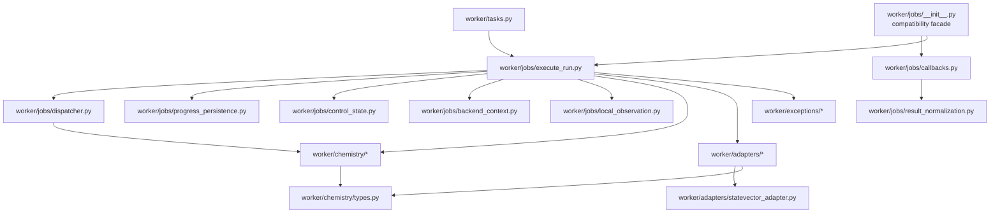

# Current Worker And Queue

## Scope

How the RQ worker process, chemistry pipeline, and queue wiring work, plus the
behavior when Redis or the worker is absent.

## Process Layout

- Top-level `worker/` package runs the repo-managed worker launcher via the
  compose command `python -m worker.main`.
- Single queue: `QUEUE_NAME` (default `quantum`). API and worker use same value.
- Job timeout: `QUANTUM_JOB_TIMEOUT_SECONDS` (default `3600` seconds).
- Backend targets:
  - `statevector` — active (`worker/adapters/statevector_adapter.py`).
  - `aer_simulator` — active local Qiskit Aer adapter with `EstimatorV2`,
    `SamplerV2`, shot/method options, and supported noise profiles for
    primitive-backed algorithms. Small KQD/QFD use `qiskit_aer.AerSimulator`
    directly for ideal Pauli time-evolution state propagation only when no noise
    profile is requested; noisy or larger Aer KQD/QFD use local Aer Estimator
    branch matrix elements instead. When Aer uses the `backend_derived` noise
    source, the worker decrypts the saved IBM profile long enough to fetch
    backend calibration data, then strips credential bookkeeping before local
    Aer primitive submission.
  - `ibm_runtime` — active adapter surface gated by credentials and validation;
    current validation allows IBM hardware execution for VQE/SQD directly and
    QSE/SKQD through their VQE/SQD substeps after explicit user confirmation.
    KQD/QFD use capped branch-state Estimator circuits to measure projected
    Hamiltonian/overlap matrix elements, then run the generalized eigensolve
    locally.
  - Unknown or unavailable targets raise `BackendError`; the worker must not
    silently fall back while claiming Aer or IBM execution.

## Current Module Responsibilities

- `worker/contracts.py`: small structural contracts for solver results,
  progress sinks, backend adapters, job observers, chemistry inputs, and
  Hamiltonian bundles; it also exposes the existing repository protocol as
  `RunRepositoryContract`.
- `worker/jobs/run_execution/contracts.py`: primary owner for named
  `SessionFactory`, `RepositoryFactory`, `EventInserter`, stopped-result
  aliases, and typed started/prepared run contexts used by worker lifecycle
  stages. SQLAlchemy sessions are typed at these boundaries while
  algorithm-specific payload dictionaries stay open until their solver
  contracts are narrowed.
- `worker/jobs/boundary_types.py` and `worker/jobs/execution_context.py`:
  compatibility exports for the moved run-execution contracts. Keep them until
  repository-wide import search proves that callers have migrated.
- `worker/tasks.py`: RQ-callable wrapper `enqueueable_execute_run` that accepts
  either a bare run ID or a payload mapping containing `run_id`/`id` plus an
  optional `execution_generation`.
- `worker/jobs/execute_run.py`: algorithm-aware execution entrypoint that
  derives algorithm/mode/backend from run snapshot, consumes easy-mode
  `metadata.easy_mode.expanded_advanced_config` snapshots when present, emits
  setup and progress events, emits runtime `estimate_updated` telemetry events,
  marks IBM Runtime primitive jobs as `SUBMITTED_TO_IBM` as soon as the remote
  job id is observed, persists `runs.ibm_job_id`, and emits IBM
  submission/status events for the live timeline; while Runtime jobs are
  pending, the worker polls status/queue position, and after completion it
  records IBM timing metadata (`pending_seconds`, `usage_seconds`,
  `total_seconds`) from Runtime job metrics, persists `runs.latest_estimate`
  snapshots, and on successful completion rewrites the final estimate to the
  observed total runtime with zero remaining work using the best completed-work
  count available from telemetry/result data. It builds molecule/Hamiltonian
  artifacts from persisted run+molecule records, performs cancellation checks,
  and streams solver-driven progress callbacks into run_events instead of
  replaying progress after solver completion. It commits progress batches
  immediately so SSE consumers see live updates, and it seeds estimates with an
  algorithm-aware heuristic plus live EMA telemetry. During the module split,
  legacy private helper aliases remain available from this entrypoint for
  existing worker tests and importers.
- `worker/jobs/_hamiltonian_cache.py`: module-local Hamiltonian bundle cache and
  invalidation helpers shared by execute-run call sites.
- `worker/jobs/_progress_tracking.py`: latest-estimate persistence helpers and
  heuristic-seeded, EMA-refined runtime telemetry. Early live samples are
  blended with the algorithm/backend heuristic during warm-up so the ETA does
  not collapse to unrealistic `1s`-style values after one fast progress event.
- `worker/jobs/result_normalization.py`: pure result payload, energy
  provenance, runtime metadata, and terminal-estimate normalization used by
  the RQ success callback.
- `worker/jobs/failure_reporting.py`: sanitized public failure and timeout
  metadata. Exception details remain in worker logs and never enter API-facing
  run metadata.
- `worker/jobs/ibm_observation.py`: IBM Runtime status and queue extraction,
  timeout, observation metadata, timing normalization, and best-effort remote
  cancellation used by primitive observers. `ObservedIBMJob` owns the
  polling/result proxy; stateful snapshot persistence and local-cancellation
  enforcement are also owned here, with session, repository, and cancellation
  callbacks injected at the boundary.
- `worker/jobs/local_observation.py`: local primitive-job polling and result
  proxy behavior. The observer receives its run-control guard factory so the
  worker entrypoint does not own local-job polling details.
- `worker/jobs/progress.py`: pure progress-event counter normalization,
  phase-aware totals, terminal iteration reconciliation, and fallback
  completion-event construction.
- `worker/jobs/progress_persistence.py`: progress callback orchestration,
  telemetry estimate construction, and ordered estimate/iteration persistence
  through `SqlRunRepository`.
- `worker/jobs/control_state.py`: repository-backed pause checkpoints,
  cooperative cancellation/pause decisions, and primitive-run guards. The
  execute-run entrypoint keeps compatibility wrappers for its existing seams.
- `worker/jobs/lifecycle.py`: repository-backed generation/status helpers and
  persisted molecule-to-`ChemistryInput` mapping used during run setup.
- `worker/jobs/execution_metadata.py`: setup payload, backend execution
  metadata, Hamiltonian messages, and result metadata enrichment.
- `worker/jobs/backend_context.py`: backend option normalization and
  target-specific primitive guard/observer attachment. `execute_run.py` keeps
  the compatibility wrapper and injects its existing observer factories.
- `worker/jobs/preparation.py`: backend selection, Hamiltonian construction,
  setup milestones, setup-control handling, setup payload creation, and setup
  event persistence. `execute_run.py` injects compatibility seams around this
  ordered preparation stage.
- `worker/jobs/orchestrator.py`: initial estimate persistence, algorithm
  dispatch, progress callback wiring, pause checks, result normalization,
  metadata enrichment, and terminal runtime metadata. It requests the initial
  estimate commit through an injected transaction boundary; `worker/db.py`
  owns the commit operation. `execute_run.py` remains the compatibility facade
  around the ordered run story.
- `worker/jobs/dispatcher.py`: registry-based algorithm dispatcher with the
  enabled algorithm set (`vqe`, `sqd`, `kqd`, `qfd`, `qse`, `skqd`) that
  derives its public keys from `shared.contracts.identifiers.RunAlgorithm`,
  exposes typed `AlgorithmDefinition` metadata, and receives a prebuilt
  chemistry Hamiltonian bundle from `execute_run`.
- `worker/chemistry/projected_execution.py`: canonical KQD/QFD projected-path
  policy and QSE measurement policy. It records the requested target, actual
  path, primitive requirement, and selection reason before execution.
- `docs/worker-chemistry.md`: algorithm ownership, registration, provenance,
  and test guidance for worker chemistry changes.
- `worker/jobs/callbacks.py`: RQ callback implementations and bounded
  database-write retry policy.
  - `on_job_success` sets `COMPLETED`, persists normalized result payloads, and
    emits result/status events.
  - `on_job_failure` sets `FAILED`, stores sanitized error metadata (no
    traceback), classifies worker time-limit expirations as timeout-specific
    public error payloads, and emits error/status events.
- `worker/jobs/__init__.py`: compatibility facade that keeps the stable
  `execute_run`, `on_job_success`, and `on_job_failure` imports.
  - Algorithm-native payloads are mapped into DB columns (`energy`,
    `iterations`) while preserving `algorithm`/`algorithm_metrics` in
    `raw_result` and result events. Normalized `algorithm_metrics` are stored in
    the dedicated `run_results` column so downstream readers do not need to
    parse `raw_result`.
  - Pure result conversion is isolated in
    `worker/jobs/result_normalization.py`; the callback retains
    repository transaction, retry, and terminal-event coordination.
- `worker/jobs/execute_run.py` does not issue direct SQL or direct commits. The
  initial estimate commit is injected into `worker/jobs/orchestrator.py` through
  the `worker/db.py` boundary. Progress, control-state, and IBM-observation
  modules own their explicit persistence boundaries. Compatibility adapters
  remain in the entrypoint so existing worker tests and callers keep their
  import surface.
- `worker/config.py`: Pydantic settings for Redis/Postgres URLs, queue name, and
  log level (hardened to require explicit DB URL env var).
- `worker/main.py`: worker startup initialization and queue-depth logging with
  resource cleanup.
- `worker/chemistry/*`:
  - statevector-primitive VQE solver using scipy optimization + direct Qiskit V2
    estimator PUB evaluations, plus Hamiltonian-driven SQD and deterministic
    KQD, QFD, QSE, and SKQD bounded execution; the solver modules emit
    structured setup, per-iteration, and final-summary logging for verbose
    worker runs;
  - SQD consumes backend sampler bitstrings (instead of synthetic in-solver
    sampling) in qiskit-addon-sqd `[beta][alpha]` order; diagnostics include
    sampled/selected counts plus best-observed and final occupancies in the SCI
    result package, and the persisted SQD result package also carries a circuit
    preview bundle with OpenQASM 3 plus an IBM-style `iqp` SVG diagram of the
    final sampled circuit for run-detail rendering. SQD applies `max_dim` as a
    selected-CI determinant-string cap before `solve_fermion`; when `max_dim` is
    omitted, sectors up to 1024 selected-CI amplitudes may solve fully, while
    larger sectors default to 32 determinant strings per spin so SQD/SKQD do not
    silently become exact full-sector FCI solves. `carryover_threshold` retains
    high-weight CI strings between recovery rounds, and `symmetrize_spin=true`
    keeps the alpha/beta determinant pools identical instead of silently doing
    that for every closed-shell run. The SCI result package records the full
    sector dimension, effective selected-CI dimension, cap source, batch
    energies, carryover diagnostics, best observed recovery iteration, final
    recovery energy, and whether an exact sector solve occurred. The final
    postselection summary uses `selected_samples`/`selected_configurations` for
    the latest accepted selected configurations and keeps the cross-iteration
    shot estimate separately under `selected_sample_shots_estimate`. SQD emits
    pre-sampling, postselection, and per-batch selected-CI progress checkpoints
    before blocking sampler/SCI work. SQD also writes typed
    `algorithm_metrics.circuit_artifacts` entries for stored sampling
    iterations, keeps every iteration up to 32 recovery steps, and otherwise
    stores the first 4, last 12, and 16 evenly spaced middle iterations while
    recording the policy under `algorithm_metrics.circuit_artifact_policy`;
  - convergence flags are evidence-based rather than completion-based: VQE
    reports the best observed objective value together with matching
    parameters/circuit artifacts, but still trusts optimizer success or SPSA
    stability windows for `converged`; SQD reports the lowest variational energy
    observed across stochastic recovery iterations but only sets
    `converged=true` when enough selected configurations also have stable energy
    and occupancies, and deterministic projected solvers report Ritz residual
    diagnostics before setting `converged=true`;
  - VQE evaluates deterministic warm-start candidates when no explicit initial
    parameters are supplied, then optimizes from the lowest-energy candidate;
    explicit `initial_parameters` and `parameter_bounds` must match the resolved
    ansatz width, every candidate is clipped into bounds before scoring, and
    normalized VQE metrics include typed ansatz and final-circuit artifacts. VQE
    progress and top-level `iterations` count objective evaluations, while
    optimizer-native step counts remain in
    `algorithm_metrics.optimizer_iterations`;
  - QSE honors `reference_method` semantics (`hf`, `vqe`, `provided_state`, and
    `provided_sector`), supports `provided_state_vector` for small dense
    references and sparse `provided_sector_amplitudes` for determinant-sector
    references, accepts JSON-safe complex coefficients for both the full-state
    and determinant-sector reference inputs, carries VQE reference depth through
    to state reconstruction, emits one representative reference circuit artifact
    for both circuit-defined `hf` and `vqe` references, and applies
    `excitation_level` (`singles` vs `singles_doubles`) with spin-preserving
    excitation patterns when building the projected basis. Above the dense
    6-active-orbital cap, QSE uses the fixed-particle-sector
    `ffsim.linear_operator` path for `hf` and `provided_sector` references. For
    determinant-like sector references, singles+doubles candidates are ordered
    by their coupling to `H|reference>` so capped subspaces include useful
    correlation-carrying doubles instead of arbitrary zero-coupling singles;
    pure reference-input parsing and state-vector normalization live in
    `worker/chemistry/algorithms/qse/reference.py`;
    reference-method selection and construction live in
    `worker/chemistry/algorithms/qse/reference_policy.py`;
    excitation generation and application live in
    `worker/chemistry/algorithms/qse/excitations.py`; sector ranking lives in
    `worker/chemistry/algorithms/qse/sector.py`; basis construction lives in
    `worker/chemistry/algorithms/qse/basis.py`; QSE helper ownership has no
    flat compatibility modules;
    `worker/chemistry/algorithms/qse/workflow.py` retains private compatibility aliases and orchestration;
  - KQD reference and representative evolution circuit artifacts live in
    `worker/chemistry/algorithms/kqd/circuit_artifacts.py`; `worker/chemistry/algorithms/kqd/workflow.py`
    retains injected private wrappers for compatibility;
  - KQD dense and fixed-sector Krylov basis construction, time evolution,
    projected progress estimates, and progress payloads live in
    `worker/chemistry/algorithms/kqd/basis.py`; `worker/chemistry/algorithms/kqd/workflow.py` retains injected
    private wrappers for compatibility;
  - KQD branch, sector, and dense resource selection lives in
    `worker/chemistry/algorithms/kqd/execution.py`; `worker/chemistry/algorithms/kqd/workflow.py` retains
    injected private wrappers for compatibility;
  - KQD result and completion-payload construction lives in
    `worker/chemistry/algorithms/kqd/results.py`; `worker/chemistry/algorithms/kqd/workflow.py` retains
    injected private wrappers for compatibility;
  - SKQD Krylov diagnostics are generated from projected Hamiltonian subspaces
    instead of synthetic arithmetic decrement ladders, use SQD selected
    bitstrings or an HF sector fallback as the seed, and normalize those seed
    states in `worker/chemistry/algorithms/skqd/seed.py` before
    QR-orthonormalizing the
    Krylov basis before reporting Ritz energies so the final energy and residual
    diagnostics use the same projected basis. Dense SKQD uses exact seeded
    time-evolution states and large SKQD uses fixed-particle-sector
    `expm_multiply` time evolution instead of dense Hilbert matrices. The hybrid
    result only promotes the Krylov extension when it both improves on the SQD
    core and satisfies the residual convergence gate, and records the chosen
    source under `krylov_extension_diagnostics.selected_solution`. SKQD flattens
    the representative SQD seed circuit into top-level
    `algorithm_metrics.circuit_artifacts` with role/source `sqd_seed`; SKQD
    progress events keep Krylov `completed_iterations` phase-local and expose
    cumulative work separately as `overall_iterations`, so the worker does not
    double-count the preceding SQD phase; the advanced contract's `time_step`
    sets the seeded evolution schedule used to generate the Krylov extension and
    is echoed in diagnostics;
  - `worker/chemistry/algorithms/skqd/extension.py` owns dense and fixed-sector
    Krylov extension construction and progress payloads;
    `worker/chemistry/algorithms/skqd/execution.py` owns SQD-seed resolution
    and dense or fixed-sector extension dispatch; `worker/chemistry/algorithms/skqd/workflow.py` retains the
    compatibility wrapper and final result orchestration;
  - `worker/chemistry/algorithms/skqd/distributions.py` owns computational-basis
    state-distribution diagnostics. `worker/chemistry/algorithms/skqd/results.py`
    owns SQD-core summaries, solution selection, and completion-payload records;
    `worker/chemistry/algorithms/skqd/workflow.py` retains extension orchestration and completion-event
    emission;
  - dense operator matrices resolved from `SparsePauliOp` are cached through a
    bounded LRU helper in `worker/chemistry/operator_matrices.py` to avoid
    repeated `to_matrix()` conversion in small-system KQD/QFD/QSE/SKQD paths.
    Larger KQD/QFD/QSE/SKQD
    runs use shared fixed-sector helpers in `sector_basis.py`,
    `hamiltonian_action.py`, `projected_execution.py`, and
    `projected_subspace.py`; the projected-execution module owns shared KQD/QFD
    backend-path policies, while the latter owns the shared projected-matrix
    stability gate;
  - `worker/chemistry/matrix_element_circuits.py` owns branch-state circuit,
    ancilla-observable, Aer transpilation, and layout preparation for hardware
    projected matrix elements; `matrix_elements.py` retains estimator
    submission, accumulation, progress, and compatibility aliases;
  - `worker/chemistry/algorithms/kqd/config.py` owns bounded KQD
    Krylov/timestep, evolution-method, and residual-tolerance settings;
    `worker/chemistry/algorithms/kqd/workflow.py` retains private compatibility aliases while retaining
    projected execution;
  - `worker/chemistry/projected_execution.py` owns shared KQD/QFD branch,
    fixed-sector, and dense resource selection. `worker/chemistry/algorithms/kqd/workflow.py` retains the
    compatibility wrapper and solver orchestration;
  - `worker/chemistry/algorithms/kqd/results.py` owns KQD overlap metrics,
    public result construction, and completed-progress payloads; `worker/chemistry/algorithms/kqd/workflow.py`
    retains the projected-path orchestration;
  - `worker/chemistry/algorithms/qfd/config.py` owns bounded QFD time-grid,
    Trotter, and projected-solve tolerance settings; `worker/chemistry/algorithms/qfd/workflow.py` keeps the
    resolved configuration explicit before selecting its execution path;
  - `worker/chemistry/algorithms/qfd/execution.py` constructs the typed QFD
    execution plan and prepares its reusable spectrum through the shared
    resource selection; `worker/chemistry/algorithms/qfd/workflow.py` retains the compatibility wrapper and
    solver orchestration;
  - `worker/chemistry/algorithms/qfd/results.py` owns QFD public result
    construction and completed-progress payloads; `worker/chemistry/algorithms/qfd/workflow.py` retains the
    compatibility wrapper and numerical-path orchestration;
  - `worker/chemistry/algorithms/qfd/states.py` owns dense and fixed-sector
    time-grid state construction, projected progress estimates, and progress
    payloads; `worker/chemistry/algorithms/qfd/workflow.py` retains compatibility wrappers;
  - `worker/chemistry/algorithms/qse/results.py` owns QSE public result
    construction and completed-progress payloads;
    `worker/chemistry/algorithms/qse/workflow.py` retains reference resolution, compatibility aliases, and
    result/progress handoff; dense and fixed-sector numerical-path orchestration
    lives in `worker/chemistry/algorithms/qse/execution.py`;
  - `worker/chemistry/reference_states.py` owns computational-zero and
    Jordan-Wigner Hartree-Fock reference-state construction. The historical
    `eigensolver.py` exports remain compatibility aliases;
  - ansatz and optimizer registries that back the VQE configuration path and the
    backend `/api/runs/config-metadata` selector metadata;
  - VQE option caps, defaults, optimizer limits, and parameter-bound
    resolution live in `worker/chemistry/algorithms/vqe/config.py`;
    `worker/chemistry/algorithms/vqe/workflow.py` keeps private compatibility aliases while retaining
    objective and optimizer execution;
  - VQE explicit-point validation, bound clipping, seeded candidate generation,
    and lowest-energy candidate selection live in
    `worker/chemistry/algorithms/vqe/initial_point.py`; `worker/chemistry/algorithms/vqe/workflow.py` retains
    private compatibility seams;
  - VQE progress-event construction lives in
    `worker/chemistry/algorithms/vqe/callbacks.py`; telemetry owns evaluation
    state and calls this boundary;
  - VQE ansatz, reported, and optimizer-final circuit-artifact composition
    lives in `worker/chemistry/algorithms/vqe/circuit_artifacts.py`;
    `worker/chemistry/algorithms/vqe/workflow.py` keeps the private compatibility alias;
  - VQE objective evaluation counts, function-evaluation caps, best-observed
    point tracking, convergence traces, and progress-event coordination live in
    `worker/chemistry/algorithms/vqe/telemetry.py`; `worker/chemistry/algorithms/vqe/workflow.py` supplies the
    numerical evaluator and keeps private compatibility aliases;
  - Qiskit V2 estimator PUB construction and scalar expectation extraction live
    in `worker/chemistry/algorithms/vqe/objective.py`; `worker/chemistry/algorithms/vqe/workflow.py` keeps the
    private objective aliases for existing importers;
  - The bounded SPSA update loop and stable energy-window convergence check live
    in `worker/chemistry/algorithms/vqe/spsa.py`; `worker/chemistry/algorithms/vqe/workflow.py` keeps private
    aliases for existing importers;
  - SciPy result normalization and the function-evaluation-limit fallback live
    in `worker/chemistry/algorithms/vqe/scipy.py`; stationary warm-start
    detection and alternate-start retry policy live in
    `worker/chemistry/algorithms/vqe/retry.py`;
    `worker/chemistry/algorithms/vqe/workflow.py` keeps the `minimize` compatibility seam and orchestration;
  - Parameterless, evaluation-limit, energy-provenance, and canonical VQE
    result assembly lives in `worker/chemistry/algorithms/vqe/results.py`;
    `worker/chemistry/algorithms/vqe/workflow.py` retains compatibility wrappers and injects state-data and
    artifact helpers;
  - Bounded Bloch-vector and density-matrix payload calculation for ideal
    statevector runs lives in
    `worker/chemistry/algorithms/vqe/state_data.py`;
  - `worker/chemistry/algorithms/skqd/config.py` owns SKQD Krylov bounds,
    tolerance/time defaults, and nested SQD option assembly; `worker/chemistry/algorithms/skqd/workflow.py`
    retains private compatibility aliases while retaining extension execution;
  - SQD Hamiltonian-input validation, bounded runtime-option resolution,
    selected-CI limit resolution, and the immutable options record live in
    `worker/chemistry/algorithms/sqd/config.py`; `worker/chemistry/algorithms/sqd/workflow.py` retains
    private compatibility aliases while retaining
    sampling/recovery orchestration;
  - SQD circuit-preview artifacts and final result-payload normalization live
    in `worker/chemistry/algorithms/sqd/results.py`; `worker/chemistry/algorithms/sqd/workflow.py` retains
    private compatibility aliases while retaining the
    recovery loop;
  - SQD selected-CI batch execution, carryover diagnostics, and selected-CI
    progress events live in
    `worker/chemistry/algorithms/sqd/recovery.py`; `worker/chemistry/algorithms/sqd/workflow.py` retains
    private compatibility aliases while retaining
    outer-loop state;
  - The SQD Hartree-Fock reference circuit, sampler retries, control-flow
    propagation, and one iteration's recovery-input preparation live in
    `worker/chemistry/algorithms/sqd/sampling_execution.py`; `worker/chemistry/algorithms/sqd/workflow.py`
    keeps a thin wrapper so existing sampler
    monkeypatch seams remain valid;
  - Recovery-trace construction and end-of-iteration progress payloads live in
    `worker/chemistry/algorithms/sqd/progress.py`; `worker/chemistry/algorithms/sqd/workflow.py` retains
    private compatibility aliases while retaining the
    outer recovery state;
  - The mutable SQD recovery-state record, dependency loading, setup logging,
    and initial-state construction live in
    `worker/chemistry/algorithms/sqd/state.py`;
  - One SQD sampling/recovery iteration, state updates, delta calculation,
    best-observation tracking, and trace recording live in
    `worker/chemistry/algorithms/sqd/iteration.py`; `worker/chemistry/algorithms/sqd/workflow.py` keeps an
    injected compatibility wrapper;
  - The bounded SQD recovery loop and convergence stop condition live in
    `worker/chemistry/algorithms/sqd/controller.py`; `worker/chemistry/algorithms/sqd/workflow.py` keeps the
    public resolver, result handoff, and compatibility
    injection points;
  - Pure SQD sampler payload/register discovery, bitstring normalization,
    frequency aggregation, and distribution diagnostics live in
    `worker/chemistry/algorithms/sqd/sampling.py`; `worker/chemistry/algorithms/sqd/workflow.py` keeps
    private compatibility aliases;
  - Pure SQD recovery deltas and convergence gates live in
    `worker/chemistry/algorithms/sqd/convergence.py`; the solver keeps resolved
    options and progress orchestration at its
    compatibility boundary;
  - Pure SQD selected-CI determinant limits, weighted selection, carryover,
    postselection, and selected-CI fraction helpers live in
    `worker/chemistry/algorithms/sqd/selection.py`; the solver keeps legacy
    private aliases for existing callers;
  - backend selection and shared dataclasses;
  - PySCF/ffsim molecule and Hamiltonian builders used by both execute-run
    runtime setup and chemistry pipeline tests; the Hamiltonian builder
    validates large molecules and auto-reduces the active space when no explicit
    active space is provided, recording the reduction in metadata;
  - bounded chemistry cache with deterministic keys and explicit invalidation.
- `worker/adapters/*`: backend adapter contract (`BackendAdapter`), active
  statevector, Aer, and IBM Runtime adapters, plus result normalization. IBM
  Runtime primitive submissions have an explicit worker-side timeout/logging
  boundary before a remote job handle is returned, so stalled submission calls
  fail with a clear timeout error instead of leaving a run silently `RUNNING`
  with no IBM job id recorded. IBM provider setup, backend resolution, and
  transpilation errors expose only the operation and exception type; provider
  exception text stays out of worker failure messages.
- `worker/persistence/run_repository.py`: active worker persistence boundary for
  lifecycle, event, result, checkpoint, IBM observation, and progress writes.
  Payload normalization converts common scalar and structured values before
  JSON persistence; unexpected scalar conversion failures propagate.
  `worker/persistence/credential_profile_repository.py` owns the encrypted IBM
  profile lookup; `worker/jobs/_credential_profiles.py` decrypts values only at
  the runtime boundary.
  internal orchestration calls the repository directly.
- `worker/tests/*`: unit tests for worker startup, queue logging, and
  algorithm-aware execute-run lifecycle behavior.

## execute_run — Execution Path

`execute_run` is the algorithm-aware execution path used by every run that
reaches the worker. It uses statevector-backed VQE execution, Hamiltonian-driven
SQD, and deterministic KQD/QFD/QSE/SKQD execution flows:

- Transitions local runs from `QUEUED` to `RUNNING` → `COMPLETED`; IBM Runtime
  runs enter `SUBMITTED_TO_IBM` while the remote primitive job is pending and
  then finish through the same success/failure callbacks. For IBM Runtime, app
  wall time and QPU usage are separate: `run_started_at`/`runtime_seconds`
  measure the worker-side run, while `metadata.ibm_timing` and
  `ibm_status_poll.payload.ibm_timing` carry IBM pending, usage, and total
  completion timing when the Runtime API returns job metrics.
- Emits a setup event (`iteration_update` with `stage="setup"`) containing
  algorithm/backend metadata and chemistry dimensions (qubits, spatial orbitals,
  active space, and active-space auto-reduction details when applicable)
- Dispatches via registry (`vqe`, `sqd`, `kqd`, `qfd`, `qse`, `skqd`) and emits
  progress events and estimate telemetry updates derived from solver output;
  progress batches are committed immediately so SSE consumers see live updates
  without refresh
- Normalizes every algorithm result with an `energy_policy` object in
  `algorithm_metrics`, documenting the reported energy source and confirming
  that HF/CASCI references are comparison context rather than replacement
  energies.
- For easy-mode runs, uses the versioned expanded advanced snapshot stored in
  run metadata rather than the raw easy request payload; the snapshot records
  the convergence-related defaults it depends on instead of leaving those
  implicit in solver fallbacks.
- Preserves run-level backend target, backend options, noise profile, and basis
  overrides while expanding easy-mode snapshots so chemistry setup and backend
  execution use the same submission-time settings selected in the form.
- Builds `ChemistryInput` from persisted molecule rows, then constructs and
  dispatches a real `HamiltonianBundle` to algorithm runners (no placeholder
  Hamiltonian payload)
- Fails fast when Hamiltonian artifacts are missing or invalid instead of
  silently defaulting to synthetic sigma-Z fallback operators.
- Uses scipy-backed VQE optimization runtime instead of
  `qiskit_algorithms.minimum_eigensolvers.VQE` wrappers.
- Resolves saved IBM credential profiles for `ibm_runtime` runs and for Aer runs
  that request `backend_derived` noise; local statevector and other Aer paths
  keep the stored profile reference out of primitive runtime options. If an
  older or drifted run snapshot is missing
  `config_json.backend_options.credential_profile_id`, the worker falls back to
  the persisted `runs.credential_profile_id` column before decrypting the saved
  profile.
- VQE and SQD emit live progress callbacks from objective evaluations and
  iteration loops; deterministic KQD, QFD, QSE, and SKQD emit in-window progress
  checkpoints during basis/time-evolution construction in addition to
  completion-stage events.
- KQD/QFD statevector runs above the dense limit build Krylov/filter states in
  the fixed electron sector with `ffsim.linear_operator` and `expm_multiply`,
  then assemble only the small projected matrices. Large KQD solves its sector
  projection on a QR-orthonormalized Krylov basis so the reported energy and
  Ritz-residual diagnostics come from the same stabilized subspace.
  - KQD/QFD with `aer_simulator` run small nonzero time-evolution states through
    ideal AerSimulator Pauli-evolution circuits only when no noise profile is
    requested. Larger ideal Aer KQD/QFD runs stay local but bypass
    hardware-style matrix-element estimation entirely: they use the same
    fixed-particle-sector `HamiltonianAction` evolution/projection path as large
    statevector runs, so local benchmarks do not stall behind long
    branch-estimator primitive waits when no noise model is involved. Noisy Aer
    KQD/QFD still use local Aer Estimator branch matrix elements capped at 8
    projected basis states so the worker can apply the same stabilized projected
    solve used on IBM branch paths, but only for active spaces up to 6 orbitals.
    IBM Runtime KQD/QFD applies that same 6-orbital projected-matrix guardrail,
    so oversized hardware-targeted branch-estimator workloads fail fast during
    validation/solver setup instead of dying later during branch-circuit
    submission. Local Aer branch-estimator runs split PUB submission into
    smaller backend-aware chunks (`2` PUBs for ideal Aer fallback paths, `1` for
    backend-derived noisy Aer) so long matrix-element batches yield progress and
    cancellation checks more often.
- KQD/QFD with `ibm_runtime` submit branch-state Estimator PUBs for the upper
  triangle of the projected Hamiltonian and overlap matrices. The worker submits
  PUBs in small chunks so progress is visible during long primitive waits, emits
  projected-subspace progress whenever a leading measured block can be solved,
  symmetrizes the measured matrices, records `matrix_element_summary`, and keeps
  the final generalized eigensolve local. On noisy branch-estimator KQD/QFD
  paths, the worker Hermitian-symmetrizes `H/S`, PSD-projects the overlap, and
  drops overlap modes below
  `max(regularization, 1e-6 * lambda_max(S), lambda_max(S) / 1e3, 4 * max_standard_error)`
  before the retained solve. That keeps the reported projected subspace near a
  `1e3` overlap-condition ceiling while preserving the raw
  generalized-eigenvalue spectrum only as diagnostics. Projected-subspace
  progress events from this path are provisional retained-subspace estimates and
  emit `energy=null` when no stable retained solve exists. Because dense
  residual diagnostics are unavailable on this path, the worker reports
  `converged=true` only when the retained overlap solve remains fully stable
  without PSD projection or overlap-mode truncation; stabilized branch-estimator
  completions can still return a reported energy but stay `converged=false`.
  Validation caps this workflow at 8 Krylov/time-grid basis states per run.
- IBM Runtime backend resolution honors the persisted selection policy at
  execution time, but new IBM runs also freeze policy-based choices during
  `POST /api/runs` by writing the resolved `backend_options.backend_name` into
  the run snapshot. That keeps worker execution, resume/restart flows, and UI
  history aligned to the same hardware selection. When a snapshot still reaches
  the worker without a concrete backend name, manual runs use the requested
  backend name, `least_busy` defers to Runtime queue metadata, and `least_error`
  picks the lowest-error operational backend from the live catalog instead of
  silently collapsing to `least_busy`.
- If the observed IBM Runtime job transitions to `CANCELLED` outside the app,
  the worker marks the local run `CANCELLED`, emits a matching `status_changed`
  event with `reason="ibm_job_cancelled"`, and stops waiting on `job.result()`
  so the run detail page and runs list do not drift into a stale IBM-pending or
  failed state.
- If a user cancels a run while an IBM Runtime primitive job is already in
  flight, the worker records the submitted job ID, requests a best-effort remote
  `job.cancel()`, and raises the local cancellation before any further primitive
  processing. The same execution guard also wraps local Aer primitive jobs: the
  worker polls their completion state once per second, rechecks the persisted
  run status between polls, and issues a best-effort local `cancel()` when the
  run becomes cancelled or paused instead of waiting indefinitely inside
  `job.result()`. submissions. A primitive-level run guard also checks for
  `CANCELLED`/`PAUSING` immediately before `primitive.run(...)` so chunked
  matrix-element workloads do not launch follow-up IBM jobs after a control
  request lands.
- If a user pauses an IBM Runtime run while a primitive job is already in
  flight, the worker lets that submitted job finish, then checkpoints the run as
  `PAUSED` before the next primitive submission. The primitive-level run guard
  blocks any follow-up chunk/PUB launch once the local status is `PAUSING`.
- KQD, QFD, QSE, and SKQD above 6 active orbitals avoid full Hilbert matrix
  materialization. QSE supports the larger path for `hf` and `provided_sector`
  references, while VQE/full-statevector references stay small-system only. SKQD
  keeps the SQD sampler-backed core and performs the Krylov extension in the
  selected fixed-particle sector.

- QFD exact time evolution precomputes the Hamiltonian eigenspectrum once per
  run and reuses it across the configured time grid, which avoids repeated
  diagonalization work that could make QFD runs appear stuck in loading on
  larger systems. QFD also honors `trotter_steps` on Aer/IBM branch-estimator
  and Aer state-propagation paths, recording the effective product-formula count
  in matrix-element/progress metadata.
- Estimate telemetry uses a per-algorithm heuristic with live EMA updates,
  replacing the old flat per-iteration constant. The worker keeps that heuristic
  as an anchor during the first few samples and only trusts the live EMA
  strongly once progress/time coverage is large enough to make the ETA more
  stable.
- Uses stage-based `iteration_update` events for deterministic one-shot solvers
  (`kqd`, `qfd`, `qse`) and avoids synthetic sleep-based replay loops after
  solver completion.
- Monitors for cancellation signals (detects `CANCELLED` status in DB)
- Queue payloads include `execution_generation` for runs enqueued by create,
  resume, and restart. Control endpoints store durable checkpoints in
  `run_checkpoints`, keyed by generation so stale resumed/restarted payloads can
  be distinguished from the current execution.
- Returns a normalized algorithm-native result envelope used by `on_job_success`
- Enriches persisted `algorithm_metrics.circuit_artifacts` with backend target,
  primitive family, job ids, shot counts, and IBM Runtime transpiled previews
  when that metadata is available from the adapter, including the concrete IBM
  backend name resolved for least-busy runs
- Handles errors gracefully with `FAILED` status and error events

## Worker Module Dependency Diagram



## Queue Depth Logging and Resource Management

The worker process starts queue depth monitoring once per minute. The logging
implementation handles resource cleanup through:

**Implementation (\_log_queue_depth):**

- **Redis client lifecycle**: Creates a Redis client via `redis.from_url()`,
  uses it to fetch queue length, and immediately closes it in a `finally` block
  (guaranteed cleanup even on exceptions).
- **Timer management**: Uses module-level state (`_timer`) to track the current
  scheduled timer. Before scheduling a new timer, any existing timer is
  cancelled via `_cancel_timer()` to prevent accumulation.
- **Failure handling**: If queue depth cannot be read (e.g., Redis unavailable),
  the exception is caught and logged at WARNING level, but the function does
  **not** reschedule the next timer. This prevents runaway logging attempts when
  Redis is offline.
- **Success path**: On successful read, the queue depth is logged at INFO level
  and `_schedule_next_log()` schedules the next 60-second timer.

**helper functions:**

- `_cancel_timer()`: Safely cancels the module-level `_timer` if it exists.
- `_schedule_next_log(redis_url, queue_name)`: Creates and starts a new
  `threading.Timer` (daemon) that will call `_log_queue_depth()` after the
  interval.

**Initialization** (from worker `main()`):\*\*

The worker process calls `_log_queue_depth()` once at startup with the queue
name from settings. This triggers the first depth log and schedules subsequent
timers. If Redis is unavailable at startup, the function logs a warning and the
worker continues running (it will retry on the next scheduled cycle).

**Example startup log:**

```log
2026-02-24 10:15:30 - worker.main - INFO - Worker scaffold initialized for queue 'quantum'
2026-02-24 10:15:30 - worker.main - INFO - Queue 'quantum' depth: 0
2026-02-24 10:16:30 - worker.main - INFO - Queue 'quantum' depth: 0
```

## Queue Architecture

Queue operations are intentionally small and service-owned:

- [`backend/app/dependencies.py`](../backend/app/dependencies.py) creates a
  per-request Redis client dependency and yields `None` if Redis initialization
  fails.
- [`backend/app/services/run.py`](../backend/app/services/run.py) owns the DB
  transaction that creates the run, records `metadata.rq_job_id`, and
  transitions `CREATED` to `QUEUED`.
- [`backend/app/services/queue_service.py`](../backend/app/services/queue_service.py)
  is the RQ wrapper used by the service layer.
- There is no current source file named `backend/app/queue.py`.

`queue_service.py` exposes:

| Function             | Signature                            | Purpose                                   |
| -------------------- | ------------------------------------ | ----------------------------------------- |
| `enqueue_run`        | `(run_id: UUID, redis_client) → str` | Enqueue on `quantum` queue, return job ID |
| `cancel_queued_job`  | `(job_id: str, redis_client) → None` | Cancel job (non-fatal on failure)         |
| `count_workers`      | `(redis_client) → int`               | Count active RQ workers                   |
| `check_redis_health` | `(client=None) → bool`               | Test Redis connectivity via PING          |

## Queue Flow (Current)

Queue submission flows through
`RunService.create() -> queue_service.enqueue_run() -> Redis`. Jobs are enqueued
on the `quantum` queue. If Redis is unavailable, the API persists the run in
`CREATED`; see [Graceful Degradation](#graceful-degradation).

```mermaid
sequenceDiagram
    participant API as FastAPI API
    participant RunSvc as RunService
    participant QSvc as queue_service<br/>(service layer)
    participant Redis as Redis<br/>quantum queue
    participant Worker as rq worker

    API->>RunSvc: create(run_in, redis_client)
    RunSvc->>RunSvc: INSERT Run (status=CREATED)
    alt redis_client is not None
        RunSvc->>QSvc: enqueue_run(run_id, redis_client)
        QSvc->>Redis: Queue("quantum").enqueue(task, run_id, timeout)
        Redis-->>QSvc: RQ job_id
        QSvc-->>RunSvc: job_id
        RunSvc->>RunSvc: UPDATE Run (status=QUEUED, metadata rq_job_id)
        RunSvc-->>API: COMMIT, return run with 201
    else redis_client is None
        Note over RunSvc: Redis absent; run stays CREATED
    end
    Worker->>Redis: dequeue job
    Worker->>Worker: execute_run(run_id)
    Worker->>DB: UPDATE runs SET status='RUNNING'
    Worker->>DB: INSERT run_event(status_changed, RUNNING)
    loop per-algorithm iterations
        Worker->>DB: SELECT status (cancellation check)
        alt status == CANCELLED
            Worker->>DB: INSERT run_event(status_changed, CANCELLED)
            Worker-->>Worker: return early
        end
      Worker->>DB: UPDATE runs.latest_estimate
      Worker->>DB: INSERT run_event(estimate_updated, estimate payload)
        Worker->>DB: INSERT run_event(iteration_update, {energy, parameters})
    end
    Worker-->>RQ: return result dict
    Note over Worker: on_job_success callback
    Worker->>DB: UPDATE runs SET status='COMPLETED'
    Worker->>DB: INSERT run_results
    Worker->>DB: INSERT run_event(status_changed, COMPLETED)
    Worker->>DB: INSERT run_event(result, {algorithm, energy, iterations, converged, algorithm_metrics})
```

## Graceful Degradation

`get_redis()` in `backend/app/dependencies.py` catches all connection errors and
yields `None` rather than raising a `5xx` error. Services must check for `None`
before calling queue operations:

- When `redis_client is None`, `RunService.create()` leaves the run in `CREATED`
  status without calling `queue_service.enqueue_run()`. The run is persisted and
  usable for export and event polling. It will not execute until re-enqueued.
- `RunService.cancel()` skips the `cancel_queued_job()` call when
  `redis_client is None`. The DB status transition to `CANCELLED` is still
  authoritative; the worker polls the DB and will respect it when connectivity
  is restored.
- `GET /api/status` reports `redis: "disconnected"` with HTTP 503 when Redis is
  unreachable. `GET /api/health` is a process liveness probe and still returns
  `{"status": "ok"}` when the API process is alive.

## Configuration

**Queue name**: `quantum`

`QUEUE_NAME` is read by both the API and worker. `REDIS_URL` is the connection
authority for both processes. The Compose contract check renders the default
and a custom queue to verify that these values stay equal.

**Job timeout**: `QUANTUM_JOB_TIMEOUT_SECONDS`, defaulting to `3600` seconds.
The RQ worker marks runs failed if the job exceeds this wall-clock limit.

## Redis Client Lifecycle and Health Checks

**`check_redis_health(client=None)`**:

1. **Provided client mode**: `check_redis_health(client=my_client)`
   - Tests the provided client via `client.ping()`
   - Does not close the client
   - Use for testing a cached, externally-managed client (e.g. from health
     endpoint)

Queue operations record structured `queue_operation` and
`queue_failure_reason` fields in diagnostics. The stable failure categories are
`connection_failure`, `missing_job`, `invalid_job_state`,
`configuration_error`, and `unknown_failure`. Cancellation failures remain
non-fatal because the database status transition is authoritative.

2. **Standalone mode**: `check_redis_health()` (no args)
   - Creates a temporary client from `REDIS_URL`
   - Tests it with `ping()`
   - Closes the client in a `finally` block (guaranteed cleanup, no resource
     leaks)
   - Use for isolated health checks or when no cached client exists

- Returns `True` on success, `False` on any failure (no exception raised)
- Handles missing `REDIS_URL` gracefully (returns `False`)

**Dependency and health endpoint behavior:**

- The request dependency `get_redis()` creates and closes a Redis client per
  request that needs queue access.
- `GET /api/status` creates a temporary health-check Redis client through
  `get_redis_client()`, calls `check_redis_health(client=client)`, and closes it
  in `finally`.
- `GET /api/health` does not check Redis or Postgres.


## How To Run It

Start the worker (plus dependencies):

```bash
docker compose up --build db redis worker
```

Tail logs to confirm the worker is consuming the `quantum` queue:

```bash
docker compose logs -f worker
```

## Callback Ownership Contract

`execute_run` and the RQ callbacks have a strict split to prevent duplicate
event writes:

- `execute_run` owns status transitions, `iteration_update`, `estimate_updated`,
  cancellation short-circuits, and the normalized result envelope it returns.
- `on_job_success` (in `worker/jobs/__init__.py`) owns the final `COMPLETED`
  status write, the `result` event, and the `run_results` row. It delegates
  pure result conversion to `worker/jobs/result_normalization.py` and also guards
  against overwriting a run that was already transitioned to `CANCELLED`.
- `on_job_failure` owns the `FAILED` status write, the `error` event, and the
  sanitized error payload (no traceback, no secrets).

## Not Yet Implemented

- Resume of already-submitted IBM Runtime jobs after a worker process restart.
  The current execution path records primitive job ids, status poll events, and
  timing metadata while the worker process remains alive.
